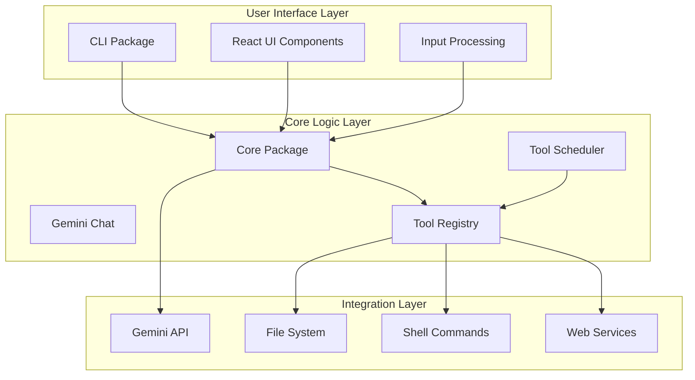
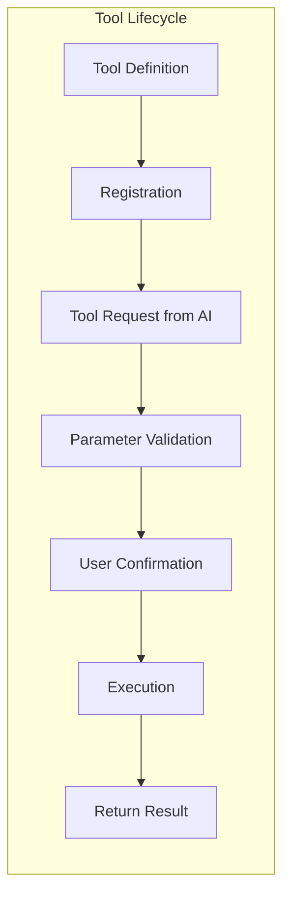
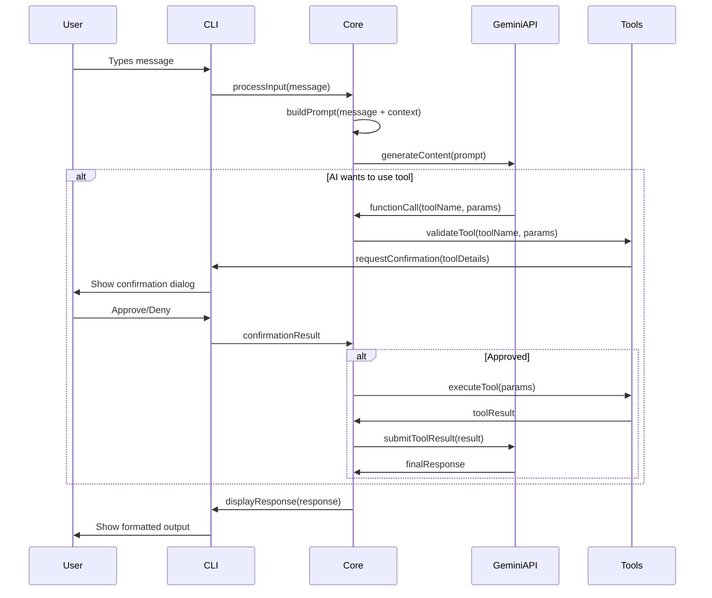
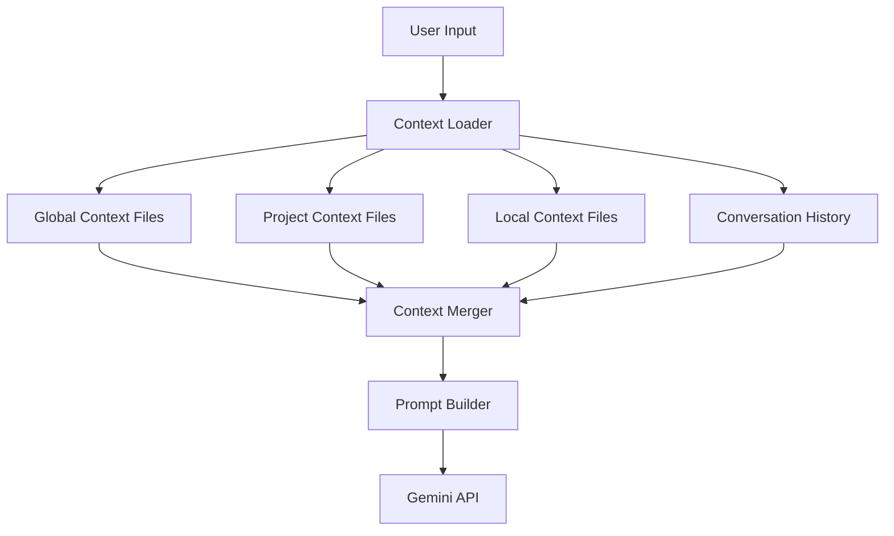
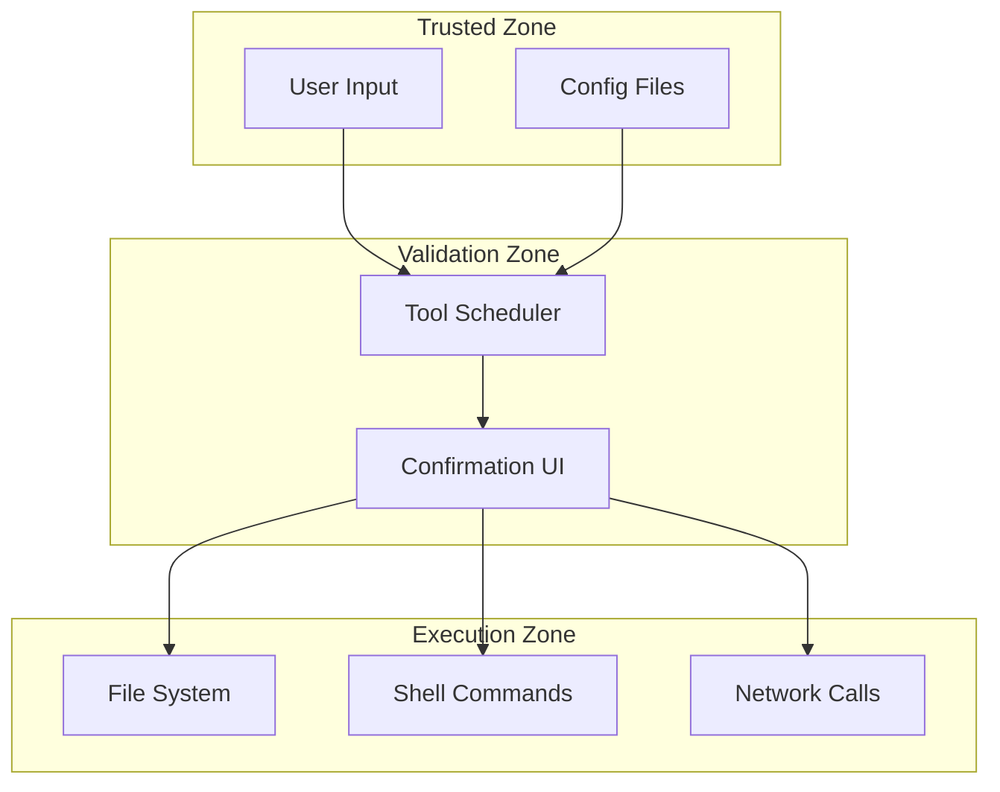

# 🏗️ Architecture Deep Dive

This guide provides a comprehensive understanding of the Gemini CLI architecture, going beyond the basic overview to help you understand how all the pieces fit together.

## 📋 Table of Contents

- [System Overview](#system-overview)
- [Package Architecture](#package-architecture)
- [Data Flow](#data-flow)
- [Key Design Patterns](#key-design-patterns)
- [Integration Points](#integration-points)
- [Next Steps](#next-steps)

## System Overview

Gemini CLI is architected as a **modular, extensible system** that bridges human-computer interaction with AI capabilities. Think of it as three main layers:



### Design Philosophy

1. **Separation of Concerns**: UI logic is separate from AI logic
2. **Extensibility**: Tools can be easily added without modifying core logic
3. **Security**: User confirmation required for potentially dangerous operations
4. **Modularity**: Each package has a well-defined responsibility

## Package Architecture

### 📦 `packages/cli` - User Interface

**Responsibility**: Handle all user interactions and presentation

Key directories:

```
cli/src/
├── commands/           # CLI command handlers (/clear, /help, etc.)
├── ui/                # React-based terminal UI
│   ├── components/    # Reusable UI components
│   ├── hooks/         # Custom React hooks
│   └── types.ts       # UI-specific types
├── config/            # CLI configuration management
└── gemini.tsx         # Main entry point
```

**Key Classes:**

- `GeminiStream` - Manages conversation flow
- `useGeminiStream` - React hook for AI interactions
- `CommandProcessor` - Handles slash commands

### 🧠 `packages/core` - AI & Logic Engine

**Responsibility**: Orchestrate AI interactions and tool execution

Key directories:

```
core/src/
├── core/              # Core conversation logic
│   ├── geminiChat.ts  # Main chat orchestrator
│   ├── turn.ts        # Single conversation turn
│   └── coreToolScheduler.ts # Tool execution coordinator
├── tools/             # All available tools
│   ├── shell.ts       # Shell command execution
│   ├── fileSystem.ts  # File read/write operations
│   └── webFetch.ts    # Web content fetching
├── prompts/           # Prompt construction logic
├── config/            # Configuration management
└── utils/             # Shared utilities
```

**Key Classes:**

- `GeminiChat` - Main conversation orchestrator
- `Turn` - Represents a single conversation exchange
- `CoreToolScheduler` - Manages tool execution and confirmation
- `ToolRegistry` - Manages available tools

### 🔧 Tool System Architecture

Tools are the extensibility mechanism that allows Gemini to interact with the world:



Each tool implements the `ToolInvocation` interface:

```typescript
interface ToolInvocation<TParams, TResult> {
  params: TParams;
  getDescription(): string;
  toolLocations(): ToolLocation[];
  shouldConfirmExecute(
    signal: AbortSignal,
  ): Promise<ToolCallConfirmationDetails | false>;
  execute(signal: AbortSignal): Promise<TResult>;
}
```

## Data Flow

### Complete Request Flow

Here's how a user request flows through the system:



### Context Engineering Flow

Context is crucial for AI performance. Here's how it flows:



**Context Hierarchy (highest to lowest priority):**

1. Local directory context files (`GEMINI.md` in current directory)
2. Project context files (searching upward to `.git` directory)
3. Global context files (`~/.gemini/GEMINI.md`)
4. System instructions

## Key Design Patterns

### 1. **Command Pattern** - Tool Execution

Tools are implemented as command objects that encapsulate all information needed for execution:

```typescript
// Tools implement a standardized interface
class ShellTool implements ToolInvocation<ShellParams, ShellResult> {
  async execute(signal: AbortSignal): Promise<ShellResult> {
    // Execution logic here
  }
}
```

### 2. **Observer Pattern** - Event Handling

The system uses events to decouple components:

```typescript
// Core emits events, CLI listens
core.on('tool_call_request', (details) => {
  ui.showConfirmationDialog(details);
});
```

### 3. **Strategy Pattern** - Authentication

Multiple authentication strategies are supported:

```typescript
interface AuthStrategy {
  authenticate(): Promise<AuthResult>;
}

class GoogleAuthStrategy implements AuthStrategy {
  /* ... */
}
class ApiKeyAuthStrategy implements AuthStrategy {
  /* ... */
}
```

### 4. **Builder Pattern** - Prompt Construction

Prompts are built incrementally:

```typescript
const prompt = new PromptBuilder()
  .addSystemContext(systemInstructions)
  .addUserContext(contextFiles)
  .addConversationHistory(history)
  .addUserMessage(userInput)
  .build();
```

## Integration Points

### External APIs

- **Gemini API**: Main AI model interaction
- **Google Search API**: Web search capabilities
- **MCP Servers**: Model Context Protocol for external tools

### File System Integration

- **Context Discovery**: Hierarchical search for `GEMINI.md` files
- **File Operations**: Read, write, and modify files through tools
- **Project Detection**: Automatic detection of project boundaries

### Shell Integration

- **Command Execution**: Safe execution of shell commands with user approval
- **Environment Preservation**: Maintains shell state across commands
- **Cross-platform Support**: Works on Windows, macOS, and Linux

## Security Architecture

### Trust Boundaries



### Confirmation Requirements

- **Read Operations**: Usually auto-approved
- **Write Operations**: Require user confirmation
- **Shell Commands**: Always require confirmation
- **Network Requests**: May require confirmation based on configuration

## Next Steps

Now that you understand the architecture, continue your learning journey:

### **🤖 Next: [LLM Workflow Explained](./02-llm-workflow.md)**

Learn how conversations and AI interactions flow through the system.

### **🔍 Quick Reference**

- [Core Classes & Interfaces](./05-core-classes.md) - Deep dive into key types
- [Tool System Deep Dive](./06-tool-system.md) - Understand tool implementation
- [Code Walkthrough](./04-code-walkthrough.md) - Guided tour of the codebase

### **🛠️ Hands-on Practice**

Try these exercises to reinforce your understanding:

1. **Trace a Request**: Follow a user message through the code from input to output
2. **Find Tool Definitions**: Locate and examine the implementation of different tools
3. **Identify Extension Points**: Look for places where new functionality could be added

### **💡 Key Takeaways**

- Gemini CLI uses a layered architecture for separation of concerns
- Tools are the primary extension mechanism
- Security is enforced through user confirmation workflows
- Context engineering is hierarchical and file-based
- The system is designed for modularity and extensibility
