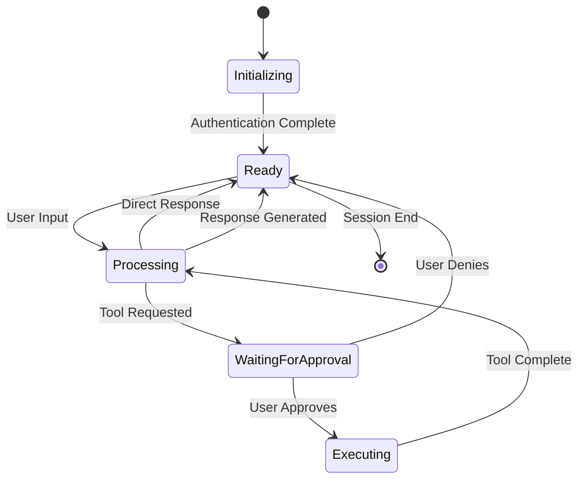
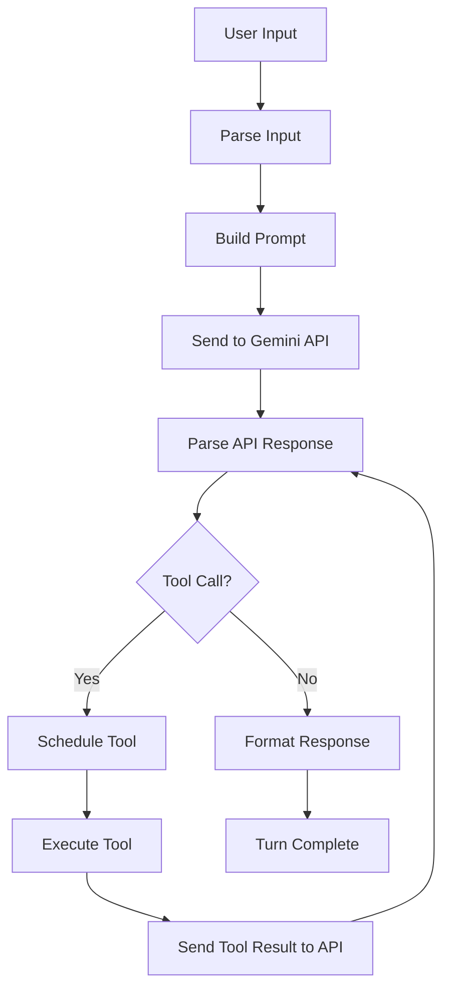
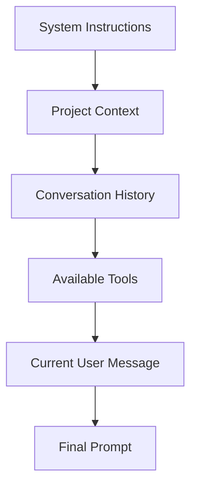
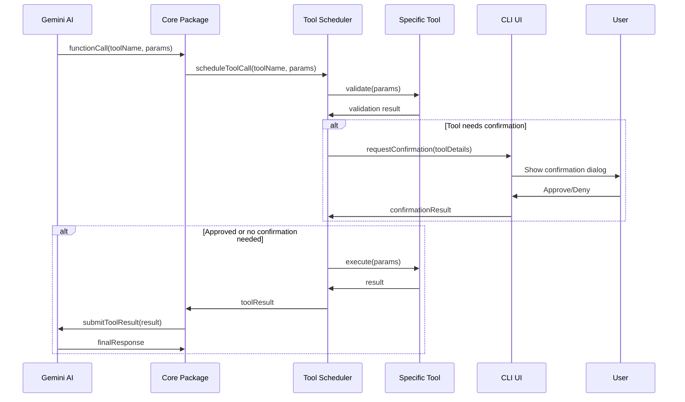
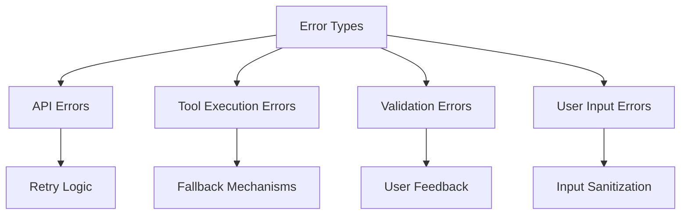

# 🤖 LLM Workflow Explained

Understanding how Large Language Model (LLM) interactions work in Gemini CLI is crucial for contributors. This guide walks you through the complete workflow from user input to AI response.

## 📋 Table of Contents

- [Conversation Lifecycle](#conversation-lifecycle)
- [Turn-by-Turn Processing](#turn-by-turn-processing)
- [Prompt Construction](#prompt-construction)
- [Tool Integration Workflow](#tool-integration-workflow)
- [Context Management](#context-management)
- [Error Handling & Recovery](#error-handling--recovery)
- [Next Steps](#next-steps)

## Conversation Lifecycle

### High-Level Flow

Every conversation follows this lifecycle:



### Code Implementation

The conversation lifecycle is managed by the `GeminiChat` class:

```typescript
// packages/core/src/core/geminiChat.ts
export class GeminiChat {
  private conversationHistory: ConversationTurn[] = [];
  private currentTurn?: Turn;

  async processUserMessage(
    message: string | PartListUnion,
    options: ChatOptions = {},
  ): Promise<ChatResponse> {
    // 1. Create new turn
    this.currentTurn = new Turn(message, this.model, this.config);

    // 2. Process the turn
    const response = await this.currentTurn.process();

    // 3. Add to history
    this.conversationHistory.push(this.currentTurn);

    return response;
  }
}
```

## Turn-by-Turn Processing

### What is a "Turn"?

A **Turn** represents a single exchange in the conversation:

- User provides input
- System processes and responds
- May involve multiple tool calls



### Turn Implementation

```typescript
// packages/core/src/core/turn.ts
export class Turn {
  constructor(
    private userInput: string | PartListUnion,
    private model: GenerativeModel,
    private config: Config,
  ) {}

  async process(): Promise<TurnResult> {
    // 1. Build the prompt with context
    const prompt = await this.buildPrompt();

    // 2. Send to Gemini API
    const apiResponse = await this.model.generateContent(prompt);

    // 3. Process the response
    return await this.processResponse(apiResponse);
  }

  private async processResponse(
    response: GenerateContentResponse,
  ): Promise<TurnResult> {
    const content = response.response;

    // Check if AI wants to call tools
    if (content.functionCalls?.length > 0) {
      return await this.handleToolCalls(content.functionCalls);
    }

    // Direct text response
    return {
      type: 'text',
      content: content.text(),
    };
  }
}
```

## Prompt Construction

### Prompt Anatomy

Every prompt sent to Gemini follows this structure:



### Context Hierarchy

Context is loaded in order of priority (most specific to least specific):

```typescript
// packages/core/src/utils/memoryDiscovery.ts
export async function loadServerHierarchicalMemory(
  cwd: string,
  additionalMemoryFiles: string[],
  includeMemoryFileDiscovery: boolean,
  fileDiscoveryService: FileDiscoveryService,
  includePaths: string[],
  folderTrustLevel: FolderTrustLevel,
): Promise<{ memoryContent: string; fileCount: number }> {
  const contextFiles = [];

  // 1. Local context (current directory)
  const localContext = await findContextInDirectory(cwd);
  if (localContext) contextFiles.push(localContext);

  // 2. Project context (search upward to git root)
  const projectContexts = await findProjectContexts(cwd);
  contextFiles.push(...projectContexts);

  // 3. Global context (user home directory)
  const globalContext = await findGlobalContext();
  if (globalContext) contextFiles.push(globalContext);

  return mergeContextFiles(contextFiles);
}
```

### Tool Definitions

Tools are included in the prompt as function definitions:

```typescript
// packages/core/src/tools/tools.ts
interface ToolDefinition {
  name: string;
  description: string;
  parameters: {
    type: 'object';
    properties: Record<string, ParameterSchema>;
    required: string[];
  };
}

// Example tool definition sent to Gemini
const readFileToolDefinition = {
  name: 'read_file',
  description: 'Read the contents of a file',
  parameters: {
    type: 'object',
    properties: {
      path: {
        type: 'string',
        description: 'The path to the file to read',
      },
    },
    required: ['path'],
  },
};
```

### Prompt Building Process

```typescript
// packages/core/src/core/prompts.ts
export class PromptBuilder {
  private parts: Part[] = [];

  addSystemInstructions(instructions: string): this {
    this.parts.push({
      text: `System: ${instructions}`,
    });
    return this;
  }

  addContext(contextContent: string): this {
    this.parts.push({
      text: `Context: ${contextContent}`,
    });
    return this;
  }

  addConversationHistory(history: ConversationTurn[]): this {
    for (const turn of history) {
      this.parts.push(...turn.toParts());
    }
    return this;
  }

  addUserMessage(message: string | PartListUnion): this {
    if (typeof message === 'string') {
      this.parts.push({ text: message });
    } else {
      this.parts.push(...message);
    }
    return this;
  }

  build(): Part[] {
    return [...this.parts];
  }
}
```

## Tool Integration Workflow

### Tool Call Sequence

When Gemini wants to use a tool, this sequence happens:



### Tool Confirmation Logic

Different tools have different confirmation requirements:

```typescript
// packages/core/src/tools/tools.ts
export abstract class BaseToolInvocation<TParams, TResult> {
  async shouldConfirmExecute(
    abortSignal: AbortSignal,
  ): Promise<ToolCallConfirmationDetails | false> {
    // Read-only operations typically don't need confirmation
    if (this.isReadOnlyOperation()) {
      return false;
    }

    // Write operations need confirmation
    return {
      type: 'info',
      title: `Execute ${this.constructor.name}`,
      prompt: this.getDescription(),
      onConfirm: async (outcome) => {
        if (outcome === ToolConfirmationOutcome.Approved) {
          // Proceed with execution
        }
      },
    };
  }

  protected abstract isReadOnlyOperation(): boolean;
}
```

### Tool Result Processing

Tool results are processed and sent back to the AI:

```typescript
// packages/core/src/core/coreToolScheduler.ts
export class CoreToolScheduler {
  private async executeToolCall(
    toolCall: ToolCallRequestInfo,
    abortSignal: AbortSignal,
  ): Promise<ToolCallResponseInfo> {
    try {
      // 1. Get tool instance
      const tool = await this.toolRegistry.createTool(
        toolCall.name,
        toolCall.args,
      );

      // 2. Check if confirmation needed
      const confirmation = await tool.shouldConfirmExecute(abortSignal);
      if (confirmation) {
        const approved = await this.requestUserConfirmation(confirmation);
        if (!approved) {
          return { success: false, error: 'User denied execution' };
        }
      }

      // 3. Execute tool
      const result = await tool.execute(abortSignal);

      // 4. Format result for AI
      return {
        success: true,
        result: this.formatToolResult(result),
      };
    } catch (error) {
      return {
        success: false,
        error: error.message,
      };
    }
  }
}
```

## Context Management

### Memory Hierarchy

Context is managed hierarchically to provide relevant information to the AI:

```typescript
// Context loading priority (highest to lowest)
const contextSources = [
  'current-directory/GEMINI.md', // Most specific
  'parent-directory/GEMINI.md', // Project-level
  'git-root/GEMINI.md', // Repository-level
  '~/.gemini/GEMINI.md', // Global user preferences
];
```

### Context Engineering Best Practices

1. **Specificity**: More specific context overrides general context
2. **Relevance**: Only include context relevant to the current task
3. **Brevity**: Keep context concise to preserve token budget
4. **Structure**: Use clear headings and sections

### Example Context File

```markdown
<!-- GEMINI.md -->

# Project: TypeScript Library

## Coding Standards

- Use TypeScript strict mode
- Prefer functional programming patterns
- All functions must have JSDoc comments

## Project Structure

- `src/`: Source code
- `tests/`: Test files
- `docs/`: Documentation

## Current Task

Working on implementing new validation logic in the user service module.
```

## Error Handling & Recovery

### Error Types

The system handles several types of errors:



### Error Recovery Strategies

```typescript
// packages/core/src/core/turn.ts
export class Turn {
  private async handleToolCallError(
    toolCall: FunctionCall,
    error: Error,
  ): Promise<TurnResult> {
    // 1. Log the error
    this.logger.error(`Tool call failed: ${toolCall.name}`, error);

    // 2. Provide error context to AI
    const errorMessage = `Tool "${toolCall.name}" failed: ${error.message}`;

    // 3. Continue conversation with error information
    return await this.continueWithError(errorMessage);
  }

  private async retryWithBackoff(
    operation: () => Promise<any>,
    maxRetries: number = 3,
  ): Promise<any> {
    for (let attempt = 1; attempt <= maxRetries; attempt++) {
      try {
        return await operation();
      } catch (error) {
        if (attempt === maxRetries) throw error;

        const delay = Math.pow(2, attempt) * 1000; // Exponential backoff
        await new Promise((resolve) => setTimeout(resolve, delay));
      }
    }
  }
}
```

## Performance Considerations

### Token Management

```typescript
// packages/core/src/core/tokenLimits.ts
export class TokenManager {
  private calculateTokens(text: string): number {
    // Rough estimation: 1 token ≈ 4 characters
    return Math.ceil(text.length / 4);
  }

  async optimizePrompt(parts: Part[]): Promise<Part[]> {
    const totalTokens = this.calculateTotalTokens(parts);

    if (totalTokens > this.maxTokens) {
      // Trim conversation history while preserving context
      return this.trimConversationHistory(parts);
    }

    return parts;
  }
}
```

### Caching Strategies

```typescript
// packages/core/src/utils/cache.ts
export class ContextCache {
  private cache = new Map<string, { content: string; timestamp: number }>();

  async getCachedContext(path: string): Promise<string | null> {
    const cached = this.cache.get(path);

    if (cached && this.isStillValid(cached.timestamp)) {
      return cached.content;
    }

    return null;
  }

  private isStillValid(timestamp: number): boolean {
    const maxAge = 5 * 60 * 1000; // 5 minutes
    return Date.now() - timestamp < maxAge;
  }
}
```

## Next Steps

Now that you understand the LLM workflow, continue your learning journey:

### **🧠 Next: [Context Engineering](./03-context-engineering.md)**

Master the art of providing effective context to the AI.

### **🔍 Related Topics**

- [Architecture Deep Dive](./01-architecture-deep-dive.md) - System overview
- [Core Classes & Interfaces](./05-core-classes.md) - Key implementation details
- [Prompt Engineering Patterns](./10-prompt-patterns.md) - Advanced techniques

### **🛠️ Hands-on Exercises**

1. **Trace a Conversation**: Follow a multi-turn conversation through the code
2. **Examine Tool Calls**: Find examples of tool calls in the codebase
3. **Context Experiments**: Try different context file configurations

### **💡 Key Takeaways**

- Every conversation is composed of discrete "turns"
- Prompt construction is hierarchical and context-aware
- Tool integration requires user confirmation for safety
- Error handling ensures robust conversation flow
- Performance optimization is crucial for responsive interactions
