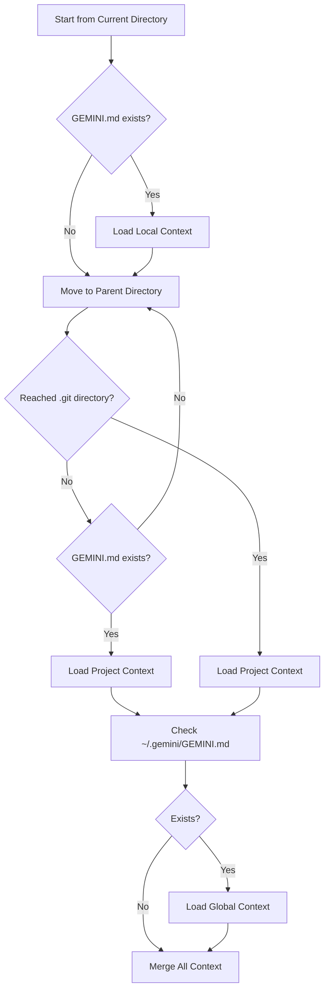

# 🧠 Context Engineering

Context engineering is the art and science of providing relevant, structured information to the AI to get better results. In Gemini CLI, context engineering is a core feature that makes interactions more intelligent and project-aware.

## 📋 Table of Contents

- [Understanding Context](#understanding-context)
- [Context Hierarchy](#context-hierarchy)
- [Context File Format](#context-file-format)
- [Best Practices](#best-practices)
- [Advanced Techniques](#advanced-techniques)
- [Debugging Context](#debugging-context)
- [Next Steps](#next-steps)

## Understanding Context

### What is Context?

Context is **additional information** provided to the AI that helps it understand:

- What kind of project you're working on
- Coding standards and preferences
- Project structure and conventions
- Current goals or tasks
- Domain-specific knowledge

### Why Context Matters

Without context, AI responses are generic. With good context, responses become:

- **Project-aware**: Understanding your specific codebase
- **Style-consistent**: Following your coding conventions
- **Goal-oriented**: Aligned with your current objectives
- **Domain-informed**: Using relevant terminology and patterns

### Context in Action

**Without Context:**

```
User: "Add validation to the user service"
AI: "I'll add basic validation. What fields need validation?"
```

**With Context:**

```
User: "Add validation to the user service"
AI: "I'll add validation to UserService following your project's pattern.
Based on your TypeScript strict mode and functional programming preferences,
I'll create a validateUser function with detailed JSDoc comments and
comprehensive error handling for email, password, and age fields."
```

## Context Hierarchy

### File Discovery Process

Gemini CLI discovers context files hierarchically:



### Context Priority

Contexts are merged with **higher priority overriding lower priority**:

1. **Local Context** (`./GEMINI.md`) - Highest priority
2. **Project Context** (`../GEMINI.md`, `../../GEMINI.md`, etc.)
3. **Repository Context** (`repo-root/GEMINI.md`)
4. **Global Context** (`~/.gemini/GEMINI.md`) - Lowest priority

### Implementation

```typescript
// packages/core/src/utils/memoryDiscovery.ts
export async function loadServerHierarchicalMemory(
  cwd: string,
  additionalMemoryFiles: string[],
  includeMemoryFileDiscovery: boolean,
  fileDiscoveryService: FileDiscoveryService,
  includePaths: string[],
  folderTrustLevel: FolderTrustLevel,
): Promise<{ memoryContent: string; fileCount: number }> {
  const memoryContent: string[] = [];
  let fileCount = 0;

  // 1. Load global context first (lowest priority)
  const globalContext = await loadGlobalContext();
  if (globalContext) {
    memoryContent.push(formatContext(globalContext, 'Global'));
    fileCount++;
  }

  // 2. Load project contexts (search upward)
  const projectContexts = await searchUpwardForContexts(cwd);
  for (const context of projectContexts.reverse()) {
    // Reverse for proper priority
    memoryContent.push(formatContext(context.content, context.relativePath));
    fileCount++;
  }

  // 3. Load local contexts (highest priority)
  const localContexts = await searchDownwardForContexts(cwd);
  for (const context of localContexts) {
    memoryContent.push(formatContext(context.content, context.relativePath));
    fileCount++;
  }

  return {
    memoryContent: memoryContent.join('\n\n'),
    fileCount,
  };
}
```

## Context File Format

### Basic Structure

Context files use **Markdown format** for readability and structure:

```markdown
# Project Name

## Overview

Brief description of what this project does.

## Coding Standards

- Use TypeScript strict mode
- Prefer functional programming
- All exports must have JSDoc comments

## Architecture

Describe key architectural patterns and decisions.

## Current Focus

What you're currently working on.
```

### Recommended Sections

#### **Project Information**

```markdown
# My Awesome Library

## Overview

A TypeScript library for data validation with functional programming patterns.

## Tech Stack

- TypeScript 5.0+
- Node.js 20+
- Vitest for testing
- ESLint + Prettier for code quality
```

#### **Coding Standards**

```markdown
## Coding Standards

### TypeScript

- Use strict mode: `"strict": true`
- Prefer `interface` over `type` for object definitions
- Use `const` assertions where appropriate

### Naming Conventions

- Interfaces: PascalCase with `I` prefix (`IUserService`)
- Functions: camelCase (`validateUser`)
- Constants: SCREAMING_SNAKE_CASE (`MAX_RETRY_COUNT`)
- Files: kebab-case (`user-service.ts`)

### Code Style

- Use 2 spaces for indentation
- Always use semicolons
- Prefer single quotes for strings
- Maximum line length: 100 characters
```

#### **Architecture Patterns**

```markdown
## Architecture

### Directory Structure
```

src/
├── services/ # Business logic
├── utils/ # Shared utilities
├── types/ # TypeScript type definitions
└── tests/ # Test files

```

### Design Patterns
- **Repository Pattern**: For data access
- **Dependency Injection**: Using constructor injection
- **Factory Pattern**: For creating complex objects
```

#### **Domain Context**

```markdown
## Domain Knowledge

### Business Rules

- Users must be 18+ years old
- Email addresses must be unique
- Passwords must contain at least 8 characters

### Key Entities

- **User**: Primary entity with email, password, profile
- **Session**: Temporary authentication state
- **Permission**: Fine-grained access control
```

### Context File Examples

#### **Global Context** (`~/.gemini/GEMINI.md`)

```markdown
# Global Development Preferences

## General Coding Style

- Prefer functional programming over OOP when possible
- Write comprehensive tests for all public APIs
- Use meaningful variable and function names
- Avoid abbreviations unless commonly understood

## Documentation Standards

- All public functions must have JSDoc comments
- Include examples in documentation when helpful
- Keep README files up to date

## Git Practices

- Use conventional commit messages
- Write descriptive commit messages
- Squash commits before merging
```

#### **Project Context** (`./GEMINI.md`)

```markdown
# Payment Processing Service

## Overview

Microservice handling payment transactions with support for multiple payment providers.

## Current Sprint Goals

- Implement Stripe integration
- Add comprehensive error handling
- Set up monitoring and alerting

## Architecture

- **Hexagonal Architecture** with ports and adapters
- **Event-driven** communication between services
- **Database per service** pattern

## Security Requirements

- All payment data must be encrypted at rest
- PCI DSS compliance required
- Audit logs for all transactions

## Testing Strategy

- Unit tests for business logic
- Integration tests for payment provider APIs
- End-to-end tests for critical payment flows
```

#### **Local Context** (`./src/services/GEMINI.md`)

```markdown
# Services Layer

## Purpose

Contains all business logic and domain services.

## Current Work

Refactoring the UserService to use the new validation framework.

## Patterns Used

- **Service Layer Pattern**: Each service handles one domain area
- **Dependency Injection**: Services receive dependencies via constructor
- **Result Pattern**: Services return Result<T, E> instead of throwing

## Key Services

- `UserService`: User management and authentication
- `PaymentService`: Payment processing logic
- `NotificationService`: Email and SMS notifications
```

## Best Practices

### 1. **Be Specific and Relevant**

❌ **Bad:**

```markdown
# My Project

This is a project I'm working on.
```

✅ **Good:**

```markdown
# E-commerce API

## Overview

RESTful API for e-commerce platform handling products, orders, and payments.

## Current Focus

Implementing real-time inventory tracking with WebSocket notifications.
```

### 2. **Use Clear Structure**

❌ **Bad:**

```markdown
We use TypeScript and need to follow coding standards and test everything...
```

✅ **Good:**

```markdown
## Coding Standards

- Language: TypeScript 5.0+ with strict mode
- Testing: Vitest with >90% coverage requirement
- Linting: ESLint with custom rules for async/await patterns

## Code Quality Requirements

- All public APIs must have JSDoc documentation
- Integration tests required for external API calls
- Performance tests for endpoints handling >1000 requests/minute
```

### 3. **Include Examples**

````markdown
## Error Handling Pattern

Use the Result pattern for operations that can fail:

```typescript
// Good
async function validateUser(
  data: UserData,
): Promise<Result<User, ValidationError>> {
  if (!data.email) {
    return Err(new ValidationError('Email is required'));
  }
  return Ok(new User(data));
}

// Bad
async function validateUser(data: UserData): Promise<User> {
  if (!data.email) {
    throw new Error('Email is required'); // Don't throw
  }
  return new User(data);
}
```
````

````

### 4. **Keep Context Current**

Update context files when:
- Project goals change
- New patterns are adopted
- Architecture evolves
- Team standards update

### 5. **Scope Context Appropriately**

- **Global**: Personal preferences, general standards
- **Project**: Project-specific rules, architecture
- **Local**: Module-specific patterns, current tasks

## Advanced Techniques

### Dynamic Context

Use environment or configuration to customize context:

```markdown
# Development Environment Context

## Database
- Local PostgreSQL on port 5432
- Test data populated via `npm run seed`

## External Services
- Payment API: Sandbox mode (test keys)
- Email Service: Console logging (no real emails)

## Debug Settings
- Verbose logging enabled
- Hot reload on file changes
- Source maps included
````

### Context Templates

Create templates for common project types:

```markdown
<!-- template-typescript-library.md -->

# TypeScript Library Template

## Tech Stack

- TypeScript 5.0+
- Node.js 20+
- Vitest for testing
- Rollup for bundling

## Standards

- Use semantic versioning
- Export all public APIs from index.ts
- Include TypeScript declarations
- Maintain comprehensive README

## Release Process

1. Update CHANGELOG.md
2. Bump version in package.json
3. Create git tag
4. Publish to npm
```

### Conditional Context

Use different context based on the current task:

```markdown
## Context: Refactoring Phase

### Current Goal

Migrating from class-based to functional approach.

### Patterns to Use

- Pure functions instead of methods
- Immutable data structures
- Composition over inheritance

### Migration Strategy

1. Extract pure functions from classes
2. Replace mutable state with functional alternatives
3. Update tests to match new signatures
4. Remove empty classes
```

## Debugging Context

### Context Visibility

Check what context is loaded:

```bash
# Gemini CLI shows context information in the footer
[Context: 3 files loaded] User: your message here
```

### Context File Discovery

Debug context file discovery:

```typescript
// packages/core/src/utils/memoryDiscovery.ts
export function debugContextDiscovery(cwd: string): void {
  console.log('Context discovery starting from:', cwd);

  const searchPaths = getContextSearchPaths(cwd);
  for (const path of searchPaths) {
    const exists = fs.existsSync(path);
    console.log(`${exists ? '✓' : '✗'} ${path}`);
  }
}
```

### Common Issues

#### **Context Not Loading**

- Check file permissions
- Verify file is named `GEMINI.md` (case-sensitive)
- Ensure file is in UTF-8 encoding

#### **Wrong Context Priority**

- More specific contexts override general ones
- Local directory has highest priority
- Check for hidden context files

#### **Context Too Long**

- Keep context files concise
- Focus on current task
- Use multiple small files instead of one large file

### Testing Context

Create test scenarios for context:

```typescript
// test-context.ts
import { loadServerHierarchicalMemory } from '../src/utils/memoryDiscovery.js';

describe('Context Loading', () => {
  it('should load context in correct priority order', async () => {
    const result = await loadServerHierarchicalMemory(
      '/project/src/services',
      [],
      true,
      fileDiscoveryService,
      [],
      'trusted',
    );

    expect(result.fileCount).toBe(3);
    expect(result.memoryContent).toContain('Services Layer'); // Local context
    expect(result.memoryContent).toContain('Payment Processing'); // Project context
  });
});
```

## Next Steps

Now that you understand context engineering, continue your learning journey:

### **🗺️ Next: [Guided Code Walkthrough](./04-code-walkthrough.md)**

Take a guided tour through the key files and directories in the codebase.

### **🔍 Related Topics**

- [LLM Workflow Explained](./02-llm-workflow.md) - How context flows through the system
- [Prompt Engineering Patterns](./10-prompt-patterns.md) - Advanced prompt construction
- [Configuration Guide](../cli/configuration.md) - Setting up context files

### **🛠️ Hands-on Exercises**

1. **Create Context Files**: Set up a hierarchy of context files for a sample project
2. **Test Context Priority**: Create conflicting contexts and see which takes precedence
3. **Optimize Context**: Refactor verbose context into concise, effective guidance

### **💡 Key Takeaways**

- Context engineering dramatically improves AI responses
- Use hierarchical context files for different scopes
- Keep context specific, structured, and current
- Test your context to ensure it's working as expected
- Good context is an investment that pays dividends over time
