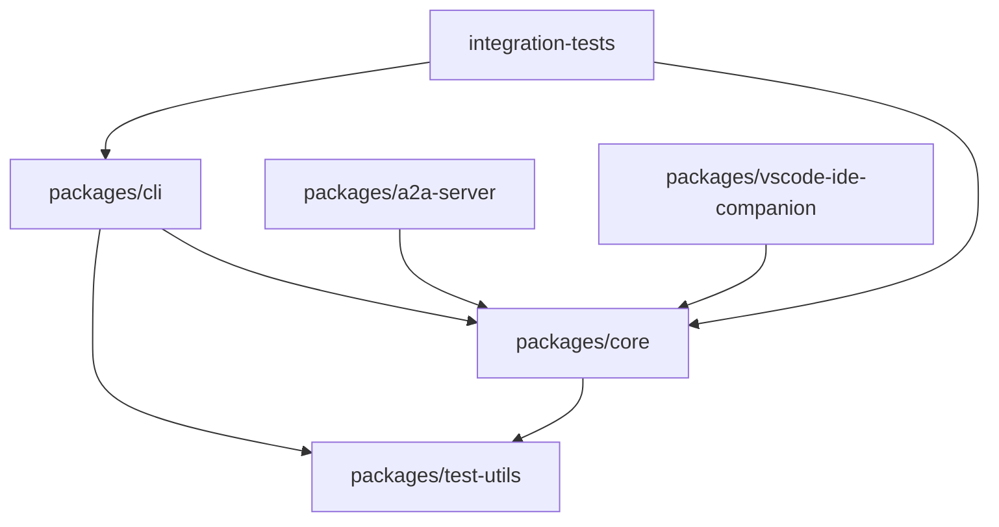
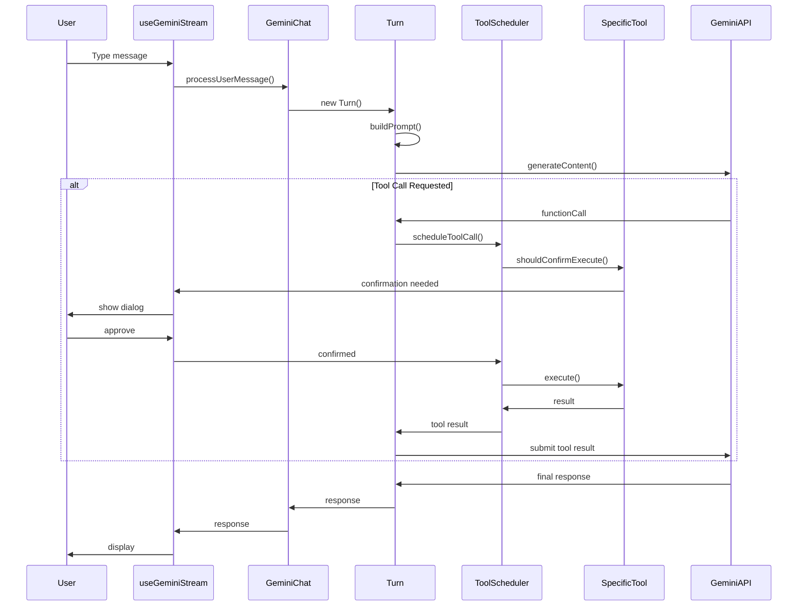

# 🗺️ Guided Code Walkthrough

This guide takes you on a comprehensive tour of the Gemini CLI codebase, helping you understand where to find key functionality and how the code is organized.

## 📋 Table of Contents

- [Repository Structure](#repository-structure)
- [CLI Package Tour](#cli-package-tour)
- [Core Package Tour](#core-package-tour)
- [Key Files Deep Dive](#key-files-deep-dive)
- [Testing Infrastructure](#testing-infrastructure)
- [Configuration & Build](#configuration--build)
- [Next Steps](#next-steps)

## Repository Structure

### High-Level Overview

```
gemini-cli/
├── docs/                    # Documentation (you are here!)
├── packages/               # Main source code packages
│   ├── cli/               # User interface and CLI logic
│   ├── core/              # AI and tool orchestration
│   ├── a2a-server/        # Agent-to-agent communication
│   ├── test-utils/        # Shared testing utilities
│   └── vscode-ide-companion/ # VSCode extension
├── integration-tests/      # End-to-end tests
├── scripts/               # Build and utility scripts
├── bundle/                # Compiled distribution files
└── .github/               # GitHub Actions and workflows
```

### Package Dependencies



## CLI Package Tour

### 📁 `packages/cli/src/` - The User Interface

This package handles everything the user sees and interacts with.

```
cli/src/
├── commands/              # Slash command implementations
│   ├── clear.ts          # /clear command
│   ├── help.ts           # /help command
│   └── index.ts          # Command registry
├── ui/                   # React-based terminal UI
│   ├── components/       # Reusable UI components
│   ├── hooks/           # Custom React hooks
│   └── types.ts         # UI-specific TypeScript types
├── config/              # CLI configuration management
├── services/            # CLI-specific services
├── utils/               # CLI utilities
├── gemini.tsx           # 🔥 Main application entry point
└── nonInteractiveCli.ts # Non-interactive mode handler
```

### Key CLI Files

#### **Main Entry Point**

```typescript
// packages/cli/src/gemini.tsx
export function GeminiCli() {
  // Main React component that renders the entire CLI interface
  return (
    <AppContextProvider>
      <GeminiStreamProvider>
        <MainInterface />
      </GeminiStreamProvider>
    </AppContextProvider>
  );
}
```

#### **User Interface Components**

```typescript
// packages/cli/src/ui/components/
├── ChatInterface.tsx        # Main chat UI
├── ConfirmationDialog.tsx   # Tool confirmation prompts
├── InputBox.tsx            # User input handling
├── MessageList.tsx         # Conversation history display
├── StatusBar.tsx           # Footer with context info
└── ToolCallDisplay.tsx     # Tool execution feedback
```

#### **Core UI Hooks**

```typescript
// packages/cli/src/ui/hooks/
├── useGeminiStream.ts      # 🔥 Main conversation management
├── useInputHistory.ts      # Input history and navigation
├── useKeyboardShortcuts.ts # Keyboard shortcuts
├── useToolCalls.ts         # Tool execution state
└── useWebSocket.ts         # Real-time communication
```

## Core Package Tour

### 📁 `packages/core/src/` - The AI Engine

This package contains all the AI orchestration and tool management logic.

```
core/src/
├── core/                 # Core conversation logic
│   ├── geminiChat.ts     # 🔥 Main chat orchestrator
│   ├── turn.ts           # Single conversation turn
│   ├── coreToolScheduler.ts # Tool execution manager
│   └── prompts.ts        # Prompt construction
├── tools/                # Available tools
│   ├── shell.ts          # Shell command execution
│   ├── fileSystem.ts     # File read/write operations
│   ├── webFetch.ts       # Web content fetching
│   ├── memory.ts         # Memory/note taking
│   └── tools.ts          # 🔥 Tool framework
├── config/               # Configuration management
├── utils/                # Core utilities
│   ├── memoryDiscovery.ts # Context file discovery
│   └── generateContentResponseUtilities.ts
├── mcp/                  # Model Context Protocol
├── services/             # Core services
└── index.ts              # 🔥 Public API exports
```

### Key Core Files

#### **Main Chat Orchestrator**

```typescript
// packages/core/src/core/geminiChat.ts
export class GeminiChat {
  private conversationHistory: ConversationTurn[] = [];
  private model: GenerativeModel;
  private toolRegistry: ToolRegistry;

  async processUserMessage(
    message: string | PartListUnion,
    options: ChatOptions = {},
  ): Promise<ChatResponse> {
    // Creates a new Turn and processes it
    const turn = new Turn(message, this.model, this.config);
    return await turn.process();
  }
}
```

#### **Tool Framework**

```typescript
// packages/core/src/tools/tools.ts
export interface ToolInvocation<TParams, TResult> {
  params: TParams;
  getDescription(): string;
  toolLocations(): ToolLocation[];
  shouldConfirmExecute(
    signal: AbortSignal,
  ): Promise<ToolCallConfirmationDetails | false>;
  execute(signal: AbortSignal): Promise<TResult>;
}

export abstract class BaseToolInvocation<TParams, TResult>
  implements ToolInvocation<TParams, TResult> {
  // Base implementation for all tools
}
```

#### **Tool Execution Coordinator**

```typescript
// packages/core/src/core/coreToolScheduler.ts
export class CoreToolScheduler {
  async scheduleToolCalls(
    toolCalls: ToolCallRequestInfo[],
    abortSignal: AbortSignal,
  ): Promise<ToolCallResponseInfo[]> {
    // Coordinates tool execution with user confirmation
    // Handles parallel and sequential execution
    // Manages tool lifecycle and error handling
  }
}
```

## Key Files Deep Dive

### 🔥 Critical Files to Understand

#### 1. **Main Conversation Flow**

```typescript
// packages/cli/src/ui/hooks/useGeminiStream.ts
export function useGeminiStream() {
  const handleUserMessage = useCallback(async (message: string) => {
    // 1. Process user input (handle commands, validate)
    // 2. Send to core for AI processing
    // 3. Handle tool calls and confirmations
    // 4. Display results to user
  }, []);

  const scheduleToolCalls = useCallback(
    async (toolCalls: ToolCallRequestInfo[]) => {
      // Handle tool execution requests from AI
      // Show confirmation dialogs
      // Execute approved tools
      // Send results back to AI
    },
    [],
  );

  return {
    handleUserMessage,
    scheduleToolCalls,
    conversationHistory,
    isResponding,
  };
}
```

#### 2. **Context Discovery System**

```typescript
// packages/core/src/utils/memoryDiscovery.ts
export async function loadServerHierarchicalMemory(
  cwd: string,
  // ... other params
): Promise<{ memoryContent: string; fileCount: number }> {
  // 1. Search for global context (~/.gemini/GEMINI.md)
  // 2. Search upward for project context files
  // 3. Search downward for local context files
  // 4. Merge contexts with proper priority
  return { memoryContent: merged, fileCount };
}
```

#### 3. **Tool Registry**

```typescript
// packages/core/src/tools/toolRegistry.ts
export class ToolRegistry {
  private tools = new Map<string, ToolBuilder>();

  registerTool<TParams, TResult>(
    name: string,
    builder: ToolBuilder<TParams, TResult>,
  ): void {
    this.tools.set(name, builder);
  }

  async createTool(name: string, params: unknown): Promise<ToolInvocation> {
    const builder = this.tools.get(name);
    if (!builder) {
      throw new Error(`Unknown tool: ${name}`);
    }
    return await builder.build(params);
  }

  getToolDefinitions(): ToolDefinition[] {
    // Returns function definitions for AI prompt
    return Array.from(this.tools.entries()).map(([name, builder]) => ({
      name,
      description: builder.description,
      parameters: builder.schema,
    }));
  }
}
```

### 🧩 How Components Work Together

#### Request Processing Flow



### Tool Implementation Example

```typescript
// packages/core/src/tools/fileSystem.ts
export class ReadFileTool extends BaseToolInvocation<
  ReadFileParams,
  ReadFileResult
> {
  constructor(
    readonly params: ReadFileParams,
    protected readonly messageBus?: MessageBus,
  ) {
    super(params, messageBus);
  }

  getDescription(): string {
    return `Reading file: ${this.params.path}`;
  }

  toolLocations(): ToolLocation[] {
    return [{ path: this.params.path }];
  }

  // Read operations usually don't need confirmation
  async shouldConfirmExecute(): Promise<false> {
    return false;
  }

  async execute(signal: AbortSignal): Promise<ReadFileResult> {
    try {
      const content = await fs.readFile(this.params.path, 'utf-8');
      return {
        success: true,
        content,
        path: this.params.path,
      };
    } catch (error) {
      return {
        success: false,
        error: `Failed to read file: ${error.message}`,
        path: this.params.path,
      };
    }
  }
}
```

## Testing Infrastructure

### Test Organization

```
packages/*/src/**/*.test.ts    # Unit tests co-located with source
integration-tests/            # End-to-end integration tests
scripts/tests/               # Build script tests
```

### Key Testing Patterns

#### **Mocking External Dependencies**

```typescript
// Typical test setup pattern
import { vi } from 'vitest';

// Mock external modules
vi.mock('@google/genai', async (importOriginal) => {
  const actual = await importOriginal();
  return {
    ...actual,
    GenerativeModel: vi.fn(() => ({
      generateContent: vi.fn(),
    })),
  };
});

// Mock file system operations
vi.mock('fs/promises', () => ({
  readFile: vi.fn(),
  writeFile: vi.fn(),
  access: vi.fn(),
}));
```

#### **Testing Tool Execution**

```typescript
// packages/core/src/tools/shell.test.ts
describe('ShellTool', () => {
  it('should execute shell command with user confirmation', async () => {
    const tool = new ShellTool({ command: 'echo hello' });

    // Mock user approval
    const confirmationDetails = await tool.shouldConfirmExecute(
      new AbortController().signal,
    );
    expect(confirmationDetails).toBeTruthy();

    // Simulate approval
    confirmationDetails?.onConfirm(ToolConfirmationOutcome.Approved);

    const result = await tool.execute(new AbortController().signal);
    expect(result.success).toBe(true);
    expect(result.output).toContain('hello');
  });
});
```

#### **Testing UI Components**

```typescript
// packages/cli/src/ui/components/ChatInterface.test.tsx
import { render } from 'ink-testing-library';
import { ChatInterface } from './ChatInterface.js';

describe('ChatInterface', () => {
  it('should render conversation history', () => {
    const { lastFrame } = render(
      <ChatInterface
        history={mockHistory}
        onUserInput={vi.fn()}
      />
    );

    expect(lastFrame()).toContain('User: Hello');
    expect(lastFrame()).toContain('Gemini: Hi there!');
  });
});
```

## Configuration & Build

### Build System Overview

```typescript
// Root package.json scripts
{
  "build": "node scripts/build.js",           // Build all packages
  "bundle": "npm run generate && node esbuild.config.js", // Create distribution
  "test": "npm run test --workspaces",        // Run all tests
  "preflight": "npm run clean && npm ci && npm run format && npm run lint:ci && npm run build && npm run typecheck && npm run test:ci"
}
```

### Key Configuration Files

```
tsconfig.json              # Root TypeScript configuration
eslint.config.js           # ESLint rules and settings
.prettierrc.json           # Code formatting rules
vitest.config.ts           # Test runner configuration
esbuild.config.js          # Bundle configuration
```

### Development Scripts

```typescript
// scripts/build.js - Main build orchestrator
// scripts/start.js - Development server
// scripts/clean.js - Clean build artifacts
// scripts/generate-git-commit-info.js - Version info
```

## Next Steps

Now that you've toured the codebase, continue your learning journey:

### **🔧 Next: [Core Classes & Interfaces](./05-core-classes.md)**

Deep dive into the key TypeScript types and class hierarchies.

### **🔍 Related Topics**

- [Architecture Deep Dive](./01-architecture-deep-dive.md) - High-level system design
- [LLM Workflow Explained](./02-llm-workflow.md) - How data flows through the system
- [Tool System Deep Dive](./06-tool-system.md) - Detailed tool implementation

### **🛠️ Hands-on Exercises**

1. **Follow a Request**: Trace a user message through the codebase from input to output
2. **Find Tool Examples**: Examine different tool implementations to understand patterns
3. **Explore Tests**: Look at test files to understand expected behavior
4. **Build the Project**: Run `npm run build` and examine the output

### **💡 Key Takeaways**

- The CLI package handles user interface, the Core package handles AI logic
- Tools are the primary extension mechanism
- Configuration and context are loaded hierarchically
- Testing follows co-location patterns with comprehensive mocking
- The build system is designed for multi-package development
