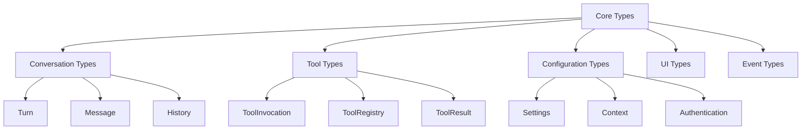

# 🔧 Core Classes & Interfaces

Understanding the key TypeScript types, classes, and interfaces is essential for contributing effectively to Gemini CLI. This guide covers the most important abstractions and how they work together.

## 📋 Table of Contents

- [Type System Overview](#type-system-overview)
- [Core Conversation Types](#core-conversation-types)
- [Tool System Types](#tool-system-types)
- [Configuration & Context Types](#configuration--context-types)
- [UI & Event Types](#ui--event-types)
- [Error Handling Types](#error-handling-types)
- [Next Steps](#next-steps)

## Type System Overview

### Design Philosophy

Gemini CLI uses TypeScript's type system to ensure:

- **Type Safety**: Catch errors at compile time
- **Developer Experience**: Rich IntelliSense and auto-completion
- **API Contracts**: Clear interfaces between components
- **Documentation**: Types serve as living documentation

### Key Type Categories



## Core Conversation Types

### Turn and Response Types

The conversation system is built around strongly-typed turn management:

```typescript
// packages/core/src/core/turn.ts
export interface TurnOptions {
  includeToolDefinitions?: boolean;
  customSystemInstructions?: string;
  additionalContext?: string;
}

export interface TurnResult {
  response: string;
  toolCalls?: ToolCallRequestInfo[];
  metadata?: {
    tokenCount?: number;
    model?: string;
    timestamp: number;
  };
}

export class Turn {
  constructor(
    private readonly userInput: string | PartListUnion,
    private readonly model: GenerativeModel,
    private readonly config: Config,
    private readonly options: TurnOptions = {},
  ) {}

  async process(): Promise<TurnResult> {
    // Implementation handles prompt building, API calls, and response processing
  }
}
```

### Conversation History

```typescript
// packages/core/src/core/geminiChat.ts
export interface ConversationTurn {
  id: string;
  timestamp: number;
  userMessage: string | PartListUnion;
  assistantResponse: string;
  toolCalls?: ToolCallInfo[];
  metadata?: ConversationMetadata;
}

export interface ChatOptions {
  includeHistory?: boolean;
  maxHistoryLength?: number;
  customContext?: string;
  toolsEnabled?: boolean;
}

export interface ChatResponse {
  id: string;
  content: string;
  toolCalls?: ToolCallRequestInfo[];
  metadata: {
    tokenCount: number;
    responseTime: number;
    model: string;
  };
}
```

### Message Types

```typescript
// packages/cli/src/ui/types.ts
export enum MessageType {
  USER = 'user',
  GEMINI = 'gemini',
  INFO = 'info',
  ERROR = 'error',
  TOOL_CALL = 'tool_call',
  TOOL_RESULT = 'tool_result',
}

export interface HistoryItem {
  id: string;
  type: MessageType;
  timestamp: number;
  text?: string;
  toolCall?: ToolCallInfo;
  metadata?: Record<string, unknown>;
}

export interface HistoryItemWithId extends HistoryItem {
  messageId: string;
  content: React.ReactNode;
}
```

## Tool System Types

### Core Tool Interfaces

The tool system is built around a flexible, type-safe architecture:

```typescript
// packages/core/src/tools/tools.ts
export interface ToolInvocation<
  TParams extends object,
  TResult extends ToolResult,
> {
  /** Validated parameters for this invocation */
  params: TParams;

  /** Get description of what this tool will do */
  getDescription(): string;

  /** Get file system paths this tool will affect */
  toolLocations(): ToolLocation[];

  /** Check if user confirmation is needed */
  shouldConfirmExecute(
    abortSignal: AbortSignal,
  ): Promise<ToolCallConfirmationDetails | false>;

  /** Execute the tool with validated parameters */
  execute(
    signal: AbortSignal,
    updateOutput?: (output: string | AnsiOutput) => void,
    shellExecutionConfig?: ShellExecutionConfig,
  ): Promise<TResult>;
}

export interface ToolLocation {
  path: string; // Absolute path to the file
  line?: number; // Optional line number
}

export interface ToolResult {
  success: boolean;
  error?: string;
  metadata?: Record<string, unknown>;
}
```

### Tool Builder Pattern

Tools are created using the builder pattern for type safety:

```typescript
// packages/core/src/tools/tools.ts
export interface ToolBuilder<
  TParams extends object,
  TResult extends ToolResult,
> {
  /** Tool name for registration */
  name: string;

  /** Human-readable description */
  description: string;

  /** JSON schema for parameter validation */
  schema: JsonSchema;

  /** Build a tool instance with validated parameters */
  build(params: unknown): Promise<ToolInvocation<TParams, TResult>>;
}

export abstract class BaseToolBuilder<
  TParams extends object,
  TResult extends ToolResult,
> implements ToolBuilder<TParams, TResult>
{
  abstract name: string;
  abstract description: string;
  abstract schema: JsonSchema;

  async build(params: unknown): Promise<ToolInvocation<TParams, TResult>> {
    const validatedParams = await this.validateParams(params);
    return this.createTool(validatedParams);
  }

  protected abstract validateParams(params: unknown): Promise<TParams>;
  protected abstract createTool(
    params: TParams,
  ): ToolInvocation<TParams, TResult>;
}
```

### Tool Registry Types

```typescript
// packages/core/src/tools/toolRegistry.ts
export interface ToolDefinition {
  name: string;
  displayName: string;
  description: string;
  parameters?: {
    type: 'object';
    properties: Record<string, ParameterSchema>;
    required?: string[];
  };
}

export interface ToolCallRequestInfo {
  callId: string;
  name: string;
  args: Record<string, unknown>;
  isClientInitiated?: boolean;
  prompt_id?: string;
}

export interface ToolCallResponseInfo {
  callId: string;
  success: boolean;
  result?: unknown;
  error?: string;
  metadata?: {
    executionTime: number;
    outputTruncated?: boolean;
  };
}
```

### Specific Tool Types

Each tool defines its own parameter and result types:

```typescript
// packages/core/src/tools/fileSystem.ts
export interface ReadFileParams {
  path: string;
  encoding?: 'utf8' | 'base64';
}

export interface ReadFileResult extends ToolResult {
  content?: string;
  path: string;
  size?: number;
  lastModified?: Date;
}

export interface WriteFileParams {
  path: string;
  content: string;
  createDirectories?: boolean;
  backup?: boolean;
}

export interface WriteFileResult extends ToolResult {
  path: string;
  bytesWritten?: number;
  backupPath?: string;
}

// packages/core/src/tools/shell.ts
export interface ShellParams {
  command: string;
  workingDirectory?: string;
  timeout?: number;
  environment?: Record<string, string>;
}

export interface ShellResult extends ToolResult {
  command: string;
  exitCode?: number;
  output?: string;
  stderr?: string;
  executionTime: number;
}
```

## Configuration & Context Types

### Configuration System

```typescript
// packages/core/src/config/config.ts
export interface Config {
  // Authentication configuration
  auth: AuthConfig;

  // Model and API settings
  model: ModelConfig;

  // Tool configuration
  tools: ToolConfig;

  // Context and memory settings
  context: ContextConfig;

  // UI and display preferences
  ui: UIConfig;
}

export interface AuthConfig {
  type: 'google' | 'api_key' | 'vertex_ai';
  apiKey?: string;
  projectId?: string;
  credentials?: ServiceAccountCredentials;
}

export interface ModelConfig {
  name: string;
  temperature?: number;
  topP?: number;
  topK?: number;
  maxOutputTokens?: number;
  safetySettings?: SafetySetting[];
}

export interface ContextConfig {
  fileName: string; // Default: 'GEMINI.md'
  maxFiles: number; // Maximum context files to load
  maxTotalSize: number; // Maximum total context size
  includeGlobalContext: boolean; // Include ~/.gemini/GEMINI.md
  trustLevel: FolderTrustLevel; // Security trust level
}
```

### Context Discovery Types

```typescript
// packages/core/src/utils/memoryDiscovery.ts
export interface ContextFile {
  path: string;
  relativePath: string;
  content: string;
  priority: number; // Higher number = higher priority
  source: 'global' | 'project' | 'local';
}

export interface MemoryResult {
  memoryContent: string; // Merged context content
  fileCount: number; // Number of files loaded
  sources: ContextFile[]; // Individual context files
}

export enum FolderTrustLevel {
  TRUSTED = 'trusted',
  UNTRUSTED = 'untrusted',
  ASK = 'ask',
}
```

## UI & Event Types

### React UI Types

The CLI uses React with Ink for terminal UI:

```typescript
// packages/cli/src/ui/types.ts
export interface AppState {
  isAuthenticated: boolean;
  currentUser?: User;
  conversations: ConversationSummary[];
  activeConversationId?: string;
  streamingState: StreamingState;
}

export enum StreamingState {
  IDLE = 'idle',
  RESPONDING = 'responding',
  WAITING_FOR_CONFIRMATION = 'waiting_for_confirmation',
}

export interface UseGeminiStreamReturn {
  // State
  conversationHistory: HistoryItem[];
  streamingState: StreamingState;
  isResponding: boolean;

  // Actions
  handleUserMessage: (message: string) => Promise<void>;
  scheduleToolCalls: (calls: ToolCallRequestInfo[]) => Promise<void>;
  cancelOngoingRequest: () => void;
  clearConversation: () => void;
}
```

### Event System Types

```typescript
// packages/core/src/core/events.ts
export enum GeminiEventType {
  CONTENT = 'content',
  TOOL_CALL_REQUEST = 'tool_call_request',
  TOOL_CALL_RESPONSE = 'tool_call_response',
  ERROR = 'error',
  STREAM_END = 'stream_end',
}

export interface GeminiEvent {
  type: GeminiEventType;
  timestamp: number;
  data: unknown;
}

export interface ToolCallEvent extends GeminiEvent {
  type: GeminiEventType.TOOL_CALL_REQUEST;
  data: {
    callId: string;
    toolName: string;
    parameters: Record<string, unknown>;
    confirmationRequired: boolean;
  };
}

export interface ContentEvent extends GeminiEvent {
  type: GeminiEventType.CONTENT;
  data: {
    content: string;
    isPartial: boolean;
    metadata?: Record<string, unknown>;
  };
}
```

### Confirmation System Types

```typescript
// packages/core/src/tools/tools.ts
export interface ToolCallConfirmationDetails {
  type: 'exec' | 'mcp' | 'info';
  title: string;
  onConfirm: (outcome: ToolConfirmationOutcome) => Promise<void>;
}

export interface ToolExecuteConfirmationDetails
  extends ToolCallConfirmationDetails {
  type: 'exec';
  command: string;
  rootCommand: string;
}

export interface ToolMcpConfirmationDetails
  extends ToolCallConfirmationDetails {
  type: 'mcp';
  serverName: string;
  toolName: string;
  toolDisplayName: string;
}

export interface ToolInfoConfirmationDetails
  extends ToolCallConfirmationDetails {
  type: 'info';
  prompt: string;
  urls?: string[];
}

export enum ToolConfirmationOutcome {
  APPROVED = 'approved',
  DENIED = 'denied',
  CANCELLED = 'cancelled',
}
```

## Error Handling Types

### Error Hierarchy

```typescript
// packages/core/src/errors/errors.ts
export abstract class GeminiCliError extends Error {
  abstract readonly code: string;
  abstract readonly category: ErrorCategory;

  constructor(
    message: string,
    public readonly cause?: Error,
    public readonly metadata?: Record<string, unknown>,
  ) {
    super(message);
    this.name = this.constructor.name;
  }
}

export enum ErrorCategory {
  AUTHENTICATION = 'authentication',
  API = 'api',
  TOOL_EXECUTION = 'tool_execution',
  CONFIGURATION = 'configuration',
  USER_INPUT = 'user_input',
  SYSTEM = 'system',
}

export class AuthenticationError extends GeminiCliError {
  readonly code = 'AUTH_FAILED';
  readonly category = ErrorCategory.AUTHENTICATION;
}

export class ToolExecutionError extends GeminiCliError {
  readonly code = 'TOOL_EXECUTION_FAILED';
  readonly category = ErrorCategory.TOOL_EXECUTION;

  constructor(
    message: string,
    public readonly toolName: string,
    public readonly toolParams: unknown,
    cause?: Error,
  ) {
    super(message, cause, { toolName, toolParams });
  }
}
```

### Result Pattern Types

Many operations use the Result pattern for explicit error handling:

```typescript
// packages/core/src/utils/result.ts
export type Result<T, E = Error> = Success<T> | Failure<E>;

export interface Success<T> {
  success: true;
  data: T;
}

export interface Failure<E> {
  success: false;
  error: E;
}

export function Ok<T>(data: T): Success<T> {
  return { success: true, data };
}

export function Err<E>(error: E): Failure<E> {
  return { success: false, error };
}

// Usage example
export async function readFileResult(
  path: string,
): Promise<Result<string, ToolExecutionError>> {
  try {
    const content = await fs.readFile(path, 'utf-8');
    return Ok(content);
  } catch (error) {
    return Err(
      new ToolExecutionError(
        `Failed to read file: ${error.message}`,
        'read_file',
        { path },
        error,
      ),
    );
  }
}
```

## Advanced Type Patterns

### Generic Tool Builder

```typescript
// packages/core/src/tools/builders.ts
export function createToolBuilder<
  TParams extends object,
  TResult extends ToolResult,
>(config: {
  name: string;
  description: string;
  schema: JsonSchema;
  validator: (params: unknown) => Promise<TParams>;
  executor: (params: TParams) => ToolInvocation<TParams, TResult>;
}): ToolBuilder<TParams, TResult> {
  return {
    name: config.name,
    description: config.description,
    schema: config.schema,

    async build(params: unknown): Promise<ToolInvocation<TParams, TResult>> {
      const validatedParams = await config.validator(params);
      return config.executor(validatedParams);
    },
  };
}
```

### Type Guards and Validators

```typescript
// packages/core/src/utils/typeGuards.ts
export function isToolCallRequest(obj: unknown): obj is ToolCallRequestInfo {
  return (
    typeof obj === 'object' &&
    obj !== null &&
    'callId' in obj &&
    'name' in obj &&
    'args' in obj &&
    typeof (obj as any).callId === 'string' &&
    typeof (obj as any).name === 'string' &&
    typeof (obj as any).args === 'object'
  );
}

export function isValidShellParams(params: unknown): params is ShellParams {
  return (
    typeof params === 'object' &&
    params !== null &&
    'command' in params &&
    typeof (params as any).command === 'string'
  );
}

// Utility type for extracting parameters from tool builders
export type ToolParams<T> = T extends ToolBuilder<infer P, any> ? P : never;
export type ToolResult<T> = T extends ToolBuilder<any, infer R> ? R : never;
```

### Conditional Types

```typescript
// packages/core/src/utils/conditionalTypes.ts
// Extract tool names from registry
export type ToolNames<T> = T extends ToolRegistry ? keyof T['tools'] : never;

// Make certain properties optional based on tool type
export type ToolConfirmation<T extends ToolInvocation<any, any>> =
  T extends ToolInvocation<any, any>
    ? T['shouldConfirmExecute'] extends () => Promise<false>
      ? { confirmationRequired: false }
      : {
          confirmationRequired: true;
          confirmationDetails: ToolCallConfirmationDetails;
        }
    : never;
```

## Next Steps

Now that you understand the core types and classes, continue your learning journey:

### **⚒️ Next: [Tool System Deep Dive](./06-tool-system.md)**

Explore how tools are implemented and how to create new ones.

### **🔍 Related Topics**

- [Guided Code Walkthrough](./04-code-walkthrough.md) - Where these types are used
- [LLM Workflow Explained](./02-llm-workflow.md) - How types flow through the system
- [Creating Your First Tool](./08-first-tool.md) - Practical application of tool types

### **🛠️ Hands-on Exercises**

1. **Explore Type Definitions**: Use your IDE to explore type definitions and their relationships
2. **Create Custom Types**: Design types for a hypothetical new tool
3. **Use Type Guards**: Write type guard functions for complex validation scenarios
4. **Trace Type Flow**: Follow how types flow through a complete request cycle

### **💡 Key Takeaways**

- TypeScript types serve as living documentation and API contracts
- The tool system uses generic types for flexibility and type safety
- Error handling uses both exceptions and Result patterns
- The UI layer has its own type system separate from core logic
- Configuration is strongly typed to prevent runtime errors
