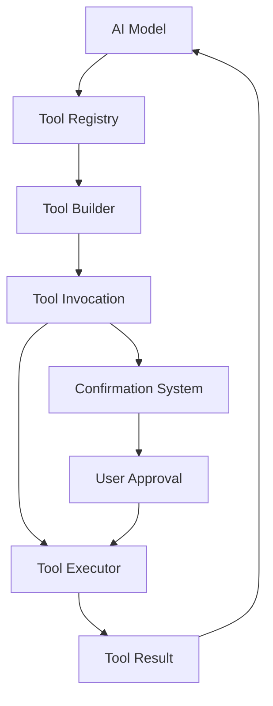
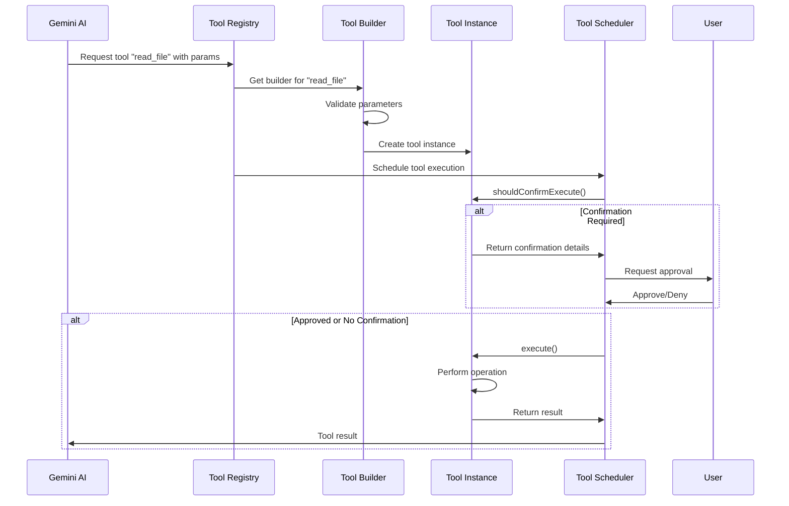
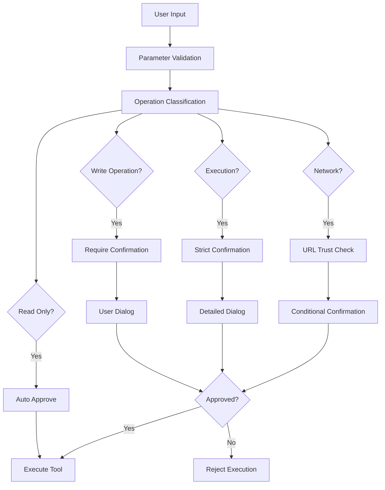

# ⚒️ Tool System Deep Dive

Tools are the key extensibility mechanism in Gemini CLI, allowing the AI to interact with the world. This guide provides a comprehensive understanding of how tools work, how to implement them, and best practices.

## 📋 Table of Contents

- [Tool System Architecture](#tool-system-architecture)
- [Tool Lifecycle](#tool-lifecycle)
- [Built-in Tools Overview](#built-in-tools-overview)
- [Tool Implementation Patterns](#tool-implementation-patterns)
- [Confirmation & Security](#confirmation--security)
- [Error Handling in Tools](#error-handling-in-tools)
- [Performance Considerations](#performance-considerations)
- [Next Steps](#next-steps)

## Tool System Architecture

### Core Concepts

Tools in Gemini CLI follow a **function-as-a-service** pattern:



### Key Components

1. **Tool Registry**: Central catalog of all available tools
2. **Tool Builder**: Factory for creating tool instances
3. **Tool Invocation**: Executable instance of a tool with validated parameters
4. **Tool Scheduler**: Orchestrates tool execution and confirmation
5. **Confirmation System**: Handles user approval for potentially dangerous operations

### Tool Definition Flow

```typescript
// 1. Define tool parameters and result types
interface MyToolParams {
  input: string;
  options?: MyToolOptions;
}

interface MyToolResult extends ToolResult {
  output: string;
  metadata: MyToolMetadata;
}

// 2. Create tool builder
class MyToolBuilder extends BaseToolBuilder<MyToolParams, MyToolResult> {
  name = 'my_tool';
  description = 'Description of what this tool does';
  schema = {
    /* JSON schema for parameters */
  };

  protected async validateParams(params: unknown): Promise<MyToolParams> {
    // Validate and transform parameters
  }

  protected createTool(
    params: MyToolParams,
  ): ToolInvocation<MyToolParams, MyToolResult> {
    return new MyToolInvocation(params);
  }
}

// 3. Register tool with registry
toolRegistry.registerTool('my_tool', new MyToolBuilder());
```

## Tool Lifecycle

### Complete Execution Flow



### Tool State Management

Tools are **stateless** by design - each invocation is independent:

```typescript
// ❌ Bad: Stateful tool (don't do this)
class BadTool {
  private state = new Map(); // State shared between invocations

  async execute() {
    this.state.set('key', 'value'); // Modifies shared state
  }
}

// ✅ Good: Stateless tool
class GoodTool {
  constructor(private readonly params: MyParams) {}

  async execute(): Promise<MyResult> {
    // All data comes from params or external sources
    // No shared mutable state
    return { success: true, data: processedData };
  }
}
```

## Built-in Tools Overview

### File System Tools

```typescript
// packages/core/src/tools/fileSystem.ts

// Read File Tool
interface ReadFileParams {
  path: string;
  encoding?: 'utf8' | 'base64';
}

class ReadFileTool extends BaseToolInvocation<ReadFileParams, ReadFileResult> {
  async shouldConfirmExecute(): Promise<false> {
    return false; // Read operations don't need confirmation
  }

  async execute(): Promise<ReadFileResult> {
    try {
      const content = await fs.readFile(
        this.params.path,
        this.params.encoding || 'utf8',
      );
      return {
        success: true,
        content,
        path: this.params.path,
        size: content.length,
      };
    } catch (error) {
      return {
        success: false,
        error: `Failed to read file: ${error.message}`,
        path: this.params.path,
      };
    }
  }
}

// Write File Tool
interface WriteFileParams {
  path: string;
  content: string;
  createDirectories?: boolean;
}

class WriteFileTool extends BaseToolInvocation<
  WriteFileParams,
  WriteFileResult
> {
  async shouldConfirmExecute(): Promise<ToolCallConfirmationDetails> {
    return {
      type: 'info',
      title: `Write to file: ${this.params.path}`,
      prompt: `Write ${this.params.content.length} characters to ${this.params.path}`,
      onConfirm: async (outcome) => {
        // Handle user confirmation
      },
    };
  }

  async execute(): Promise<WriteFileResult> {
    // Create directories if needed
    if (this.params.createDirectories) {
      await fs.mkdir(path.dirname(this.params.path), { recursive: true });
    }

    await fs.writeFile(this.params.path, this.params.content, 'utf8');

    return {
      success: true,
      path: this.params.path,
      bytesWritten: this.params.content.length,
    };
  }
}
```

### Shell Tool

```typescript
// packages/core/src/tools/shell.ts
interface ShellParams {
  command: string;
  workingDirectory?: string;
  timeout?: number;
  environment?: Record<string, string>;
}

class ShellTool extends BaseToolInvocation<ShellParams, ShellResult> {
  async shouldConfirmExecute(): Promise<ToolExecuteConfirmationDetails> {
    return {
      type: 'exec',
      title: 'Execute Shell Command',
      command: this.params.command,
      rootCommand: this.extractRootCommand(this.params.command),
      onConfirm: async (outcome) => {
        if (outcome !== ToolConfirmationOutcome.Approved) {
          throw new Error('Shell command execution denied by user');
        }
      },
    };
  }

  async execute(signal: AbortSignal): Promise<ShellResult> {
    const startTime = Date.now();

    try {
      const result = await this.executeCommand(signal);

      return {
        success: true,
        command: this.params.command,
        exitCode: result.exitCode,
        output: result.stdout,
        stderr: result.stderr,
        executionTime: Date.now() - startTime,
      };
    } catch (error) {
      return {
        success: false,
        command: this.params.command,
        error: error.message,
        executionTime: Date.now() - startTime,
      };
    }
  }

  private async executeCommand(signal: AbortSignal): Promise<ExecutionResult> {
    return new Promise((resolve, reject) => {
      const child = spawn(this.params.command, {
        cwd: this.params.workingDirectory,
        env: { ...process.env, ...this.params.environment },
        shell: true,
      });

      signal.addEventListener('abort', () => {
        child.kill('SIGTERM');
        reject(new Error('Command execution aborted'));
      });

      // Handle stdout, stderr, and exit
      // ... implementation details
    });
  }
}
```

### Web Tools

```typescript
// packages/core/src/tools/webFetch.ts
interface WebFetchParams {
  url: string;
  method?: 'GET' | 'POST' | 'PUT' | 'DELETE';
  headers?: Record<string, string>;
  body?: string;
  timeout?: number;
}

class WebFetchTool extends BaseToolInvocation<WebFetchParams, WebFetchResult> {
  async shouldConfirmExecute(): Promise<ToolCallConfirmationDetails | false> {
    // Check if URL is trusted
    if (this.isTrustedDomain(this.params.url)) {
      return false; // No confirmation needed for trusted domains
    }

    return {
      type: 'info',
      title: 'Web Request',
      prompt: `Make ${this.params.method || 'GET'} request to ${this.params.url}`,
      urls: [this.params.url],
      onConfirm: async (outcome) => {
        // Handle confirmation
      },
    };
  }

  async execute(): Promise<WebFetchResult> {
    const response = await fetch(this.params.url, {
      method: this.params.method || 'GET',
      headers: this.params.headers,
      body: this.params.body,
      signal: AbortSignal.timeout(this.params.timeout || 10000),
    });

    const content = await response.text();

    return {
      success: true,
      url: this.params.url,
      status: response.status,
      statusText: response.statusText,
      headers: Object.fromEntries(response.headers.entries()),
      content,
      contentLength: content.length,
    };
  }

  private isTrustedDomain(url: string): boolean {
    const trustedDomains = ['api.github.com', 'docs.microsoft.com'];
    try {
      const domain = new URL(url).hostname;
      return trustedDomains.includes(domain);
    } catch {
      return false;
    }
  }
}
```

## Tool Implementation Patterns

### 1. Parameter Validation Pattern

Always validate parameters thoroughly:

```typescript
class MyToolBuilder extends BaseToolBuilder<MyParams, MyResult> {
  protected async validateParams(params: unknown): Promise<MyParams> {
    // Type guard
    if (!this.isValidParams(params)) {
      throw new Error('Invalid parameters');
    }

    // Additional validation
    if (params.path && !path.isAbsolute(params.path)) {
      throw new Error('Path must be absolute');
    }

    // Sanitization
    return {
      ...params,
      path: path.resolve(params.path),
      timeout: Math.max(1000, params.timeout || 5000), // Ensure minimum timeout
    };
  }

  private isValidParams(params: unknown): params is MyParams {
    return (
      typeof params === 'object' &&
      params !== null &&
      'path' in params &&
      typeof (params as any).path === 'string'
    );
  }
}
```

### 2. Resource Management Pattern

Properly manage resources and cleanup:

```typescript
class DatabaseTool extends BaseToolInvocation<DbParams, DbResult> {
  private connection?: DatabaseConnection;

  async execute(signal: AbortSignal): Promise<DbResult> {
    try {
      // Acquire resource
      this.connection = await createConnection(this.params.connectionString);

      // Set up cleanup on abort
      signal.addEventListener('abort', () => {
        this.cleanup();
      });

      // Do work
      const result = await this.connection.query(this.params.query);

      return { success: true, data: result };
    } finally {
      // Always cleanup
      await this.cleanup();
    }
  }

  private async cleanup(): Promise<void> {
    if (this.connection) {
      await this.connection.close();
      this.connection = undefined;
    }
  }
}
```

### 3. Progress Reporting Pattern

For long-running operations, report progress:

```typescript
class LongRunningTool extends BaseToolInvocation<LongParams, LongResult> {
  async execute(
    signal: AbortSignal,
    updateOutput?: (output: string) => void,
  ): Promise<LongResult> {
    const steps = this.getProcessingSteps();

    for (let i = 0; i < steps.length; i++) {
      if (signal.aborted) {
        throw new Error('Operation cancelled');
      }

      // Report progress
      updateOutput?.(`Step ${i + 1}/${steps.length}: ${steps[i].description}`);

      // Do the work
      await this.executeStep(steps[i]);

      // Update progress
      const progress = Math.round(((i + 1) / steps.length) * 100);
      updateOutput?.(`Progress: ${progress}% complete`);
    }

    return { success: true, stepsCompleted: steps.length };
  }
}
```

### 4. Error Recovery Pattern

Implement robust error handling with recovery:

```typescript
class ResilientTool extends BaseToolInvocation<
  ResilientParams,
  ResilientResult
> {
  async execute(): Promise<ResilientResult> {
    const maxRetries = 3;
    let lastError: Error | undefined;

    for (let attempt = 1; attempt <= maxRetries; attempt++) {
      try {
        return await this.attemptOperation();
      } catch (error) {
        lastError = error;

        // Don't retry certain errors
        if (this.isNonRetryableError(error)) {
          break;
        }

        // Wait before retry with exponential backoff
        if (attempt < maxRetries) {
          const delay = Math.pow(2, attempt) * 1000;
          await new Promise((resolve) => setTimeout(resolve, delay));
        }
      }
    }

    return {
      success: false,
      error: `Failed after ${maxRetries} attempts: ${lastError?.message}`,
      retriesAttempted: maxRetries,
    };
  }

  private isNonRetryableError(error: Error): boolean {
    // Don't retry authentication errors, file not found, etc.
    return (
      error.message.includes('401') ||
      error.message.includes('ENOENT') ||
      error.message.includes('permission denied')
    );
  }
}
```

## Confirmation & Security

### Security Model

Tools operate within a **trust boundary** system:



### Confirmation Implementation

```typescript
class SecureFileTool extends BaseToolInvocation<FileParams, FileResult> {
  async shouldConfirmExecute(): Promise<ToolCallConfirmationDetails | false> {
    // Read operations - no confirmation needed
    if (this.params.operation === 'read') {
      return false;
    }

    // Write operations - detailed confirmation
    if (this.params.operation === 'write') {
      return {
        type: 'info',
        title: `Write to file: ${this.params.path}`,
        prompt: this.buildConfirmationPrompt(),
        onConfirm: async (outcome) => {
          if (outcome !== ToolConfirmationOutcome.Approved) {
            throw new Error('File write operation denied by user');
          }

          // Log the approved operation
          this.logApprovedOperation();
        },
      };
    }

    // Delete operations - strict confirmation
    if (this.params.operation === 'delete') {
      return {
        type: 'info',
        title: `⚠️ Delete file: ${this.params.path}`,
        prompt: `This will permanently delete the file. Are you sure?`,
        onConfirm: async (outcome) => {
          if (outcome !== ToolConfirmationOutcome.Approved) {
            throw new Error('File deletion cancelled');
          }
        },
      };
    }

    return false;
  }

  private buildConfirmationPrompt(): string {
    const size = this.params.content?.length || 0;
    const action = this.params.createBackup
      ? 'overwrite (with backup)'
      : 'overwrite';

    return `${action} ${this.params.path} with ${size} characters of content`;
  }
}
```

### Path Security

Prevent directory traversal and unauthorized access:

```typescript
class SecurePathTool extends BaseToolInvocation<PathParams, PathResult> {
  protected validatePath(requestedPath: string): string {
    // Resolve to absolute path
    const absolutePath = path.resolve(requestedPath);

    // Check for directory traversal attempts
    if (absolutePath.includes('..')) {
      throw new Error('Directory traversal not allowed');
    }

    // Ensure path is within allowed directories
    const allowedRoots = [
      process.cwd(),
      path.join(os.homedir(), 'projects'),
      '/tmp',
    ];

    const isAllowed = allowedRoots.some((root) =>
      absolutePath.startsWith(path.resolve(root)),
    );

    if (!isAllowed) {
      throw new Error(
        `Access denied: ${absolutePath} is outside allowed directories`,
      );
    }

    return absolutePath;
  }
}
```

## Error Handling in Tools

### Error Categories and Handling

```typescript
// Tool-specific error types
export class ToolValidationError extends GeminiCliError {
  readonly code = 'TOOL_VALIDATION_FAILED';
  readonly category = ErrorCategory.TOOL_EXECUTION;
}

export class ToolExecutionError extends GeminiCliError {
  readonly code = 'TOOL_EXECUTION_FAILED';
  readonly category = ErrorCategory.TOOL_EXECUTION;

  constructor(
    message: string,
    public readonly toolName: string,
    public readonly toolParams: unknown,
    cause?: Error,
  ) {
    super(message, cause, { toolName, toolParams });
  }
}

export class ToolTimeoutError extends ToolExecutionError {
  readonly code = 'TOOL_TIMEOUT';

  constructor(toolName: string, timeout: number) {
    super(`Tool ${toolName} timed out after ${timeout}ms`, toolName, {
      timeout,
    });
  }
}
```

### Error Handling Pattern

```typescript
class RobustTool extends BaseToolInvocation<RobustParams, RobustResult> {
  async execute(signal: AbortSignal): Promise<RobustResult> {
    try {
      // Validate preconditions
      await this.validatePreconditions();

      // Execute with timeout
      const result = await Promise.race([
        this.performOperation(signal),
        this.timeoutPromise(),
      ]);

      // Validate result
      this.validateResult(result);

      return { success: true, data: result };
    } catch (error) {
      return this.handleError(error);
    }
  }

  private async validatePreconditions(): Promise<void> {
    if (
      this.params.requiredFile &&
      !(await fs.access(this.params.requiredFile).catch(() => false))
    ) {
      throw new ToolValidationError(
        `Required file not found: ${this.params.requiredFile}`,
      );
    }
  }

  private timeoutPromise(): Promise<never> {
    return new Promise((_, reject) => {
      setTimeout(() => {
        reject(
          new ToolTimeoutError(
            this.constructor.name,
            this.params.timeout || 30000,
          ),
        );
      }, this.params.timeout || 30000);
    });
  }

  private handleError(error: Error): RobustResult {
    // Log error with context
    console.error(`Tool ${this.constructor.name} failed:`, {
      error: error.message,
      params: this.params,
      stack: error.stack,
    });

    // Return structured error result
    return {
      success: false,
      error: error.message,
      errorType: error.constructor.name,
      recoveryHint: this.getRecoveryHint(error),
    };
  }

  private getRecoveryHint(error: Error): string {
    if (error instanceof ToolTimeoutError) {
      return 'Try increasing the timeout value or simplifying the operation';
    }
    if (error.message.includes('ENOENT')) {
      return 'Check that the specified file or directory exists';
    }
    if (error.message.includes('EACCES')) {
      return 'Check file permissions and access rights';
    }
    return 'Review the error message and tool parameters';
  }
}
```

## Performance Considerations

### Async Operations and Concurrency

```typescript
class PerformantTool extends BaseToolInvocation<PerfParams, PerfResult> {
  async execute(): Promise<PerfResult> {
    // Process items concurrently with controlled concurrency
    const results = await this.processConcurrently(
      this.params.items,
      this.params.concurrency || 3,
    );

    return { success: true, results };
  }

  private async processConcurrently<T, R>(
    items: T[],
    concurrency: number,
  ): Promise<R[]> {
    const results: R[] = [];

    // Process in batches
    for (let i = 0; i < items.length; i += concurrency) {
      const batch = items.slice(i, i + concurrency);
      const batchResults = await Promise.all(
        batch.map((item) => this.processItem(item)),
      );
      results.push(...batchResults);
    }

    return results;
  }
}
```

### Caching and Memoization

```typescript
class CachedTool extends BaseToolInvocation<CacheParams, CacheResult> {
  private static cache = new Map<string, { data: any; timestamp: number }>();

  async execute(): Promise<CacheResult> {
    const cacheKey = this.getCacheKey();
    const cached = CachedTool.cache.get(cacheKey);

    // Check cache validity
    if (cached && this.isCacheValid(cached.timestamp)) {
      return { success: true, data: cached.data, fromCache: true };
    }

    // Execute and cache result
    const result = await this.performExpensiveOperation();
    CachedTool.cache.set(cacheKey, {
      data: result,
      timestamp: Date.now(),
    });

    return { success: true, data: result, fromCache: false };
  }

  private getCacheKey(): string {
    return JSON.stringify(this.params);
  }

  private isCacheValid(timestamp: number): boolean {
    const maxAge = this.params.cacheMaxAge || 5 * 60 * 1000; // 5 minutes
    return Date.now() - timestamp < maxAge;
  }
}
```

## Next Steps

Now that you understand the tool system, continue your learning journey:

### **🚀 Next: [Development Environment Setup](./07-dev-setup.md)**

Set up your development environment to start building tools.

### **🔍 Related Topics**

- [Core Classes & Interfaces](./05-core-classes.md) - Type system for tools
- [Creating Your First Tool](./08-first-tool.md) - Hands-on tool development
- [Security Model](./12-security.md) - Advanced security considerations

### **🛠️ Hands-on Exercises**

1. **Explore Built-in Tools**: Examine the implementation of existing tools
2. **Trace Tool Execution**: Follow a tool call from AI request to result
3. **Design a Tool**: Plan the interface for a new tool you'd like to create
4. **Security Analysis**: Review how different tools handle security and confirmation

### **💡 Key Takeaways**

- Tools are stateless, type-safe, and follow consistent patterns
- Security is enforced through confirmation workflows
- Error handling should be comprehensive and user-friendly
- Performance considerations are important for responsive interactions
- The tool system is designed for easy extension and testing
