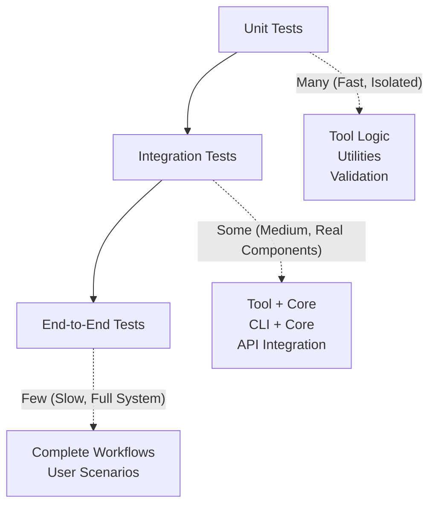

# 🐛 Testing & Debugging Guide

This guide covers essential testing and debugging practices for Gemini CLI development, helping you build robust, maintainable code with confidence.

## 📋 Table of Contents

- [Testing Strategy](#testing-strategy)
- [Unit Testing Best Practices](#unit-testing-best-practices)
- [Integration Testing](#integration-testing)
- [Debugging Techniques](#debugging-techniques)
- [Performance Testing](#performance-testing)
- [Troubleshooting Common Issues](#troubleshooting-common-issues)
- [CI/CD Testing](#cicd-testing)
- [Next Steps](#next-steps)

## Testing Strategy

### Testing Pyramid for Gemini CLI



### Test Categories

1. **Unit Tests** (70% of tests)
   - Tool logic and validation
   - Utility functions
   - Individual component behavior

2. **Integration Tests** (20% of tests)
   - Tool integration with core systems
   - API interactions
   - File system operations

3. **End-to-End Tests** (10% of tests)
   - Complete user workflows
   - Cross-component interactions
   - Real environment scenarios

## Unit Testing Best Practices

### Test Structure and Organization

```typescript
// packages/core/src/tools/myTool.test.ts
import { describe, it, expect, vi, beforeEach, afterEach } from 'vitest';
import { MyTool, MyToolBuilder } from './myTool.js';

// Mock external dependencies at the top
vi.mock('fs/promises', () => ({
  readFile: vi.fn(),
  writeFile: vi.fn(),
  stat: vi.fn(),
}));

vi.mock('child_process', () => ({
  spawn: vi.fn(),
}));

describe('MyTool', () => {
  // Setup and teardown
  beforeEach(() => {
    vi.resetAllMocks();
  });

  afterEach(() => {
    vi.restoreAllMocks();
  });

  describe('parameter validation', () => {
    const builder = new MyToolBuilder();

    it('should accept valid parameters', async () => {
      const params = { path: '/valid/path', option: true };
      const result = await builder.validateParams(params);

      expect(result).toEqual({
        path: '/valid/path',
        option: true,
      });
    });

    it('should reject invalid parameters', async () => {
      const invalidParams = [
        {}, // Missing required fields
        { path: '' }, // Empty path
        { path: '/valid', option: 'invalid' }, // Wrong type
        { path: '../../../etc/passwd' }, // Security issue
      ];

      for (const params of invalidParams) {
        await expect(builder.validateParams(params)).rejects.toThrow();
      }
    });
  });

  describe('execution', () => {
    it('should execute successfully with valid input', async () => {
      // Arrange
      const mockFs = vi.mocked(await import('fs/promises'));
      mockFs.readFile.mockResolvedValue('file content');

      const tool = new MyTool({ path: '/test/file.txt' });
      const signal = new AbortController().signal;

      // Act
      const result = await tool.execute(signal);

      // Assert
      expect(result.success).toBe(true);
      expect(result.data).toBeDefined();
      expect(mockFs.readFile).toHaveBeenCalledWith('/test/file.txt', 'utf-8');
    });

    it('should handle errors gracefully', async () => {
      // Arrange
      const mockFs = vi.mocked(await import('fs/promises'));
      mockFs.readFile.mockRejectedValue(new Error('File not found'));

      const tool = new MyTool({ path: '/nonexistent/file.txt' });
      const signal = new AbortController().signal;

      // Act
      const result = await tool.execute(signal);

      // Assert
      expect(result.success).toBe(false);
      expect(result.error).toContain('File not found');
    });

    it('should respect cancellation signals', async () => {
      // Arrange
      const abortController = new AbortController();
      const tool = new MyTool({ path: '/test/file.txt' });

      // Mock slow operation
      const mockFs = vi.mocked(await import('fs/promises'));
      mockFs.readFile.mockImplementation(
        () => new Promise((resolve) => setTimeout(resolve, 1000)),
      );

      // Act
      const executePromise = tool.execute(abortController.signal);

      // Cancel immediately
      abortController.abort();

      const result = await executePromise;

      // Assert
      expect(result.success).toBe(false);
      expect(result.error).toContain('cancelled');
    });
  });

  describe('confirmation logic', () => {
    it('should require confirmation for dangerous operations', async () => {
      const tool = new MyTool({ path: '/important/file.txt', delete: true });
      const confirmation = await tool.shouldConfirmExecute(
        new AbortController().signal,
      );

      expect(confirmation).not.toBe(false);
      expect(confirmation?.type).toBe('info');
      expect(confirmation?.title).toContain('Delete');
    });

    it('should not require confirmation for safe operations', async () => {
      const tool = new MyTool({ path: '/test/file.txt', read: true });
      const confirmation = await tool.shouldConfirmExecute(
        new AbortController().signal,
      );

      expect(confirmation).toBe(false);
    });
  });
});
```

### Effective Mocking Strategies

#### 1. **Selective Mocking with `importOriginal`**

```typescript
// Mock specific functions while keeping others
vi.mock('fs/promises', async (importOriginal) => {
  const actual = await importOriginal();
  return {
    ...actual,
    readFile: vi.fn(),
    writeFile: vi.fn(),
    // Keep real implementations of other functions
  };
});
```

#### 2. **Hoisted Mocks for Shared State**

```typescript
// When you need to access mock in multiple places
const mockExecute = vi.hoisted(() => vi.fn());

vi.mock('./externalTool', () => ({
  ExternalTool: vi.fn(() => ({
    execute: mockExecute,
  })),
}));

describe('MyTool', () => {
  it('should call external tool', async () => {
    mockExecute.mockResolvedValue({ success: true });

    // ... test logic ...

    expect(mockExecute).toHaveBeenCalledWith(expectedParams);
  });
});
```

#### 3. **Dynamic Mocking Based on Test Scenarios**

```typescript
describe('file operations', () => {
  const mockFs = vi.mocked(await import('fs/promises'));

  it('should handle permission errors', async () => {
    // Mock specific error for this test
    const permissionError = new Error('EACCES: permission denied');
    (permissionError as any).code = 'EACCES';
    mockFs.readFile.mockRejectedValue(permissionError);

    const tool = new MyTool({ path: '/restricted/file.txt' });
    const result = await tool.execute(new AbortController().signal);

    expect(result.success).toBe(false);
    expect(result.error).toContain('permission denied');
  });

  it('should handle file not found', async () => {
    const notFoundError = new Error('ENOENT: no such file or directory');
    (notFoundError as any).code = 'ENOENT';
    mockFs.readFile.mockRejectedValue(notFoundError);

    // ... test logic ...
  });
});
```

### Testing Async Operations

```typescript
describe('async operations', () => {
  it('should handle concurrent operations', async () => {
    const mockOperation = vi
      .fn()
      .mockResolvedValueOnce('result1')
      .mockResolvedValueOnce('result2')
      .mockResolvedValueOnce('result3');

    const tool = new ConcurrentTool({
      items: ['item1', 'item2', 'item3'],
      concurrency: 2,
    });

    const result = await tool.execute(new AbortController().signal);

    expect(result.success).toBe(true);
    expect(mockOperation).toHaveBeenCalledTimes(3);
    expect(result.results).toHaveLength(3);
  });

  it('should handle timeouts correctly', async () => {
    vi.useFakeTimers();

    try {
      const slowOperation = vi.fn(
        () => new Promise((resolve) => setTimeout(resolve, 10000)),
      );

      const tool = new TimeoutTool({ timeout: 5000 });
      const executePromise = tool.execute(new AbortController().signal);

      // Fast-forward time
      vi.advanceTimersByTime(6000);

      const result = await executePromise;
      expect(result.success).toBe(false);
      expect(result.error).toContain('timeout');
    } finally {
      vi.useRealTimers();
    }
  });
});
```

## Integration Testing

### Testing Tool Integration with Core

```typescript
// packages/core/src/integration/toolIntegration.test.ts
import { describe, it, expect, beforeEach } from 'vitest';
import { ToolRegistry } from '../tools/toolRegistry.js';
import { CoreToolScheduler } from '../core/coreToolScheduler.js';
import { MyToolBuilder } from '../tools/myTool.js';

describe('Tool Integration', () => {
  let registry: ToolRegistry;
  let scheduler: CoreToolScheduler;

  beforeEach(() => {
    registry = new ToolRegistry();
    registry.registerTool('my_tool', new MyToolBuilder());

    scheduler = new CoreToolScheduler({
      toolRegistry: registry,
      // ... other config
    });
  });

  it('should register and execute tools through scheduler', async () => {
    const toolCalls = [
      {
        callId: 'test-call-1',
        name: 'my_tool',
        args: { path: '/test/file.txt' },
      },
    ];

    const results = await scheduler.scheduleToolCalls(
      toolCalls,
      new AbortController().signal,
    );

    expect(results).toHaveLength(1);
    expect(results[0].success).toBe(true);
  });

  it('should handle tool validation errors', async () => {
    const toolCalls = [
      {
        callId: 'test-call-2',
        name: 'my_tool',
        args: {
          /* invalid args */
        },
      },
    ];

    const results = await scheduler.scheduleToolCalls(
      toolCalls,
      new AbortController().signal,
    );

    expect(results[0].success).toBe(false);
    expect(results[0].error).toContain('validation');
  });
});
```

### Testing with Real File System

```typescript
import { mkdtemp, rm } from 'fs/promises';
import { join } from 'path';
import { tmpdir } from 'os';

describe('FileSystemTool Integration', () => {
  let tempDir: string;

  beforeEach(async () => {
    // Create temporary directory for testing
    tempDir = await mkdtemp(join(tmpdir(), 'gemini-test-'));
  });

  afterEach(async () => {
    // Clean up
    await rm(tempDir, { recursive: true, force: true });
  });

  it('should read and write files in real filesystem', async () => {
    const testFile = join(tempDir, 'test.txt');
    const testContent = 'Hello, World!';

    // Test write
    const writeTool = new WriteFileTool({
      path: testFile,
      content: testContent,
    });

    const writeResult = await writeTool.execute(new AbortController().signal);
    expect(writeResult.success).toBe(true);

    // Test read
    const readTool = new ReadFileTool({ path: testFile });
    const readResult = await readTool.execute(new AbortController().signal);

    expect(readResult.success).toBe(true);
    expect(readResult.content).toBe(testContent);
  });
});
```

## Debugging Techniques

### Console Debugging

```typescript
// Enable debug logging
export class MyTool extends BaseToolInvocation<MyParams, MyResult> {
  private debug(message: string, ...args: any[]): void {
    if (process.env.DEBUG) {
      console.log(`[DEBUG] ${this.constructor.name}: ${message}`, ...args);
    }
  }

  async execute(signal: AbortSignal): Promise<MyResult> {
    this.debug('Starting execution with params:', this.params);

    try {
      const result = await this.performOperation();
      this.debug('Operation completed successfully:', result);
      return result;
    } catch (error) {
      this.debug('Operation failed:', error);
      throw error;
    }
  }
}
```

### VS Code Debugging Configuration

```json
// .vscode/launch.json
{
  "version": "0.2.0",
  "configurations": [
    {
      "name": "Debug Specific Tool Test",
      "type": "node",
      "request": "launch",
      "program": "${workspaceFolder}/node_modules/vitest/dist/cli.js",
      "args": [
        "run",
        "--reporter=verbose",
        "packages/core/src/tools/myTool.test.ts"
      ],
      "env": {
        "NODE_ENV": "test",
        "DEBUG": "1"
      },
      "console": "integratedTerminal",
      "skipFiles": ["<node_internals>/**"]
    },
    {
      "name": "Debug Tool in CLI",
      "type": "node",
      "request": "launch",
      "program": "${workspaceFolder}/scripts/start.js",
      "env": {
        "DEBUG": "1",
        "GEMINI_DEBUG_TOOLS": "my_tool"
      },
      "console": "integratedTerminal"
    }
  ]
}
```

### Debugging with Breakpoints

```typescript
export class MyTool extends BaseToolInvocation<MyParams, MyResult> {
  async execute(signal: AbortSignal): Promise<MyResult> {
    // Set breakpoint here
    debugger; // This will pause execution in debugger

    const step1Result = await this.step1();

    // Another breakpoint
    debugger; // Inspect step1Result

    const finalResult = await this.step2(step1Result);

    return finalResult;
  }
}
```

### Debugging Network Requests

```typescript
import { IncomingMessage } from 'http';

export class WebTool extends BaseToolInvocation<WebParams, WebResult> {
  async execute(): Promise<WebResult> {
    const response = await fetch(this.params.url, {
      method: 'GET',
      headers: this.params.headers,
    });

    // Debug logging for network requests
    console.log('Request URL:', this.params.url);
    console.log('Request Headers:', this.params.headers);
    console.log('Response Status:', response.status);
    console.log('Response Headers:', Object.fromEntries(response.headers));

    // Save response for debugging
    const responseText = await response.text();

    if (process.env.DEBUG) {
      const fs = await import('fs/promises');
      const debugFile = `/tmp/debug-response-${Date.now()}.txt`;
      await fs.writeFile(debugFile, responseText);
      console.log('Response saved to:', debugFile);
    }

    return {
      success: true,
      content: responseText,
      status: response.status,
    };
  }
}
```

### Error Stack Trace Enhancement

```typescript
export class EnhancedErrorTool extends BaseToolInvocation<MyParams, MyResult> {
  async execute(signal: AbortSignal): Promise<MyResult> {
    try {
      return await this.performOperation();
    } catch (error) {
      // Enhance error with context
      const enhancedError = new Error(
        `Tool ${this.constructor.name} failed: ${error.message}`,
      );

      // Preserve original stack trace
      enhancedError.stack = error.stack;

      // Add context information
      (enhancedError as any).toolParams = this.params;
      (enhancedError as any).toolName = this.constructor.name;
      (enhancedError as any).timestamp = new Date().toISOString();

      throw enhancedError;
    }
  }
}
```

## Performance Testing

### Benchmarking Tool Performance

```typescript
// packages/core/src/tools/performance.test.ts
import { describe, it, expect } from 'vitest';
import { performance } from 'perf_hooks';

describe('Tool Performance', () => {
  it('should complete within acceptable time limits', async () => {
    const tool = new MyTool({
      largeDataset: generateLargeDataset(10000),
    });

    const startTime = performance.now();
    const result = await tool.execute(new AbortController().signal);
    const endTime = performance.now();

    const executionTime = endTime - startTime;

    expect(result.success).toBe(true);
    expect(executionTime).toBeLessThan(5000); // Should complete within 5 seconds
  });

  it('should handle concurrent executions efficiently', async () => {
    const tools = Array.from(
      { length: 10 },
      () => new MyTool({ input: 'test' }),
    );

    const startTime = performance.now();

    const results = await Promise.all(
      tools.map((tool) => tool.execute(new AbortController().signal)),
    );

    const endTime = performance.now();
    const totalTime = endTime - startTime;

    // All tools should succeed
    expect(results.every((r) => r.success)).toBe(true);

    // Concurrent execution should be faster than sequential
    expect(totalTime).toBeLessThan(tools.length * 1000); // Less than 1s per tool
  });
});
```

### Memory Usage Testing

```typescript
describe('Memory Usage', () => {
  it('should not leak memory during repeated executions', async () => {
    const initialMemory = process.memoryUsage().heapUsed;

    // Execute tool many times
    for (let i = 0; i < 100; i++) {
      const tool = new MyTool({ input: `test-${i}` });
      await tool.execute(new AbortController().signal);

      // Force garbage collection (if available)
      if (global.gc) {
        global.gc();
      }
    }

    const finalMemory = process.memoryUsage().heapUsed;
    const memoryIncrease = finalMemory - initialMemory;

    // Memory increase should be reasonable (less than 10MB)
    expect(memoryIncrease).toBeLessThan(10 * 1024 * 1024);
  });
});
```

## Troubleshooting Common Issues

### Issue 1: Mock Not Working

**Problem**: Mocks are not being applied or are returning undefined

**Solution**:

```typescript
// ❌ Wrong: Mock after import
import { MyModule } from './myModule.js';
vi.mock('./myModule.js', () => ({ ... }));

// ✅ Correct: Mock before import
vi.mock('./myModule.js', () => ({
  MyModule: vi.fn(() => ({
    method: vi.fn().mockResolvedValue('mocked result')
  }))
}));
import { MyModule } from './myModule.js';
```

### Issue 2: Async Test Not Waiting

**Problem**: Test completes before async operation finishes

**Solution**:

```typescript
// ❌ Wrong: Not awaiting promise
it('should handle async operation', () => {
  const tool = new MyTool({ input: 'test' });
  tool.execute().then((result) => {
    expect(result.success).toBe(true); // This might not run
  });
});

// ✅ Correct: Properly await
it('should handle async operation', async () => {
  const tool = new MyTool({ input: 'test' });
  const result = await tool.execute(new AbortController().signal);
  expect(result.success).toBe(true);
});
```

### Issue 3: AbortSignal Not Respected

**Problem**: Tool doesn't respond to cancellation

**Solution**:

```typescript
// ❌ Wrong: Not checking signal
async execute(signal: AbortSignal): Promise<MyResult> {
  for (const item of this.largeList) {
    await this.processItem(item); // No cancellation check
  }
}

// ✅ Correct: Regular cancellation checks
async execute(signal: AbortSignal): Promise<MyResult> {
  for (const item of this.largeList) {
    if (signal.aborted) {
      throw new Error('Operation cancelled');
    }
    await this.processItem(item);
  }
}
```

### Issue 4: File System Permission Errors in Tests

**Problem**: Tests fail with permission errors

**Solution**:

```typescript
// Use proper temporary directories
import { mkdtemp, rm } from 'fs/promises';
import { join } from 'path';
import { tmpdir } from 'os';

describe('File Operations', () => {
  let testDir: string;

  beforeEach(async () => {
    testDir = await mkdtemp(join(tmpdir(), 'test-'));
  });

  afterEach(async () => {
    await rm(testDir, { recursive: true, force: true });
  });

  // Tests use testDir for file operations
});
```

## CI/CD Testing

### GitHub Actions Configuration

```yaml
# .github/workflows/test.yml
name: Test Suite

on: [push, pull_request]

jobs:
  test:
    runs-on: ubuntu-latest

    strategy:
      matrix:
        node-version: [20, 22]

    steps:
      - uses: actions/checkout@v4

      - name: Setup Node.js
        uses: actions/setup-node@v4
        with:
          node-version: ${{ matrix.node-version }}
          cache: 'npm'

      - name: Install dependencies
        run: npm ci

      - name: Run linting
        run: npm run lint:ci

      - name: Run type checking
        run: npm run typecheck

      - name: Run unit tests
        run: npm run test:ci

      - name: Run integration tests
        run: npm run test:integration:sandbox:none

      - name: Upload coverage
        uses: codecov/codecov-action@v3
        with:
          file: ./coverage/coverage-final.json
```

### Test Result Analysis

```typescript
// scripts/analyze-test-results.js
import { readFile } from 'fs/promises';

async function analyzeTestResults() {
  const results = JSON.parse(await readFile('./test-results.json', 'utf-8'));

  const summary = {
    total: results.numTotalTests,
    passed: results.numPassedTests,
    failed: results.numFailedTests,
    coverage: results.coverageMap,
  };

  console.log('Test Summary:', summary);

  // Fail CI if coverage below threshold
  if (summary.coverage.total < 80) {
    process.exit(1);
  }
}
```

## Next Steps

You now have comprehensive testing and debugging skills for Gemini CLI development. Continue your learning journey:

### **💬 Next: [Prompt Engineering Patterns](./10-prompt-patterns.md)**

Learn advanced techniques for crafting effective prompts and managing AI interactions.

### **🔍 Related Topics**

- [Creating Your First Tool](./08-first-tool.md) - Apply testing to your tools
- [Performance Considerations](./11-performance.md) - Optimize your tools
- [Development Environment Setup](./07-dev-setup.md) - Configure debugging tools

### **🛠️ Practice Exercises**

1. **Add Tests to Existing Tool**: Write comprehensive tests for a built-in tool
2. **Debug a Failing Test**: Intentionally break a test and practice debugging
3. **Performance Profile**: Measure and optimize tool performance
4. **Integration Test**: Create tests that use real file system or network

### **💡 Key Takeaways**

- Write tests first or alongside development (TDD approach)
- Use mocking strategically to isolate units of work
- Test error conditions as thoroughly as success cases
- Debug systematically with logging and breakpoints
- Performance test critical code paths
- Respect cancellation signals in all async operations
