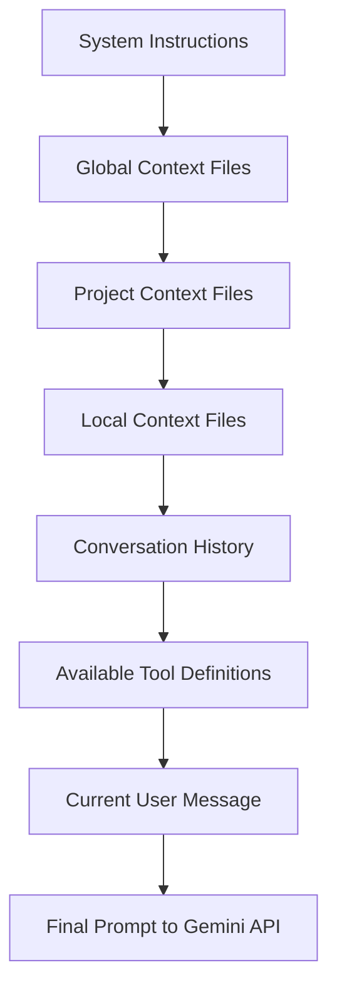

# 💬 Prompt Engineering Patterns

This guide covers advanced prompt engineering patterns used in Gemini CLI, helping you understand how to craft effective prompts and optimize AI interactions for better development productivity.

## 📋 Table of Contents

- [Prompt Engineering Fundamentals](#prompt-engineering-fundamentals)
- [Context Construction Patterns](#context-construction-patterns)
- [Tool Definition Strategies](#tool-definition-strategies)
- [Conversation Flow Optimization](#conversation-flow-optimization)
- [Error Recovery Patterns](#error-recovery-patterns)
- [Performance Optimization](#performance-optimization)
- [Advanced Techniques](#advanced-techniques)
- [Next Steps](#next-steps)

## Prompt Engineering Fundamentals

### Anatomy of a Gemini CLI Prompt

Every prompt sent to Gemini follows a structured format:



### Prompt Construction Implementation

```typescript
// packages/core/src/core/prompts.ts
export class PromptBuilder {
  private parts: Part[] = [];

  static async buildCompletePrompt(
    userMessage: string | PartListUnion,
    context: PromptContext,
  ): Promise<Part[]> {
    const builder = new PromptBuilder();

    // 1. System instructions (foundational behavior)
    builder.addSystemInstructions(context.systemInstructions);

    // 2. Context hierarchy (project knowledge)
    if (context.memoryContent) {
      builder.addContextMemory(context.memoryContent);
    }

    // 3. Tool definitions (available capabilities)
    if (context.toolDefinitions.length > 0) {
      builder.addToolDefinitions(context.toolDefinitions);
    }

    // 4. Conversation history (maintain context)
    if (context.conversationHistory.length > 0) {
      builder.addConversationHistory(context.conversationHistory);
    }

    // 5. Current user message (the actual request)
    builder.addUserMessage(userMessage);

    return builder.build();
  }

  private addSystemInstructions(instructions: string): this {
    this.parts.push({
      text: `System Instructions:
${instructions}

Key principles:
- Always provide helpful, accurate responses
- Use available tools when appropriate for the task
- Ask for clarification when requirements are unclear
- Respect user preferences and project conventions
- Maintain conversation context and follow up appropriately`,
    });
    return this;
  }

  private addContextMemory(memoryContent: string): this {
    this.parts.push({
      text: `Project Context and Instructions:
${memoryContent}

Please follow the guidelines and conventions specified in the context above.`,
    });
    return this;
  }

  private addToolDefinitions(definitions: ToolDefinition[]): this {
    const toolsText = definitions
      .map((def) => `- ${def.name}: ${def.description}`)
      .join('\n');

    this.parts.push({
      text: `Available Tools:
You have access to the following tools to help complete tasks:

${toolsText}

Use these tools when they would be helpful for the user's request. Always provide clear explanations of what you're doing when using tools.`,
    });
    return this;
  }
}
```

## Context Construction Patterns

### Hierarchical Context Pattern

The most important pattern in Gemini CLI is hierarchical context loading:

```typescript
// packages/core/src/utils/memoryDiscovery.ts
export async function loadServerHierarchicalMemory(
  cwd: string,
  additionalMemoryFiles: string[],
  includeMemoryFileDiscovery: boolean,
  fileDiscoveryService: FileDiscoveryService,
  includePaths: string[],
  folderTrustLevel: FolderTrustLevel,
): Promise<{ memoryContent: string; fileCount: number }> {
  const contextSources: ContextSource[] = [];

  // 1. Global context (lowest priority)
  const globalContext = await loadGlobalContext();
  if (globalContext) {
    contextSources.push({
      content: globalContext.content,
      source: 'global',
      priority: 1,
      path: globalContext.path,
    });
  }

  // 2. Project contexts (ascending directory tree)
  const projectContexts = await searchUpwardForContexts(cwd);
  for (const [index, context] of projectContexts.entries()) {
    contextSources.push({
      content: context.content,
      source: 'project',
      priority: 10 + index, // Higher priority for closer contexts
      path: context.path,
    });
  }

  // 3. Local contexts (highest priority)
  const localContexts = await searchDownwardForContexts(cwd);
  for (const [index, context] of localContexts.entries()) {
    contextSources.push({
      content: context.content,
      source: 'local',
      priority: 100 + index, // Highest priority
      path: context.path,
    });
  }

  // Merge contexts with priority-based formatting
  return mergeContextSources(contextSources);
}

function mergeContextSources(sources: ContextSource[]): {
  memoryContent: string;
  fileCount: number;
} {
  // Sort by priority (lowest to highest)
  sources.sort((a, b) => a.priority - b.priority);

  const mergedContent = sources
    .map((source) => {
      const relativePath = getRelativePath(source.path);
      return `--- Context from: ${relativePath} (${source.source}) ---
${source.content}
--- End of Context from: ${relativePath} ---`;
    })
    .join('\n\n');

  return {
    memoryContent: mergedContent,
    fileCount: sources.length,
  };
}
```

### Context Optimization Patterns

```typescript
// Advanced context optimization
export class ContextOptimizer {
  private readonly maxTokens: number;
  private readonly preservePriority: ContextPriority[];

  constructor(maxTokens: number = 32000) {
    this.maxTokens = maxTokens;
    this.preservePriority = [
      'local',
      'recent_conversation',
      'tool_definitions',
    ];
  }

  optimizeContext(context: PromptContext): PromptContext {
    let currentTokens = this.estimateTokens(context);

    if (currentTokens <= this.maxTokens) {
      return context; // No optimization needed
    }

    // 1. Compress conversation history first
    context = this.compressConversationHistory(context);
    currentTokens = this.estimateTokens(context);

    if (currentTokens <= this.maxTokens) {
      return context;
    }

    // 2. Summarize older context files
    context = this.summarizeOlderContext(context);
    currentTokens = this.estimateTokens(context);

    if (currentTokens <= this.maxTokens) {
      return context;
    }

    // 3. Truncate least relevant content
    context = this.truncateLeastRelevant(context);

    return context;
  }

  private compressConversationHistory(context: PromptContext): PromptContext {
    const history = context.conversationHistory;

    if (history.length <= 10) {
      return context; // Keep recent conversation intact
    }

    // Keep first 2 turns (establish context) and last 6 turns (recent context)
    const compressed = [
      ...history.slice(0, 2),
      {
        role: 'system',
        content: `[Conversation summary: ${history.length - 8} turns omitted for brevity]`,
      },
      ...history.slice(-6),
    ];

    return {
      ...context,
      conversationHistory: compressed,
    };
  }

  private summarizeOlderContext(context: PromptContext): PromptContext {
    // Summarize project-level context files that are less specific
    const contextFiles = this.parseContextFiles(context.memoryContent);
    const summarized = contextFiles.map((file) => {
      if (file.source === 'global' || file.source === 'distant_project') {
        return {
          ...file,
          content: this.summarizeContextFile(file.content),
        };
      }
      return file;
    });

    return {
      ...context,
      memoryContent: this.reconstructContextContent(summarized),
    };
  }
}
```

## Tool Definition Strategies

### Effective Tool Descriptions

Tools are defined in prompts using JSON schema. Here are patterns for effective definitions:

```typescript
// packages/core/src/tools/toolDefinitions.ts
export const effectiveToolDefinitions = {
  // ✅ Good: Clear, specific, actionable description
  read_file: {
    name: 'read_file',
    description:
      'Read the complete contents of a text file. Use this when you need to examine, analyze, or reference file contents.',
    parameters: {
      type: 'object',
      properties: {
        path: {
          type: 'string',
          description:
            'Absolute or relative path to the file to read. Use relative paths when working within the current project.',
        },
      },
      required: ['path'],
    },
  },

  // ❌ Bad: Vague, unclear description
  file_operation: {
    name: 'file_operation',
    description: 'Does file stuff', // Too vague
    parameters: {
      type: 'object',
      properties: {
        action: { type: 'string' }, // No description
        target: { type: 'string' }, // Unclear parameter name
      },
    },
  },

  // ✅ Good: Comprehensive with examples and constraints
  run_shell_command: {
    name: 'run_shell_command',
    description: `Execute a shell command in the current working directory. 
    
Use this for:
- Running build scripts, tests, or development commands
- Checking system status or file properties
- Installing packages or dependencies

Important: 
- Commands will require user approval for security
- Use relative paths when possible
- Consider the current operating system`,

    parameters: {
      type: 'object',
      properties: {
        command: {
          type: 'string',
          description:
            'The shell command to execute. Examples: "npm test", "ls -la", "git status"',
        },
        working_directory: {
          type: 'string',
          description:
            'Optional working directory for the command. Defaults to current directory.',
        },
      },
      required: ['command'],
    },
  },
};
```

### Tool Grouping and Organization

```typescript
// Organize tools by capability areas
export const toolCategories = {
  'File System': ['read_file', 'write_file', 'read_many_files', 'file_stats'],

  Development: ['run_shell_command', 'git_operations', 'package_manager'],

  'Information Gathering': [
    'web_fetch',
    'google_web_search',
    'documentation_lookup',
  ],

  'Code Analysis': [
    'analyze_code_structure',
    'find_function_definition',
    'trace_dependencies',
  ],
};

// Present tools contextually based on user intent
export function selectRelevantTools(
  userMessage: string,
  availableTools: ToolDefinition[],
): ToolDefinition[] {
  const intent = analyzeUserIntent(userMessage);

  const relevantCategories =
    {
      file_operation: ['File System'],
      code_question: ['File System', 'Code Analysis'],
      development_task: ['Development', 'File System'],
      research_task: ['Information Gathering', 'File System'],
      debugging: ['Development', 'Code Analysis', 'File System'],
    }[intent.category] || Object.keys(toolCategories);

  const relevantTools = relevantCategories.flatMap(
    (category) => toolCategories[category] || [],
  );

  return availableTools.filter((tool) => relevantTools.includes(tool.name));
}
```

## Conversation Flow Optimization

### Maintaining Context Across Turns

```typescript
// packages/core/src/core/conversationManager.ts
export class ConversationManager {
  private conversationState: ConversationState;

  async processUserTurn(
    userMessage: string,
    context: ConversationContext,
  ): Promise<TurnResult> {
    // 1. Analyze user intent and extract context
    const intent = await this.analyzeUserIntent(userMessage, context);

    // 2. Determine if context needs updating
    const contextUpdate = this.determineContextUpdate(intent, context);

    // 3. Build contextually aware prompt
    const prompt = await this.buildContextualPrompt(
      userMessage,
      context,
      contextUpdate,
    );

    // 4. Process with Gemini
    const response = await this.processWithGemini(prompt);

    // 5. Update conversation state
    this.updateConversationState(userMessage, response, contextUpdate);

    return response;
  }

  private buildContextualPrompt(
    userMessage: string,
    context: ConversationContext,
    update: ContextUpdate,
  ): PromptParts {
    const promptBuilder = new PromptBuilder();

    // Add conversation continuation cues
    if (this.conversationState.hasActiveTask) {
      promptBuilder.addContinuationContext(
        `Continuing work on: ${this.conversationState.activeTask.description}
        Previous progress: ${this.conversationState.activeTask.progress}`,
      );
    }

    // Add relevant recent context
    const recentlyDiscussedFiles = this.getRecentlyDiscussedFiles();
    if (recentlyDiscussedFiles.length > 0) {
      promptBuilder.addRecentContext(
        `Recently discussed files: ${recentlyDiscussedFiles.join(', ')}`,
      );
    }

    // Add user message with enhanced context
    promptBuilder.addUserMessage(this.enhanceUserMessage(userMessage, context));

    return promptBuilder.build();
  }

  private enhanceUserMessage(
    userMessage: string,
    context: ConversationContext,
  ): string {
    // Add implicit context to user message
    const enhancements = [];

    // Add current working directory context
    enhancements.push(`Current directory: ${context.workingDirectory}`);

    // Add recent file operations context
    const recentFiles = this.getRecentFileOperations();
    if (recentFiles.length > 0) {
      enhancements.push(`Recent files: ${recentFiles.join(', ')}`);
    }

    // Add project type context
    if (context.projectType) {
      enhancements.push(`Project type: ${context.projectType}`);
    }

    const enhancedMessage = `${userMessage}

Context:
${enhancements.join('\n')}`;

    return enhancedMessage;
  }
}
```

### Progressive Disclosure Pattern

```typescript
// Start with simple responses, add detail as needed
export class ProgressiveResponseBuilder {
  buildResponse(
    query: string,
    complexity: 'simple' | 'detailed' | 'comprehensive',
  ): string {
    const baseResponse = this.getBaseResponse(query);

    switch (complexity) {
      case 'simple':
        return this.addSimpleResponse(baseResponse);

      case 'detailed':
        return this.addDetailedResponse(baseResponse);

      case 'comprehensive':
        return this.addComprehensiveResponse(baseResponse);

      default:
        return baseResponse;
    }
  }

  private addSimpleResponse(base: string): string {
    return `${base}

Would you like me to explain this in more detail or show you how to implement it?`;
  }

  private addDetailedResponse(base: string): string {
    return `${base}

Here's how you can implement this:

[Implementation details]

Would you like me to show you additional examples or related patterns?`;
  }

  private addComprehensiveResponse(base: string): string {
    return `${base}

Complete implementation with examples:

[Detailed implementation]

Related concepts and alternatives:

[Related information]

Next steps you might consider:

[Suggestions for next actions]`;
  }
}
```

## Error Recovery Patterns

### Graceful Degradation

```typescript
// Handle errors gracefully and provide alternatives
export class ErrorRecoveryPromptBuilder {
  buildErrorRecoveryPrompt(
    originalRequest: string,
    error: Error,
    context: ErrorContext,
  ): string {
    const recovery = this.analyzeErrorRecovery(error, context);

    return `I encountered an issue while processing your request: "${originalRequest}"

Error: ${error.message}

${this.buildRecoveryOptions(recovery)}

How would you like to proceed?`;
  }

  private buildRecoveryOptions(recovery: RecoveryOptions): string {
    const options = [];

    if (recovery.canRetryWithDifferentApproach) {
      options.push(
        `1. Try a different approach: ${recovery.alternativeApproach}`,
      );
    }

    if (recovery.canRequestMoreInfo) {
      options.push(`2. Provide more information: ${recovery.neededInfo}`);
    }

    if (recovery.canUseAlternativeTool) {
      options.push(`3. Use alternative method: ${recovery.alternativeTool}`);
    }

    if (recovery.canContinuePartially) {
      options.push(
        `4. Continue with partial result: ${recovery.partialResult}`,
      );
    }

    return options.join('\n');
  }
}
```

### Tool Failure Recovery

```typescript
// When tools fail, guide the user through alternatives
export const toolFailureRecoveryPatterns = {
  file_not_found: {
    pattern: /ENOENT|no such file/i,
    recovery: (error: Error, toolCall: ToolCall) => `
The file "${toolCall.args.path}" wasn't found. Let me help you locate it:

1. Check if the path is correct
2. Search for similar files in the directory
3. List directory contents to see available files

Would you like me to search for the file or list the current directory contents?`,
  },

  permission_denied: {
    pattern: /EACCES|permission denied/i,
    recovery: (error: Error, toolCall: ToolCall) => `
I don't have permission to access "${toolCall.args.path}". This could be due to:

1. File permissions (try: chmod +r filename)
2. Directory permissions 
3. The file being in use by another process

Would you like me to:
- Check the file permissions?
- Try an alternative approach?
- Help you modify the permissions?`,
  },

  network_error: {
    pattern: /ECONNREFUSED|ETIMEDOUT|network/i,
    recovery: (error: Error, toolCall: ToolCall) => `
I couldn't reach the network resource "${toolCall.args.url}". This might be due to:

1. Network connectivity issues
2. The server being down
3. URL being incorrect

Let me try alternative approaches:
- Check if you're online
- Verify the URL is correct
- Try a cached version if available

Would you like me to help troubleshoot the connection?`,
  },
};
```

## Performance Optimization

### Token Efficiency Patterns

```typescript
// Optimize prompts for token efficiency while maintaining effectiveness
export class TokenOptimizedPromptBuilder {
  private readonly maxTokens = 30000; // Reserve tokens for response

  buildOptimizedPrompt(context: PromptContext): OptimizedPrompt {
    // 1. Prioritize essential information
    const essential = this.extractEssentialContext(context);

    // 2. Compress repetitive information
    const compressed = this.compressRepetitiveContent(essential);

    // 3. Use abbreviated formats where appropriate
    const abbreviated = this.abbreviateVerboseContent(compressed);

    // 4. Ensure critical information is preserved
    const validated = this.validateCriticalInformation(abbreviated, context);

    return validated;
  }

  private extractEssentialContext(context: PromptContext): EssentialContext {
    return {
      // Always include
      systemInstructions: context.systemInstructions,
      userMessage: context.userMessage,
      toolDefinitions: context.toolDefinitions,

      // Selectively include based on relevance
      recentHistory: context.conversationHistory.slice(-3), // Last 3 turns
      localContext: this.extractLocalContext(context.memoryContent),

      // Summarize or omit
      globalContext: this.summarizeGlobalContext(context.memoryContent),
      olderHistory: this.summarizeOlderHistory(context.conversationHistory),
    };
  }

  private compressRepetitiveContent(
    context: EssentialContext,
  ): CompressedContext {
    // Remove duplicate tool definitions
    const uniqueTools = this.deduplicateTools(context.toolDefinitions);

    // Merge similar context sections
    const mergedContext = this.mergeContextSections(context.localContext);

    // Compress conversation patterns
    const compressedHistory = this.compressConversationPatterns(
      context.recentHistory,
    );

    return {
      ...context,
      toolDefinitions: uniqueTools,
      localContext: mergedContext,
      recentHistory: compressedHistory,
    };
  }
}
```

### Streaming Response Optimization

```typescript
// Optimize for streaming responses
export class StreamingPromptOptimizer {
  optimizeForStreaming(prompt: PromptContext): StreamingOptimizedPrompt {
    return {
      // Front-load essential context
      immediateContext: this.buildImmediateContext(prompt),

      // Structure for progressive revelation
      progressiveContent: this.structureProgressiveContent(prompt),

      // Optimize for early token generation
      earlyTokenHints: this.buildEarlyTokenHints(prompt),
    };
  }

  private buildEarlyTokenHints(prompt: PromptContext): string[] {
    // Provide hints that help the model start generating useful tokens quickly
    const hints = [];

    if (this.isCodeRequest(prompt.userMessage)) {
      hints.push('Start with code implementation');
    }

    if (this.isExplanationRequest(prompt.userMessage)) {
      hints.push('Begin with a clear explanation');
    }

    if (this.isListRequest(prompt.userMessage)) {
      hints.push('Start with the most important items');
    }

    return hints;
  }
}
```

## Advanced Techniques

### Dynamic Context Injection

```typescript
// Inject context dynamically based on conversation state
export class DynamicContextInjector {
  async injectRelevantContext(
    basePrompt: PromptContext,
    conversationState: ConversationState,
  ): Promise<EnhancedPromptContext> {
    const enhancements = [];

    // 1. Inject code context when discussing code
    if (conversationState.discussingCode) {
      const codeContext = await this.loadRelevantCodeContext(
        conversationState.currentCodeFiles,
      );
      enhancements.push(codeContext);
    }

    // 2. Inject error context when debugging
    if (conversationState.debugging) {
      const errorContext = await this.loadErrorContext(
        conversationState.currentError,
      );
      enhancements.push(errorContext);
    }

    // 3. Inject documentation context when explaining concepts
    if (conversationState.explaining) {
      const docContext = await this.loadDocumentationContext(
        conversationState.currentConcept,
      );
      enhancements.push(docContext);
    }

    return {
      ...basePrompt,
      dynamicContext: enhancements.join('\n\n'),
    };
  }

  private async loadRelevantCodeContext(files: string[]): Promise<string> {
    const relevantCode = await Promise.all(
      files.map(async (file) => {
        const content = await this.readFile(file);
        const summary = this.summarizeCodeFile(content);
        return `${file}:\n${summary}`;
      }),
    );

    return `Relevant code context:\n${relevantCode.join('\n\n')}`;
  }
}
```

### Adaptive Prompting

```typescript
// Adapt prompting strategy based on user expertise and context
export class AdaptivePromptingStrategy {
  adaptPrompt(
    basePrompt: string,
    userProfile: UserProfile,
    context: AdaptiveContext,
  ): string {
    const adaptations = [];

    // Adjust technical level
    if (userProfile.experienceLevel === 'beginner') {
      adaptations.push(this.addBeginnerExplanations(basePrompt));
    } else if (userProfile.experienceLevel === 'expert') {
      adaptations.push(this.addExpertShortcuts(basePrompt));
    }

    // Adjust based on current task complexity
    if (context.taskComplexity === 'high') {
      adaptations.push(this.addStructuredApproach(basePrompt));
    }

    // Adjust based on time constraints
    if (context.timeConstraints === 'urgent') {
      adaptations.push(this.prioritizeQuickSolutions(basePrompt));
    }

    return this.combineAdaptations(basePrompt, adaptations);
  }

  private addBeginnerExplanations(prompt: string): PromptAdaptation {
    return {
      type: 'explanation_enhancement',
      content: `
Please provide detailed explanations for technical concepts.
Include step-by-step instructions where appropriate.
Explain any assumptions or prerequisites.
Offer to clarify anything that might be confusing.`,
    };
  }

  private addExpertShortcuts(prompt: string): PromptAdaptation {
    return {
      type: 'efficiency_enhancement',
      content: `
Focus on efficient, direct solutions.
Assume familiarity with common patterns and tools.
Highlight advanced techniques or optimizations.
Provide links to relevant documentation rather than basic explanations.`,
    };
  }
}
```

## Next Steps

You now understand advanced prompt engineering patterns used in Gemini CLI. Continue your learning journey:

### **⚡ Next: [Performance Considerations](./11-performance.md)**

Learn about optimizing performance in AI-driven applications.

### **🔍 Related Topics**

- [Context Engineering](./03-context-engineering.md) - Foundational context concepts
- [LLM Workflow Explained](./02-llm-workflow.md) - How prompts flow through the system
- [Creating Your First Tool](./08-first-tool.md) - Apply prompt patterns to tools

### **🛠️ Practice Exercises**

1. **Analyze Existing Prompts**: Examine the prompt construction in the codebase
2. **Optimize Context Loading**: Experiment with different context prioritization strategies
3. **Design Tool Descriptions**: Write effective tool descriptions for better AI understanding
4. **Create Context Templates**: Design context file templates for different project types

### **💡 Key Takeaways**

- Prompt engineering is crucial for effective AI interactions
- Context hierarchy determines what information the AI prioritizes
- Tool descriptions should be clear, specific, and actionable
- Error recovery patterns improve user experience
- Token efficiency balances information completeness with performance
- Adaptive prompting personalizes the AI experience
