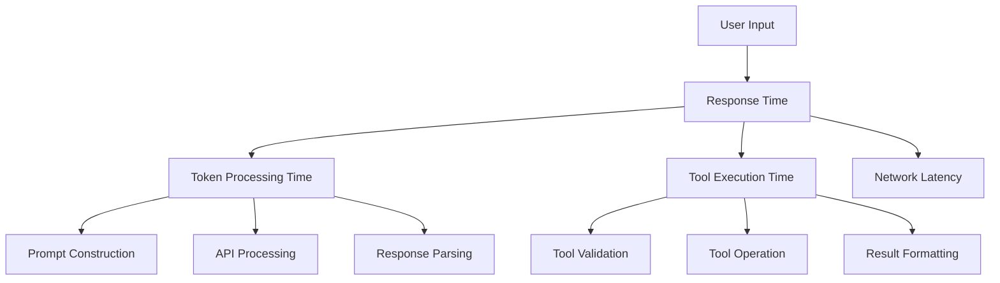

# ⚡ Performance Considerations

This guide covers performance optimization strategies for Gemini CLI, helping you build efficient, responsive tools and interactions that scale well with complex projects and large datasets.

## 📋 Table of Contents

- [Performance Fundamentals](#performance-fundamentals)
- [Token Management](#token-management)
- [Tool Execution Optimization](#tool-execution-optimization)
- [Memory Management](#memory-management)
- [Caching Strategies](#caching-strategies)
- [Concurrent Operations](#concurrent-operations)
- [Monitoring and Profiling](#monitoring-and-profiling)
- [Next Steps](#next-steps)

## Performance Fundamentals

### Performance Metrics in Gemini CLI



### Key Performance Bottlenecks

1. **Token Limits**: Gemini API has token limits that affect prompt size
2. **Network Latency**: API calls introduce network delay
3. **Tool Execution**: File operations and shell commands can be slow
4. **Context Loading**: Large context files slow down prompt construction
5. **Memory Usage**: Large conversations consume memory

### Performance Goals

```typescript
// Performance targets for Gemini CLI
export const performanceTargets = {
  // Response times
  simpleQuery: 2000, // 2 seconds for text-only responses
  toolExecution: 5000, // 5 seconds for simple tool operations
  complexTool: 15000, // 15 seconds for complex operations

  // Token usage
  maxPromptTokens: 30000, // Reserve tokens for response
  maxResponseTokens: 8000, // Reasonable response length

  // Memory usage
  maxMemoryUsage: 500 * 1024 * 1024, // 500MB for CLI process
  maxContextFiles: 50, // Limit context file count

  // Concurrency
  maxConcurrentTools: 3, // Parallel tool execution limit
  maxFileOperations: 10, // Concurrent file operations
};
```

## Token Management

### Token Estimation and Optimization

```typescript
// packages/core/src/utils/tokenManagement.ts
export class TokenManager {
  private readonly tokensPerCharacter = 0.25; // Rough estimation
  private readonly maxPromptTokens = 30000;
  private readonly reservedResponseTokens = 8000;

  estimateTokens(text: string): number {
    // Simple estimation - in practice, use tiktoken or similar
    return Math.ceil(text.length * this.tokensPerCharacter);
  }

  optimizePromptForTokens(
    prompt: PromptContext,
    maxTokens: number = this.maxPromptTokens,
  ): OptimizedPrompt {
    let currentTokens = this.calculateTotalTokens(prompt);

    if (currentTokens <= maxTokens) {
      return { prompt, tokensUsed: currentTokens, optimized: false };
    }

    // Optimization strategies in order of preference
    const strategies = [
      () => this.compressConversationHistory(prompt),
      () => this.summarizeOlderContext(prompt),
      () => this.removeNonEssentialTools(prompt),
      () => this.truncateContent(prompt, maxTokens),
    ];

    for (const strategy of strategies) {
      prompt = strategy();
      currentTokens = this.calculateTotalTokens(prompt);

      if (currentTokens <= maxTokens) {
        break;
      }
    }

    return {
      prompt,
      tokensUsed: currentTokens,
      optimized: true,
      savedTokens: this.calculateTotalTokens(prompt) - currentTokens,
    };
  }

  private compressConversationHistory(prompt: PromptContext): PromptContext {
    const history = prompt.conversationHistory;

    if (history.length <= 6) {
      return prompt; // Keep recent history intact
    }

    // Keep first turn (context setting) and last 4 turns (recent context)
    const compressed = [
      history[0], // First turn establishes context
      {
        role: 'system',
        content: `[Previous conversation: ${history.length - 5} turns summarized for brevity]`,
      },
      ...history.slice(-4), // Keep last 4 turns
    ];

    return {
      ...prompt,
      conversationHistory: compressed,
    };
  }

  private summarizeOlderContext(prompt: PromptContext): PromptContext {
    const contextSections = this.parseContextSections(prompt.memoryContent);

    const summarized = contextSections.map((section) => {
      if (section.priority < 50 && section.content.length > 1000) {
        return {
          ...section,
          content: this.createContextSummary(section.content),
          summarized: true,
        };
      }
      return section;
    });

    return {
      ...prompt,
      memoryContent: this.reconstructContext(summarized),
    };
  }

  private createContextSummary(content: string): string {
    // Extract key information from context
    const lines = content.split('\n');
    const headers = lines.filter((line) => line.startsWith('#'));
    const keyPoints = lines.filter(
      (line) =>
        line.includes('important') ||
        line.includes('requirement') ||
        line.startsWith('-') ||
        line.startsWith('*'),
    );

    return [
      '## Summary',
      ...headers.slice(0, 3),
      '### Key Points',
      ...keyPoints.slice(0, 5),
      '[Full context available if needed]',
    ].join('\n');
  }
}
```

### Streaming Response Optimization

```typescript
// Optimize for streaming responses to reduce perceived latency
export class StreamingOptimizer {
  optimizeForStreaming(prompt: PromptContext): StreamingPrompt {
    return {
      // Structure prompt for early useful tokens
      earlyContent: this.extractEarlyContent(prompt),

      // Main content for comprehensive response
      mainContent: this.structureMainContent(prompt),

      // Hints for response structure
      responseHints: this.generateResponseHints(prompt),
    };
  }

  private extractEarlyContent(prompt: PromptContext): string {
    // Provide context that helps generate useful tokens immediately
    const userIntent = this.analyzeUserIntent(prompt.userMessage);

    switch (userIntent.type) {
      case 'code_request':
        return 'Generate code solution immediately. Explain afterwards.';

      case 'explanation':
        return 'Start with a clear, concise explanation.';

      case 'list_request':
        return 'Begin with the most important items in order.';

      case 'troubleshooting':
        return 'Provide immediate solution, then explain troubleshooting steps.';

      default:
        return 'Provide direct, actionable response.';
    }
  }

  private generateResponseHints(prompt: PromptContext): ResponseHints {
    return {
      preferredFormat: this.determinePreferredFormat(prompt),
      expectedLength: this.estimateResponseLength(prompt),
      structureHints: this.generateStructureHints(prompt),
    };
  }
}
```

## Tool Execution Optimization

### Asynchronous Tool Execution

```typescript
// packages/core/src/core/optimizedToolScheduler.ts
export class OptimizedToolScheduler extends CoreToolScheduler {
  private readonly concurrencyLimit = 3;
  private readonly executionQueue = new Map<string, ToolExecution>();

  async scheduleOptimizedToolCalls(
    toolCalls: ToolCallRequestInfo[],
    abortSignal: AbortSignal,
  ): Promise<ToolCallResponseInfo[]> {
    // Analyze dependencies and optimize execution order
    const executionPlan = this.createExecutionPlan(toolCalls);

    // Execute tools with optimal concurrency
    return await this.executeWithOptimalConcurrency(executionPlan, abortSignal);
  }

  private createExecutionPlan(toolCalls: ToolCallRequestInfo[]): ExecutionPlan {
    const plan: ExecutionPlan = {
      parallel: [],
      sequential: [],
      dependencies: new Map(),
    };

    // Analyze tool dependencies
    for (const call of toolCalls) {
      const dependencies = this.analyzeDependencies(call, toolCalls);

      if (dependencies.length === 0) {
        plan.parallel.push(call);
      } else {
        plan.sequential.push(call);
        plan.dependencies.set(call.callId, dependencies);
      }
    }

    return plan;
  }

  private async executeWithOptimalConcurrency(
    plan: ExecutionPlan,
    abortSignal: AbortSignal,
  ): Promise<ToolCallResponseInfo[]> {
    const results: ToolCallResponseInfo[] = [];

    // Execute parallel tools first
    const parallelResults = await this.executeParallelTools(
      plan.parallel,
      abortSignal,
    );
    results.push(...parallelResults);

    // Execute sequential tools in dependency order
    const sequentialResults = await this.executeSequentialTools(
      plan.sequential,
      plan.dependencies,
      abortSignal,
    );
    results.push(...sequentialResults);

    return results;
  }

  private async executeParallelTools(
    toolCalls: ToolCallRequestInfo[],
    abortSignal: AbortSignal,
  ): Promise<ToolCallResponseInfo[]> {
    // Batch tools into groups based on concurrency limit
    const batches = this.createBatches(toolCalls, this.concurrencyLimit);
    const results: ToolCallResponseInfo[] = [];

    for (const batch of batches) {
      const batchResults = await Promise.all(
        batch.map((call) => this.executeSingleTool(call, abortSignal)),
      );
      results.push(...batchResults);
    }

    return results;
  }

  private analyzeDependencies(
    toolCall: ToolCallRequestInfo,
    allCalls: ToolCallRequestInfo[],
  ): string[] {
    const dependencies: string[] = [];

    // Check for file dependencies
    if (toolCall.name === 'read_file') {
      const writeCalls = allCalls.filter(
        (call) =>
          call.name === 'write_file' && call.args.path === toolCall.args.path,
      );
      dependencies.push(...writeCalls.map((call) => call.callId));
    }

    // Check for directory dependencies
    if (this.isDirectoryOperation(toolCall)) {
      const conflictingCalls = allCalls.filter((call) =>
        this.hasDirectoryConflict(toolCall, call),
      );
      dependencies.push(...conflictingCalls.map((call) => call.callId));
    }

    return dependencies;
  }
}
```

### File Operation Optimization

```typescript
// Optimize file operations for better performance
export class OptimizedFileOperations {
  private fileCache = new Map<string, CachedFileContent>();
  private readonly maxCacheSize = 100;
  private readonly cacheExpiryMs = 5 * 60 * 1000; // 5 minutes

  async readFileOptimized(path: string): Promise<FileContent> {
    // Check cache first
    const cached = this.fileCache.get(path);
    if (cached && this.isCacheValid(cached)) {
      return cached.content;
    }

    // Read file with optimization
    const content = await this.readWithOptimization(path);

    // Cache result
    this.cacheFileContent(path, content);

    return content;
  }

  private async readWithOptimization(path: string): Promise<FileContent> {
    const stats = await fs.stat(path);

    // Handle large files differently
    if (stats.size > 10 * 1024 * 1024) {
      // 10MB
      return await this.readLargeFile(path, stats);
    }

    // Read small to medium files normally
    const content = await fs.readFile(path, 'utf-8');
    return {
      content,
      size: stats.size,
      lastModified: stats.mtime,
      encoding: 'utf-8',
    };
  }

  private async readLargeFile(
    path: string,
    stats: fs.Stats,
  ): Promise<FileContent> {
    // For large files, provide options or stream reading
    return {
      content: `[Large file: ${this.formatFileSize(stats.size)}. Use specific line range or streaming read.]`,
      size: stats.size,
      lastModified: stats.mtime,
      encoding: 'utf-8',
      isLarge: true,
      streamingAvailable: true,
    };
  }

  async readMultipleFiles(paths: string[]): Promise<Map<string, FileContent>> {
    // Optimize for reading multiple files
    const results = new Map<string, FileContent>();

    // Group by directory for efficient reading
    const groupedPaths = this.groupPathsByDirectory(paths);

    // Read files concurrently within directory groups
    const readPromises = Array.from(groupedPaths.entries()).map(
      async ([directory, filePaths]) => {
        const dirResults = await this.readDirectoryFiles(directory, filePaths);
        for (const [path, content] of dirResults) {
          results.set(path, content);
        }
      },
    );

    await Promise.all(readPromises);
    return results;
  }

  private async readDirectoryFiles(
    directory: string,
    filePaths: string[],
  ): Promise<Map<string, FileContent>> {
    const results = new Map<string, FileContent>();

    // Limit concurrent reads per directory
    const concurrencyLimit = 5;
    const batches = this.createBatches(filePaths, concurrencyLimit);

    for (const batch of batches) {
      const batchPromises = batch.map(async (filePath) => {
        try {
          const content = await this.readFileOptimized(filePath);
          results.set(filePath, content);
        } catch (error) {
          results.set(filePath, {
            content: '',
            size: 0,
            lastModified: new Date(),
            encoding: 'utf-8',
            error: error.message,
          });
        }
      });

      await Promise.all(batchPromises);
    }

    return results;
  }
}
```

## Memory Management

### Memory-Efficient Context Handling

```typescript
// Manage memory usage in large projects
export class MemoryEfficientContextManager {
  private readonly maxMemoryUsage = 500 * 1024 * 1024; // 500MB
  private contextCache = new Map<string, WeakRef<ContextData>>();
  private memoryMonitor: MemoryMonitor;

  constructor() {
    this.memoryMonitor = new MemoryMonitor();
    this.setupMemoryMonitoring();
  }

  async loadContextEfficiently(
    contextPaths: string[],
  ): Promise<EfficiientContextResult> {
    // Monitor memory before loading
    const initialMemory = process.memoryUsage();

    // Prioritize context files by relevance
    const prioritizedPaths = this.prioritizeContextFiles(contextPaths);

    // Load context incrementally with memory checks
    const loadedContext = await this.loadIncrementalContext(
      prioritizedPaths,
      initialMemory,
    );

    return {
      context: loadedContext,
      memoryUsed: process.memoryUsage().heapUsed - initialMemory.heapUsed,
      filesLoaded: loadedContext.files.length,
      filesSkipped: contextPaths.length - loadedContext.files.length,
    };
  }

  private async loadIncrementalContext(
    prioritizedPaths: PrioritizedPath[],
    initialMemory: NodeJS.MemoryUsage,
  ): Promise<LoadedContext> {
    const context: LoadedContext = {
      content: '',
      files: [],
      memoryUsage: 0,
    };

    for (const { path, priority } of prioritizedPaths) {
      // Check memory usage before loading each file
      const currentMemory = process.memoryUsage();
      const memoryIncrease = currentMemory.heapUsed - initialMemory.heapUsed;

      if (memoryIncrease > this.maxMemoryUsage * 0.8) {
        console.warn(
          `Memory usage approaching limit, skipping remaining context files`,
        );
        break;
      }

      try {
        const fileContext = await this.loadSingleContextFile(path);

        // Check if adding this content would exceed limits
        if (this.wouldExceedLimits(context, fileContext)) {
          // Summarize instead of including full content
          fileContext.content = this.summarizeContent(fileContext.content);
        }

        context.content += fileContext.content + '\n\n';
        context.files.push({ path, priority, size: fileContext.size });
      } catch (error) {
        console.warn(`Failed to load context file ${path}:`, error.message);
      }
    }

    return context;
  }

  private wouldExceedLimits(
    currentContext: LoadedContext,
    newContext: ContextFile,
  ): boolean {
    const combinedSize =
      currentContext.content.length + newContext.content.length;
    const estimatedTokens = combinedSize * 0.25; // Rough token estimation

    return estimatedTokens > 25000; // Leave room for other prompt parts
  }

  private setupMemoryMonitoring(): void {
    setInterval(() => {
      const usage = process.memoryUsage();

      if (usage.heapUsed > this.maxMemoryUsage * 0.9) {
        console.warn('High memory usage detected, triggering cleanup');
        this.performMemoryCleanup();
      }
    }, 10000); // Check every 10 seconds
  }

  private performMemoryCleanup(): void {
    // Clear expired cache entries
    for (const [key, weakRef] of this.contextCache) {
      if (!weakRef.deref()) {
        this.contextCache.delete(key);
      }
    }

    // Force garbage collection if available
    if (global.gc) {
      global.gc();
    }
  }
}
```

### Garbage Collection Optimization

```typescript
// Optimize garbage collection for better performance
export class GarbageCollectionOptimizer {
  private largeObjectPool = new Map<string, LargeObject>();
  private objectPoolSizeLimit = 10;

  optimizeMemoryUsage(): void {
    // Configure Node.js garbage collection
    this.configureGarbageCollection();

    // Set up memory pressure monitoring
    this.monitorMemoryPressure();

    // Implement object pooling for large objects
    this.setupObjectPooling();
  }

  private configureGarbageCollection(): void {
    // Optimize GC for CLI application characteristics
    if (process.argv.includes('--optimize-for-size')) {
      // Prioritize memory usage over speed
      process.env.NODE_OPTIONS = `${process.env.NODE_OPTIONS || ''} --max-old-space-size=512`;
    } else {
      // Balanced approach
      process.env.NODE_OPTIONS = `${process.env.NODE_OPTIONS || ''} --max-old-space-size=1024`;
    }
  }

  private monitorMemoryPressure(): void {
    const memoryThreshold = 0.8; // 80% of max memory

    setInterval(() => {
      const usage = process.memoryUsage();
      const maxMemory = 1024 * 1024 * 1024; // 1GB default

      if (usage.heapUsed / maxMemory > memoryThreshold) {
        this.handleMemoryPressure();
      }
    }, 5000);
  }

  private handleMemoryPressure(): void {
    // Clear caches
    this.clearNonEssentialCaches();

    // Pool large objects instead of creating new ones
    this.returnObjectsToPool();

    // Request garbage collection
    if (global.gc) {
      global.gc();
    }
  }
}
```

## Caching Strategies

### Multi-Level Caching

```typescript
// Implement efficient multi-level caching
export class MultiLevelCache {
  private memoryCache = new Map<string, CacheEntry>();
  private diskCache: DiskCache;
  private readonly maxMemoryCacheSize = 100;
  private readonly maxMemoryAge = 5 * 60 * 1000; // 5 minutes

  constructor() {
    this.diskCache = new DiskCache({
      maxSize: 1000,
      maxAge: 60 * 60 * 1000, // 1 hour
    });
  }

  async get<T>(key: string): Promise<T | null> {
    // Level 1: Memory cache (fastest)
    const memoryResult = this.getFromMemory<T>(key);
    if (memoryResult) {
      return memoryResult;
    }

    // Level 2: Disk cache (medium speed)
    const diskResult = await this.diskCache.get<T>(key);
    if (diskResult) {
      // Promote to memory cache
      this.setInMemory(key, diskResult);
      return diskResult;
    }

    return null;
  }

  async set<T>(key: string, value: T, options?: CacheOptions): Promise<void> {
    // Store in memory cache
    this.setInMemory(key, value, options);

    // Store in disk cache for persistence
    await this.diskCache.set(key, value, options);
  }

  private getFromMemory<T>(key: string): T | null {
    const entry = this.memoryCache.get(key);

    if (!entry) return null;

    // Check expiration
    if (Date.now() - entry.timestamp > this.maxMemoryAge) {
      this.memoryCache.delete(key);
      return null;
    }

    // Update access time for LRU
    entry.lastAccessed = Date.now();
    return entry.value as T;
  }

  private setInMemory<T>(key: string, value: T, options?: CacheOptions): void {
    // Ensure cache size limit
    if (this.memoryCache.size >= this.maxMemoryCacheSize) {
      this.evictLeastRecentlyUsed();
    }

    this.memoryCache.set(key, {
      value,
      timestamp: Date.now(),
      lastAccessed: Date.now(),
      size: this.estimateSize(value),
      options,
    });
  }

  private evictLeastRecentlyUsed(): void {
    let oldestKey = '';
    let oldestTime = Date.now();

    for (const [key, entry] of this.memoryCache) {
      if (entry.lastAccessed < oldestTime) {
        oldestTime = entry.lastAccessed;
        oldestKey = key;
      }
    }

    if (oldestKey) {
      this.memoryCache.delete(oldestKey);
    }
  }
}
```

### Context-Aware Caching

```typescript
// Cache based on context for better hit rates
export class ContextAwareCache {
  private contextCaches = new Map<string, SpecializedCache>();

  async get(key: string, context: CacheContext): Promise<any> {
    const contextKey = this.generateContextKey(context);
    const cache = this.getOrCreateCache(contextKey);

    return await cache.get(key);
  }

  async set(key: string, value: any, context: CacheContext): Promise<void> {
    const contextKey = this.generateContextKey(context);
    const cache = this.getOrCreateCache(contextKey);

    await cache.set(key, value);
  }

  private generateContextKey(context: CacheContext): string {
    // Create cache key based on context characteristics
    const factors = [
      context.projectPath,
      context.userPreferences?.theme || 'default',
      context.toolsEnabled ? 'tools' : 'no-tools',
      context.workingDirectory,
    ];

    return factors.join(':');
  }

  private getOrCreateCache(contextKey: string): SpecializedCache {
    if (!this.contextCaches.has(contextKey)) {
      this.contextCaches.set(
        contextKey,
        new SpecializedCache({
          maxSize: 50,
          maxAge: 10 * 60 * 1000, // 10 minutes
        }),
      );
    }

    return this.contextCaches.get(contextKey)!;
  }
}
```

## Concurrent Operations

### Smart Concurrency Control

```typescript
// Manage concurrent operations intelligently
export class SmartConcurrencyManager {
  private readonly maxConcurrency = 3;
  private activeOperations = new Map<string, Promise<any>>();
  private operationQueue: QueuedOperation[] = [];

  async executeWithConcurrencyControl<T>(
    operations: Operation<T>[],
    options: ConcurrencyOptions = {},
  ): Promise<T[]> {
    const concurrencyLimit = options.maxConcurrency || this.maxConcurrency;
    const results: T[] = [];

    // Group operations by type for optimal scheduling
    const groupedOps = this.groupOperationsByType(operations);

    // Execute groups with appropriate concurrency
    for (const [opType, ops] of groupedOps) {
      const groupResults = await this.executeOperationGroup(
        ops,
        this.getConcurrencyLimitForType(opType, concurrencyLimit),
      );
      results.push(...groupResults);
    }

    return results;
  }

  private groupOperationsByType<T>(
    operations: Operation<T>[],
  ): Map<string, Operation<T>[]> {
    const groups = new Map<string, Operation<T>[]>();

    for (const op of operations) {
      const type = this.classifyOperation(op);
      if (!groups.has(type)) {
        groups.set(type, []);
      }
      groups.get(type)!.push(op);
    }

    return groups;
  }

  private classifyOperation(operation: Operation<any>): string {
    // Classify operations for optimal scheduling
    if (operation.type === 'file_read') return 'io_read';
    if (operation.type === 'file_write') return 'io_write';
    if (operation.type === 'shell_command') return 'compute';
    if (operation.type === 'network_request') return 'network';
    return 'general';
  }

  private getConcurrencyLimitForType(
    type: string,
    maxConcurrency: number,
  ): number {
    // Different operation types have different optimal concurrency
    const limits = {
      io_read: Math.min(maxConcurrency * 2, 6), // Reading can be more concurrent
      io_write: Math.min(maxConcurrency, 3), // Writing should be more limited
      compute: maxConcurrency, // CPU-bound operations
      network: Math.min(maxConcurrency * 3, 10), // Network can handle more concurrency
      general: maxConcurrency,
    };

    return limits[type] || maxConcurrency;
  }

  private async executeOperationGroup<T>(
    operations: Operation<T>[],
    concurrencyLimit: number,
  ): Promise<T[]> {
    const results: T[] = [];
    const executing = new Set<Promise<T>>();

    for (const operation of operations) {
      // Wait if we've reached the concurrency limit
      if (executing.size >= concurrencyLimit) {
        await Promise.race(executing);
      }

      const promise = this.executeOperation(operation).finally(() =>
        executing.delete(promise),
      );

      executing.add(promise);

      // Don't await here - let operations run concurrently
      promise.then((result) => results.push(result));
    }

    // Wait for all remaining operations
    await Promise.all(executing);

    return results;
  }
}
```

### Resource Pool Management

```typescript
// Manage resource pools for expensive operations
export class ResourcePoolManager {
  private filePools = new Map<string, FileResourcePool>();
  private networkPool: NetworkResourcePool;
  private computePool: ComputeResourcePool;

  constructor() {
    this.networkPool = new NetworkResourcePool({ maxConnections: 10 });
    this.computePool = new ComputeResourcePool({ maxWorkers: 3 });
  }

  async executeWithResource<T>(
    resourceType: ResourceType,
    operation: (resource: Resource) => Promise<T>,
  ): Promise<T> {
    const pool = this.getResourcePool(resourceType);
    const resource = await pool.acquire();

    try {
      return await operation(resource);
    } finally {
      pool.release(resource);
    }
  }

  private getResourcePool(type: ResourceType): ResourcePool {
    switch (type) {
      case 'file':
        return this.getFilePool();
      case 'network':
        return this.networkPool;
      case 'compute':
        return this.computePool;
      default:
        throw new Error(`Unknown resource type: ${type}`);
    }
  }

  private getFilePool(): FileResourcePool {
    // Create file pools per directory for better performance
    const cwd = process.cwd();

    if (!this.filePools.has(cwd)) {
      this.filePools.set(
        cwd,
        new FileResourcePool({
          maxHandles: 20,
          directory: cwd,
        }),
      );
    }

    return this.filePools.get(cwd)!;
  }
}
```

## Monitoring and Profiling

### Performance Monitoring

```typescript
// Monitor performance metrics during development and production
export class PerformanceMonitor {
  private metrics = new Map<string, PerformanceMetric>();
  private readonly samplingRate = 0.1; // 10% sampling

  startMeasurement(operation: string): PerformanceMeasurement {
    const startTime = performance.now();
    const startMemory = process.memoryUsage();

    return {
      operation,
      startTime,
      startMemory,

      end: () => this.endMeasurement(operation, startTime, startMemory),
    };
  }

  private endMeasurement(
    operation: string,
    startTime: number,
    startMemory: NodeJS.MemoryUsage,
  ): PerformanceResult {
    const endTime = performance.now();
    const endMemory = process.memoryUsage();

    const result: PerformanceResult = {
      operation,
      duration: endTime - startTime,
      memoryDelta: endMemory.heapUsed - startMemory.heapUsed,
      timestamp: Date.now(),
    };

    // Sample metrics for analysis
    if (Math.random() < this.samplingRate) {
      this.recordMetric(result);
    }

    return result;
  }

  private recordMetric(result: PerformanceResult): void {
    const existing = this.metrics.get(result.operation);

    if (existing) {
      existing.count++;
      existing.totalDuration += result.duration;
      existing.totalMemory += result.memoryDelta;
      existing.averageDuration = existing.totalDuration / existing.count;
      existing.averageMemory = existing.totalMemory / existing.count;

      // Track min/max
      existing.minDuration = Math.min(existing.minDuration, result.duration);
      existing.maxDuration = Math.max(existing.maxDuration, result.duration);
    } else {
      this.metrics.set(result.operation, {
        operation: result.operation,
        count: 1,
        totalDuration: result.duration,
        totalMemory: result.memoryDelta,
        averageDuration: result.duration,
        averageMemory: result.memoryDelta,
        minDuration: result.duration,
        maxDuration: result.duration,
      });
    }
  }

  generateReport(): PerformanceReport {
    const operations = Array.from(this.metrics.values()).sort(
      (a, b) => b.averageDuration - a.averageDuration,
    );

    return {
      timestamp: Date.now(),
      operations,
      summary: {
        totalOperations: operations.reduce((sum, op) => sum + op.count, 0),
        slowestOperation: operations[0]?.operation,
        averageResponseTime:
          operations.reduce((sum, op) => sum + op.averageDuration, 0) /
          operations.length,
      },
    };
  }
}
```

### Profiling Integration

```typescript
// Integrate with Node.js profiling tools
export class ProfilerIntegration {
  private profilingEnabled = process.env.NODE_ENV === 'development';
  private cpuProfiler?: any;

  async startProfiling(options: ProfilingOptions = {}): Promise<void> {
    if (!this.profilingEnabled) return;

    try {
      // Use v8-profiler-next for CPU profiling
      const profiler = await import('v8-profiler-next');
      this.cpuProfiler = profiler;

      // Start CPU profiling
      this.cpuProfiler.startProfiling('performance-profile', true);

      console.log('CPU profiling started');
    } catch (error) {
      console.warn('Could not start profiling:', error.message);
    }
  }

  async stopProfiling(): Promise<string | null> {
    if (!this.cpuProfiler) return null;

    try {
      const profile = this.cpuProfiler.stopProfiling('performance-profile');

      // Save profile to file
      const filename = `profile-${Date.now()}.cpuprofile`;
      const fs = await import('fs/promises');
      await fs.writeFile(filename, JSON.stringify(profile));

      console.log(`CPU profile saved to ${filename}`);
      console.log(
        `Open in Chrome DevTools: chrome://inspect -> Open dedicated DevTools for Node`,
      );

      return filename;
    } catch (error) {
      console.error('Error saving CPU profile:', error);
      return null;
    }
  }

  measureMemoryUsage(): MemoryUsageReport {
    const usage = process.memoryUsage();

    return {
      heapUsed: this.formatBytes(usage.heapUsed),
      heapTotal: this.formatBytes(usage.heapTotal),
      external: this.formatBytes(usage.external),
      rss: this.formatBytes(usage.rss),
      timestamp: Date.now(),
    };
  }

  private formatBytes(bytes: number): string {
    const units = ['B', 'KB', 'MB', 'GB'];
    let value = bytes;
    let unitIndex = 0;

    while (value >= 1024 && unitIndex < units.length - 1) {
      value /= 1024;
      unitIndex++;
    }

    return `${value.toFixed(2)} ${units[unitIndex]}`;
  }
}
```

## Next Steps

You now understand performance optimization strategies for Gemini CLI. Continue your learning journey:

### **🔒 Next: [Security Model](./12-security.md)**

Learn about security considerations and best practices in AI-driven development tools.

### **🔍 Related Topics**

- [Tool System Deep Dive](./06-tool-system.md) - Apply performance optimizations to tools
- [Testing & Debugging Guide](./09-testing-debugging.md) - Performance testing strategies
- [Prompt Engineering Patterns](./10-prompt-patterns.md) - Token optimization techniques

### **🛠️ Practice Exercises**

1. **Profile Tool Performance**: Use the performance monitoring tools to measure tool execution times
2. **Optimize Context Loading**: Implement caching for context files in your development environment
3. **Concurrent Tool Execution**: Create tools that can run concurrently without conflicts
4. **Memory Optimization**: Monitor and optimize memory usage in long-running CLI sessions

### **💡 Key Takeaways**

- Token management is crucial for API efficiency and cost control
- Concurrent operations should be carefully controlled to avoid resource conflicts
- Caching strategies dramatically improve perceived performance
- Memory management prevents degradation in long-running sessions
- Performance monitoring helps identify optimization opportunities
- Different operation types require different concurrency strategies
