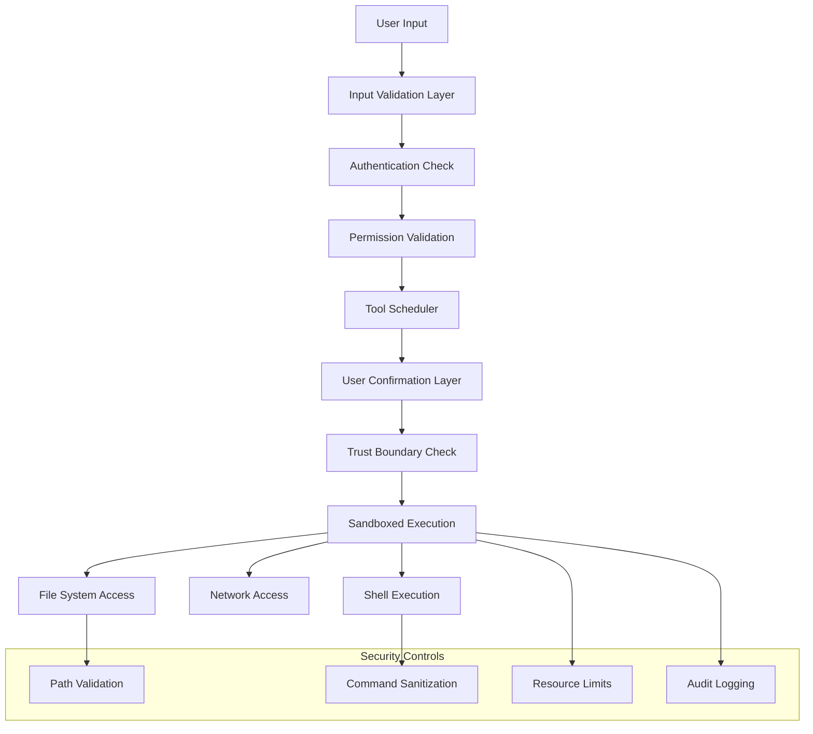

# 🔒 Security Model

This guide covers the comprehensive security model of Gemini CLI, helping you understand security boundaries, trust mechanisms, and best practices for building secure AI-driven development tools.

## 📋 Table of Contents

- [Security Architecture](#security-architecture)
- [Trust Boundaries](#trust-boundaries)
- [Tool Execution Security](#tool-execution-security)
- [Data Protection](#data-protection)
- [Authentication & Authorization](#authentication--authorization)
- [Input Validation & Sanitization](#input-validation--sanitization)
- [Secure Development Practices](#secure-development-practices)
- [Next Steps](#next-steps)

## Security Architecture

### Security Layers



### Core Security Principles

1. **Principle of Least Privilege**: Tools only get necessary permissions
2. **Defense in Depth**: Multiple security layers
3. **User Consent**: Explicit approval for dangerous operations
4. **Fail Secure**: Default to secure behavior on errors
5. **Audit Trail**: Log security-relevant actions

### Security Implementation

```typescript
// packages/core/src/security/securityManager.ts
export class SecurityManager {
  private readonly trustedPaths: Set<string>;
  private readonly dangerousCommands: RegExp[];
  private readonly auditLogger: SecurityAuditLogger;

  constructor(config: SecurityConfig) {
    this.trustedPaths = new Set(config.trustedPaths);
    this.dangerousCommands = config.dangerousCommands.map(
      (pattern) => new RegExp(pattern),
    );
    this.auditLogger = new SecurityAuditLogger();
  }

  async validateToolExecution(
    toolName: string,
    params: unknown,
    context: SecurityContext,
  ): Promise<SecurityValidationResult> {
    // 1. Validate tool registration
    const toolValidation = await this.validateToolRegistration(toolName);
    if (!toolValidation.isValid) {
      return { allowed: false, reason: 'Tool not registered or invalid' };
    }

    // 2. Validate parameters
    const paramValidation = await this.validateToolParameters(toolName, params);
    if (!paramValidation.isValid) {
      return {
        allowed: false,
        reason: `Invalid parameters: ${paramValidation.error}`,
      };
    }

    // 3. Check trust boundaries
    const trustValidation = await this.validateTrustBoundaries(
      toolName,
      params,
      context,
    );
    if (!trustValidation.isValid) {
      return {
        allowed: false,
        reason: `Trust boundary violation: ${trustValidation.error}`,
      };
    }

    // 4. Determine confirmation requirements
    const confirmationLevel = this.determineConfirmationLevel(toolName, params);

    // 5. Log security validation
    await this.auditLogger.logSecurityCheck({
      toolName,
      params,
      context,
      result: 'allowed',
      confirmationRequired: confirmationLevel !== 'none',
    });

    return {
      allowed: true,
      confirmationRequired: confirmationLevel,
      restrictions: this.calculateRestrictions(toolName, params, context),
    };
  }

  private determineConfirmationLevel(
    toolName: string,
    params: unknown,
  ): ConfirmationLevel {
    // Read operations typically don't need confirmation
    if (this.isReadOnlyOperation(toolName, params)) {
      return 'none';
    }

    // Write operations need basic confirmation
    if (this.isWriteOperation(toolName, params)) {
      return 'basic';
    }

    // Destructive operations need strong confirmation
    if (this.isDestructiveOperation(toolName, params)) {
      return 'strong';
    }

    // Shell commands need strong confirmation
    if (this.isShellOperation(toolName, params)) {
      return 'strong';
    }

    // Network operations may need confirmation based on destination
    if (this.isNetworkOperation(toolName, params)) {
      return this.isUntrustedNetworkOperation(params) ? 'basic' : 'none';
    }

    return 'basic'; // Default to requiring confirmation
  }
}
```

## Trust Boundaries

### Folder Trust System

```typescript
// packages/core/src/security/folderTrust.ts
export enum FolderTrustLevel {
  TRUSTED = 'trusted',
  UNTRUSTED = 'untrusted',
  ASK = 'ask',
}

export class FolderTrustManager {
  private trustDatabase: Map<string, TrustEntry>;
  private readonly configPath: string;

  constructor(configPath: string) {
    this.configPath = configPath;
    this.trustDatabase = new Map();
    this.loadTrustDatabase();
  }

  async evaluateFolderTrust(
    folderPath: string,
  ): Promise<FolderTrustEvaluation> {
    const absolutePath = path.resolve(folderPath);

    // Check direct trust entry
    const directTrust = this.trustDatabase.get(absolutePath);
    if (directTrust) {
      return {
        level: directTrust.level,
        inherited: false,
        source: 'explicit',
        path: absolutePath,
      };
    }

    // Check inherited trust from parent directories
    const inheritedTrust = this.findInheritedTrust(absolutePath);
    if (inheritedTrust) {
      return {
        level: inheritedTrust.level,
        inherited: true,
        source: 'inherited',
        path: inheritedTrust.path,
      };
    }

    // Apply default security policies
    return this.applyDefaultTrustPolicy(absolutePath);
  }

  private findInheritedTrust(folderPath: string): TrustEntry | null {
    let currentPath = folderPath;

    while (currentPath !== path.dirname(currentPath)) {
      currentPath = path.dirname(currentPath);
      const trustEntry = this.trustDatabase.get(currentPath);

      if (trustEntry && trustEntry.inheritable) {
        return trustEntry;
      }
    }

    return null;
  }

  private applyDefaultTrustPolicy(folderPath: string): FolderTrustEvaluation {
    // System directories are untrusted by default
    const systemPaths = [
      '/etc',
      '/var',
      '/usr/bin',
      '/usr/sbin',
      'C:\\Windows',
      'C:\\Program Files',
    ];
    if (systemPaths.some((sysPath) => folderPath.startsWith(sysPath))) {
      return {
        level: FolderTrustLevel.UNTRUSTED,
        inherited: false,
        source: 'system_policy',
        path: folderPath,
      };
    }

    // User home directory and subdirectories are trusted
    const homeDir = os.homedir();
    if (folderPath.startsWith(homeDir)) {
      return {
        level: FolderTrustLevel.TRUSTED,
        inherited: false,
        source: 'home_policy',
        path: folderPath,
      };
    }

    // Everything else requires confirmation
    return {
      level: FolderTrustLevel.ASK,
      inherited: false,
      source: 'default_policy',
      path: folderPath,
    };
  }

  async updateFolderTrust(
    folderPath: string,
    level: FolderTrustLevel,
    options: TrustUpdateOptions = {},
  ): Promise<void> {
    const absolutePath = path.resolve(folderPath);

    const trustEntry: TrustEntry = {
      path: absolutePath,
      level,
      inheritable: options.inheritable ?? true,
      createdAt: new Date(),
      createdBy: options.createdBy || 'user',
      reason: options.reason,
    };

    this.trustDatabase.set(absolutePath, trustEntry);
    await this.saveTrustDatabase();

    // Log trust change for audit
    await this.auditLogger.logTrustChange({
      path: absolutePath,
      oldLevel: this.trustDatabase.get(absolutePath)?.level,
      newLevel: level,
      reason: options.reason,
    });
  }
}
```

### Path Security Validation

```typescript
// packages/core/src/security/pathSecurity.ts
export class PathSecurityValidator {
  private readonly allowedRoots: string[];
  private readonly blockedPaths: string[];
  private readonly sensitivePatterns: RegExp[];

  constructor(config: PathSecurityConfig) {
    this.allowedRoots = config.allowedRoots.map((p) => path.resolve(p));
    this.blockedPaths = config.blockedPaths.map((p) => path.resolve(p));
    this.sensitivePatterns = config.sensitivePatterns.map((p) => new RegExp(p));
  }

  validatePath(
    requestedPath: string,
    operation: FileOperation,
  ): PathValidationResult {
    const resolvedPath = path.resolve(requestedPath);

    // 1. Check for path traversal attempts
    if (this.containsPathTraversal(requestedPath)) {
      return {
        valid: false,
        reason: 'Path traversal detected',
        securityRisk: 'high',
      };
    }

    // 2. Check against blocked paths
    if (this.isBlockedPath(resolvedPath)) {
      return {
        valid: false,
        reason: 'Path is explicitly blocked',
        securityRisk: 'high',
      };
    }

    // 3. Check allowed roots
    if (!this.isUnderAllowedRoot(resolvedPath)) {
      return {
        valid: false,
        reason: 'Path is outside allowed directories',
        securityRisk: 'medium',
      };
    }

    // 4. Check for sensitive file patterns
    const sensitiveCheck = this.checkSensitivePatterns(resolvedPath);
    if (sensitiveCheck.isSensitive && operation === 'write') {
      return {
        valid: false,
        reason: `Access to sensitive file pattern: ${sensitiveCheck.pattern}`,
        securityRisk: 'high',
      };
    }

    // 5. Check file permissions (if file exists)
    const permissionCheck = this.checkFilePermissions(resolvedPath, operation);
    if (!permissionCheck.allowed) {
      return {
        valid: false,
        reason: `Insufficient permissions for ${operation}`,
        securityRisk: 'medium',
      };
    }

    return {
      valid: true,
      normalizedPath: resolvedPath,
      requiresConfirmation: sensitiveCheck.isSensitive,
      securityRisk: 'low',
    };
  }

  private containsPathTraversal(requestedPath: string): boolean {
    const normalized = path.normalize(requestedPath);

    // Check for common path traversal patterns
    const traversalPatterns = [
      /\.\.\//,
      /\.\.\\/,
      /%2e%2e%2f/i,
      /%2e%2e%5c/i,
      /\.\.%2f/i,
      /\.\.%5c/i,
    ];

    return (
      traversalPatterns.some((pattern) => pattern.test(requestedPath)) ||
      normalized.includes('..')
    );
  }

  private isBlockedPath(resolvedPath: string): boolean {
    return this.blockedPaths.some((blocked) =>
      resolvedPath.startsWith(blocked),
    );
  }

  private isUnderAllowedRoot(resolvedPath: string): boolean {
    return this.allowedRoots.some((root) => resolvedPath.startsWith(root));
  }

  private checkSensitivePatterns(resolvedPath: string): SensitiveFileCheck {
    for (const pattern of this.sensitivePatterns) {
      if (pattern.test(resolvedPath)) {
        return {
          isSensitive: true,
          pattern: pattern.source,
        };
      }
    }

    return { isSensitive: false };
  }

  private checkFilePermissions(
    filePath: string,
    operation: FileOperation,
  ): PermissionCheck {
    try {
      // Check if file exists and get permissions
      const stats = fs.statSync(filePath);
      const mode = stats.mode;

      switch (operation) {
        case 'read':
          return { allowed: !!(mode & fs.constants.S_IRUSR) };
        case 'write':
          return { allowed: !!(mode & fs.constants.S_IWUSR) };
        case 'execute':
          return { allowed: !!(mode & fs.constants.S_IXUSR) };
        default:
          return { allowed: false };
      }
    } catch (error) {
      // File doesn't exist - check parent directory permissions
      const parentDir = path.dirname(filePath);
      return this.checkDirectoryPermissions(parentDir, operation);
    }
  }
}
```

## Tool Execution Security

### Secure Tool Execution Framework

```typescript
// packages/core/src/security/secureToolExecution.ts
export class SecureToolExecutor {
  private readonly securityManager: SecurityManager;
  private readonly sandboxManager: SandboxManager;
  private readonly auditLogger: SecurityAuditLogger;

  async executeToolSecurely<T>(
    toolInvocation: ToolInvocation<any, T>,
    context: ExecutionContext,
  ): Promise<SecureExecutionResult<T>> {
    const executionId = this.generateExecutionId();

    try {
      // 1. Pre-execution security checks
      const securityCheck = await this.performPreExecutionChecks(
        toolInvocation,
        context,
        executionId,
      );

      if (!securityCheck.allowed) {
        throw new SecurityError(securityCheck.reason);
      }

      // 2. Set up execution environment
      const secureEnvironment = await this.createSecureEnvironment(
        toolInvocation,
        securityCheck.restrictions,
      );

      // 3. Execute tool in secure environment
      const result = await this.executeInSecureEnvironment(
        toolInvocation,
        secureEnvironment,
        context.abortSignal,
      );

      // 4. Post-execution validation
      const validatedResult = await this.validateExecutionResult(
        result,
        securityCheck.restrictions,
      );

      // 5. Log successful execution
      await this.auditLogger.logToolExecution({
        executionId,
        toolName: toolInvocation.constructor.name,
        status: 'success',
        restrictions: securityCheck.restrictions,
      });

      return {
        success: true,
        result: validatedResult,
        executionId,
        securityApplied: securityCheck.restrictions,
      };
    } catch (error) {
      // Log security incident
      await this.auditLogger.logSecurityIncident({
        executionId,
        toolName: toolInvocation.constructor.name,
        error: error.message,
        securityImplications: this.assessSecurityImplications(error),
      });

      return {
        success: false,
        error: error.message,
        executionId,
        securityRisk: this.calculateSecurityRisk(error),
      };
    }
  }

  private async createSecureEnvironment(
    toolInvocation: ToolInvocation<any, any>,
    restrictions: SecurityRestrictions,
  ): Promise<SecureEnvironment> {
    const environment: SecureEnvironment = {
      // Restrict file system access
      fileSystemRestrictions: {
        allowedPaths: restrictions.allowedPaths,
        readOnly: restrictions.readOnlyMode,
        maxFileSize: restrictions.maxFileSize,
      },

      // Restrict network access
      networkRestrictions: {
        allowedDomains: restrictions.allowedDomains,
        blockedPorts: restrictions.blockedPorts,
        requireSSL: restrictions.requireSSL,
      },

      // Resource limits
      resourceLimits: {
        maxExecutionTime: restrictions.maxExecutionTime,
        maxMemoryUsage: restrictions.maxMemoryUsage,
        maxCpuUsage: restrictions.maxCpuUsage,
      },

      // Execution context
      executionContext: {
        workingDirectory: this.sanitizeWorkingDirectory(
          restrictions.workingDirectory,
        ),
        environment: this.sanitizeEnvironmentVariables(
          restrictions.environment,
        ),
        umask: restrictions.umask || 0o077, // Restrictive by default
      },
    };

    return environment;
  }

  private async executeInSecureEnvironment<T>(
    toolInvocation: ToolInvocation<any, T>,
    environment: SecureEnvironment,
    abortSignal: AbortSignal,
  ): Promise<T> {
    // Create timeout for execution
    const timeoutMs = environment.resourceLimits.maxExecutionTime;
    const timeoutSignal = AbortSignal.timeout(timeoutMs);
    const combinedSignal = this.combineAbortSignals(abortSignal, timeoutSignal);

    // Monitor resource usage during execution
    const resourceMonitor = new ExecutionResourceMonitor(
      environment.resourceLimits,
    );
    resourceMonitor.start();

    try {
      // Execute tool with security wrapper
      const result = await this.wrapToolExecution(
        toolInvocation,
        environment,
        combinedSignal,
      );

      // Validate resource usage
      const resourceUsage = resourceMonitor.getUsage();
      this.validateResourceUsage(resourceUsage, environment.resourceLimits);

      return result;
    } finally {
      resourceMonitor.stop();
    }
  }

  private async wrapToolExecution<T>(
    toolInvocation: ToolInvocation<any, T>,
    environment: SecureEnvironment,
    abortSignal: AbortSignal,
  ): Promise<T> {
    // Create security proxy for tool execution
    const securityProxy = new ToolSecurityProxy(toolInvocation, environment);

    // Execute through security proxy
    return await securityProxy.execute(abortSignal);
  }
}
```

### Command Injection Prevention

```typescript
// packages/core/src/security/commandSecurity.ts
export class CommandSecurityValidator {
  private readonly dangerousCommands: Set<string>;
  private readonly dangerousPatterns: RegExp[];
  private readonly allowedCommands: Set<string>;

  constructor() {
    this.dangerousCommands = new Set([
      'rm',
      'del',
      'format',
      'fdisk',
      'mkfs',
      'dd',
      'shutdown',
      'reboot',
      'halt',
      'poweroff',
      'su',
      'sudo',
      'passwd',
      'chown',
      'chmod',
      'netcat',
      'nc',
      'telnet',
      'ssh',
      'ftp',
    ]);

    this.dangerousPatterns = [
      /;\s*rm\s+/, // Command chaining with rm
      /\|\s*sh\s*/, // Piping to shell
      /`[^`]*`/, // Command substitution with backticks
      /\$\([^)]*\)/, // Command substitution with $()
      />\s*\/dev\//, // Writing to device files
      /\|\s*nc\s+/, // Piping to netcat
      /<\s*\/dev\/tcp\//, // TCP redirect
      /eval\s+/, // Eval command
      /exec\s+/, // Exec command
    ];

    this.allowedCommands = new Set([
      'ls',
      'dir',
      'pwd',
      'cd',
      'cat',
      'type',
      'head',
      'tail',
      'grep',
      'find',
      'sort',
      'uniq',
      'wc',
      'echo',
      'git',
      'npm',
      'node',
      'python',
      'python3',
      'pip',
      'make',
      'cmake',
      'cargo',
      'go',
      'javac',
      'java',
    ]);
  }

  validateCommand(command: string): CommandValidationResult {
    const normalizedCommand = command.trim().toLowerCase();

    // 1. Check for dangerous command patterns
    for (const pattern of this.dangerousPatterns) {
      if (pattern.test(command)) {
        return {
          safe: false,
          reason: `Dangerous pattern detected: ${pattern.source}`,
          risk: 'high',
          suggestion:
            'Use safer alternatives or split into multiple operations',
        };
      }
    }

    // 2. Extract base command
    const baseCommand = this.extractBaseCommand(command);

    // 3. Check against dangerous commands
    if (this.dangerousCommands.has(baseCommand)) {
      return {
        safe: false,
        reason: `Dangerous command: ${baseCommand}`,
        risk: 'high',
        suggestion:
          'This command requires special handling or should be avoided',
      };
    }

    // 4. Check command injection patterns
    const injectionCheck = this.checkCommandInjection(command);
    if (!injectionCheck.safe) {
      return injectionCheck;
    }

    // 5. Validate arguments
    const argumentCheck = this.validateCommandArguments(command);
    if (!argumentCheck.safe) {
      return argumentCheck;
    }

    // 6. Check if command is explicitly allowed
    if (this.allowedCommands.has(baseCommand)) {
      return {
        safe: true,
        risk: 'low',
        sanitizedCommand: this.sanitizeCommand(command),
      };
    }

    // 7. Unknown command - requires confirmation
    return {
      safe: true,
      risk: 'medium',
      requiresConfirmation: true,
      reason: `Unknown command: ${baseCommand}`,
      sanitizedCommand: this.sanitizeCommand(command),
    };
  }

  private checkCommandInjection(command: string): CommandValidationResult {
    // Check for command separators that could enable injection
    const injectionPatterns = [
      /;\s*[^;\s]/, // Command separator
      /\|\s*[^|\s]/, // Pipe to another command
      /&&\s*[^&\s]/, // AND operator
      /\|\|\s*[^|\s]/, // OR operator
      />\s*[^>\s]/, // Output redirection
      /<\s*[^<\s]/, // Input redirection
      /\$\{[^}]*\}/, // Variable expansion
      /\\\w+/, // Escape sequences
    ];

    for (const pattern of injectionPatterns) {
      if (pattern.test(command)) {
        return {
          safe: false,
          reason: `Potential command injection: ${pattern.source}`,
          risk: 'high',
          suggestion: 'Simplify command or use multiple separate commands',
        };
      }
    }

    return { safe: true, risk: 'low' };
  }

  private sanitizeCommand(command: string): string {
    // Remove or escape potentially dangerous characters
    return command
      .replace(/[`$\\]/g, '\\$&') // Escape backticks, dollar signs, backslashes
      .replace(/\s+/g, ' ') // Normalize whitespace
      .trim();
  }

  private extractBaseCommand(command: string): string {
    // Extract the first word as the base command
    const parts = command.trim().split(/\s+/);
    return parts[0].toLowerCase();
  }

  private validateCommandArguments(command: string): CommandValidationResult {
    // Check for suspicious arguments
    const suspiciousArgs = [
      /--password[=\s]/i,
      /--secret[=\s]/i,
      /--token[=\s]/i,
      /--key[=\s]/i,
      /-p\s+\S/, // -p password
      /--user[=\s]/i,
      /--username[=\s]/i,
    ];

    for (const pattern of suspiciousArgs) {
      if (pattern.test(command)) {
        return {
          safe: false,
          reason: 'Command contains potentially sensitive arguments',
          risk: 'medium',
          suggestion:
            'Use environment variables or configuration files for sensitive data',
        };
      }
    }

    return { safe: true, risk: 'low' };
  }
}
```

## Data Protection

### Sensitive Data Detection

```typescript
// packages/core/src/security/dataProtection.ts
export class SensitiveDataDetector {
  private readonly patterns: SensitivePattern[];

  constructor() {
    this.patterns = [
      {
        name: 'API Key',
        pattern:
          /(?:api[_-]?key|apikey)['":\s]*[=:]\s*['"]?([a-zA-Z0-9_-]{20,})['"]?/i,
        severity: 'high',
      },
      {
        name: 'AWS Access Key',
        pattern: /AKIA[0-9A-Z]{16}/,
        severity: 'high',
      },
      {
        name: 'Private Key',
        pattern: /-----BEGIN (RSA |EC |DSA )?PRIVATE KEY-----/,
        severity: 'critical',
      },
      {
        name: 'Password',
        pattern:
          /(?:password|passwd|pwd)['":\s]*[=:]\s*['"]?([^\s'"]{6,})['"]?/i,
        severity: 'high',
      },
      {
        name: 'JWT Token',
        pattern: /eyJ[A-Za-z0-9_-]+\.eyJ[A-Za-z0-9_-]+\.[A-Za-z0-9_-]+/,
        severity: 'medium',
      },
      {
        name: 'Credit Card',
        pattern:
          /(?:4[0-9]{12}(?:[0-9]{3})?|5[1-5][0-9]{14}|3[47][0-9]{13}|3[0-9]{13}|6(?:011|5[0-9]{2})[0-9]{12})/,
        severity: 'critical',
      },
      {
        name: 'Social Security Number',
        pattern: /\b\d{3}-\d{2}-\d{4}\b/,
        severity: 'critical',
      },
    ];
  }

  scanForSensitiveData(content: string): SensitiveDataScanResult {
    const detections: SensitiveDataDetection[] = [];

    for (const pattern of this.patterns) {
      const matches = content.matchAll(new RegExp(pattern.pattern, 'gi'));

      for (const match of matches) {
        detections.push({
          type: pattern.name,
          severity: pattern.severity,
          match: match[0],
          position: match.index || 0,
          context: this.extractContext(content, match.index || 0),
        });
      }
    }

    return {
      hasSensitiveData: detections.length > 0,
      detections,
      riskLevel: this.calculateRiskLevel(detections),
      recommendation: this.generateRecommendation(detections),
    };
  }

  sanitizeContent(content: string): SanitizedContent {
    let sanitized = content;
    const replacements: DataReplacement[] = [];

    for (const pattern of this.patterns) {
      const regex = new RegExp(pattern.pattern, 'gi');
      sanitized = sanitized.replace(regex, (match, ...groups) => {
        const replacement = this.generateReplacement(pattern.name, match);
        replacements.push({
          original: match,
          replacement,
          type: pattern.name,
          position: content.indexOf(match),
        });
        return replacement;
      });
    }

    return {
      sanitizedContent: sanitized,
      replacements,
      originalLength: content.length,
      sanitizedLength: sanitized.length,
    };
  }

  private generateReplacement(type: string, original: string): string {
    const prefix = original.substring(0, Math.min(4, original.length));
    const suffix =
      original.length > 8 ? original.substring(original.length - 4) : '';
    const masked = '*'.repeat(Math.max(4, original.length - 8));

    return `[${type.toUpperCase()}_REDACTED:${prefix}${masked}${suffix}]`;
  }

  private calculateRiskLevel(detections: SensitiveDataDetection[]): RiskLevel {
    if (detections.some((d) => d.severity === 'critical')) {
      return 'critical';
    }
    if (detections.some((d) => d.severity === 'high')) {
      return 'high';
    }
    if (detections.some((d) => d.severity === 'medium')) {
      return 'medium';
    }
    return 'low';
  }

  private generateRecommendation(detections: SensitiveDataDetection[]): string {
    if (detections.length === 0) {
      return 'No sensitive data detected.';
    }

    const types = [...new Set(detections.map((d) => d.type))];
    return (
      `Found ${detections.length} instances of sensitive data (${types.join(', ')}). ` +
      'Consider using environment variables, secure configuration files, or secrets management systems.'
    );
  }
}
```

### Secure Configuration Management

```typescript
// packages/core/src/security/secureConfig.ts
export class SecureConfigurationManager {
  private readonly configPath: string;
  private readonly encryptionKey: Buffer;
  private readonly saltRounds = 12;

  constructor(configPath: string, encryptionKey?: Buffer) {
    this.configPath = configPath;
    this.encryptionKey = encryptionKey || this.deriveKeyFromEnvironment();
  }

  async storeSecureConfiguration(config: SecureConfiguration): Promise<void> {
    // 1. Validate configuration
    const validation = this.validateConfiguration(config);
    if (!validation.valid) {
      throw new Error(`Invalid configuration: ${validation.errors.join(', ')}`);
    }

    // 2. Separate sensitive and non-sensitive data
    const { sensitive, nonSensitive } = this.separateConfigurationData(config);

    // 3. Encrypt sensitive data
    const encryptedSensitive = await this.encryptSensitiveData(sensitive);

    // 4. Create configuration structure
    const configStructure: StoredConfiguration = {
      version: '1.0',
      timestamp: new Date().toISOString(),
      nonSensitive,
      sensitive: encryptedSensitive,
      integrity: await this.calculateIntegrityHash(
        nonSensitive,
        encryptedSensitive,
      ),
    };

    // 5. Store configuration securely
    await this.writeConfigurationFile(configStructure);

    // 6. Set secure file permissions
    await this.setSecureFilePermissions(this.configPath);
  }

  async loadSecureConfiguration(): Promise<SecureConfiguration> {
    // 1. Read configuration file
    const storedConfig = await this.readConfigurationFile();

    // 2. Verify integrity
    const integrityValid = await this.verifyIntegrity(storedConfig);
    if (!integrityValid) {
      throw new SecurityError('Configuration file integrity check failed');
    }

    // 3. Decrypt sensitive data
    const decryptedSensitive = await this.decryptSensitiveData(
      storedConfig.sensitive,
    );

    // 4. Combine and return configuration
    return {
      ...storedConfig.nonSensitive,
      ...decryptedSensitive,
    };
  }

  private async encryptSensitiveData(
    sensitiveData: Record<string, any>,
  ): Promise<EncryptedData> {
    const plaintext = JSON.stringify(sensitiveData);
    const salt = crypto.randomBytes(16);
    const iv = crypto.randomBytes(16);

    // Derive key with salt
    const key = crypto.pbkdf2Sync(
      this.encryptionKey,
      salt,
      10000,
      32,
      'sha256',
    );

    // Encrypt data
    const cipher = crypto.createCipher('aes-256-gcm', key);
    cipher.setAAD(salt); // Additional authenticated data

    let encrypted = cipher.update(plaintext, 'utf8', 'hex');
    encrypted += cipher.final('hex');

    const authTag = cipher.getAuthTag();

    return {
      algorithm: 'aes-256-gcm',
      salt: salt.toString('hex'),
      iv: iv.toString('hex'),
      authTag: authTag.toString('hex'),
      data: encrypted,
    };
  }

  private async decryptSensitiveData(
    encryptedData: EncryptedData,
  ): Promise<Record<string, any>> {
    const salt = Buffer.from(encryptedData.salt, 'hex');
    const iv = Buffer.from(encryptedData.iv, 'hex');
    const authTag = Buffer.from(encryptedData.authTag, 'hex');

    // Derive key with salt
    const key = crypto.pbkdf2Sync(
      this.encryptionKey,
      salt,
      10000,
      32,
      'sha256',
    );

    // Decrypt data
    const decipher = crypto.createDecipher('aes-256-gcm', key);
    decipher.setAuthTag(authTag);
    decipher.setAAD(salt);

    let decrypted = decipher.update(encryptedData.data, 'hex', 'utf8');
    decrypted += decipher.final('utf8');

    return JSON.parse(decrypted);
  }

  private async setSecureFilePermissions(filePath: string): Promise<void> {
    // Set restrictive permissions (readable/writable by owner only)
    await fs.chmod(filePath, 0o600);
  }

  private deriveKeyFromEnvironment(): Buffer {
    // Derive encryption key from environment or system
    const keyMaterial =
      process.env.GEMINI_CONFIG_KEY || os.hostname() + os.userInfo().username;

    return crypto.scryptSync(keyMaterial, 'gemini-cli-salt', 32);
  }
}
```

## Authentication & Authorization

### Authentication Framework

```typescript
// packages/core/src/security/authentication.ts
export class AuthenticationManager {
  private currentUser: AuthenticatedUser | null = null;
  private readonly sessionManager: SessionManager;
  private readonly auditLogger: SecurityAuditLogger;

  constructor() {
    this.sessionManager = new SessionManager();
    this.auditLogger = new SecurityAuditLogger();
  }

  async authenticate(
    method: AuthenticationMethod,
    credentials: AuthenticationCredentials,
  ): Promise<AuthenticationResult> {
    try {
      // 1. Validate authentication method
      if (!this.isValidAuthMethod(method)) {
        throw new AuthenticationError(
          `Invalid authentication method: ${method}`,
        );
      }

      // 2. Perform authentication based on method
      const authResult = await this.performAuthentication(method, credentials);

      if (!authResult.success) {
        await this.auditLogger.logAuthenticationFailure({
          method,
          reason: authResult.reason,
          timestamp: new Date(),
          ipAddress: this.getClientIP(),
        });

        return authResult;
      }

      // 3. Create user session
      const user = authResult.user!;
      const session = await this.sessionManager.createSession(user);

      // 4. Set current user
      this.currentUser = {
        ...user,
        sessionId: session.id,
        authenticatedAt: new Date(),
        lastActivity: new Date(),
      };

      // 5. Log successful authentication
      await this.auditLogger.logAuthentication({
        userId: user.id,
        method,
        sessionId: session.id,
        timestamp: new Date(),
      });

      return {
        success: true,
        user: this.currentUser,
        session,
        permissions: await this.loadUserPermissions(user),
      };
    } catch (error) {
      await this.auditLogger.logAuthenticationError({
        method,
        error: error.message,
        timestamp: new Date(),
      });

      return {
        success: false,
        reason: error.message,
      };
    }
  }

  private async performAuthentication(
    method: AuthenticationMethod,
    credentials: AuthenticationCredentials,
  ): Promise<AuthenticationResult> {
    switch (method) {
      case 'google_oauth':
        return await this.authenticateWithGoogle(
          credentials as GoogleCredentials,
        );

      case 'api_key':
        return await this.authenticateWithApiKey(
          credentials as ApiKeyCredentials,
        );

      case 'vertex_ai':
        return await this.authenticateWithVertexAI(
          credentials as VertexAICredentials,
        );

      default:
        throw new AuthenticationError(
          `Unsupported authentication method: ${method}`,
        );
    }
  }

  private async authenticateWithGoogle(
    credentials: GoogleCredentials,
  ): Promise<AuthenticationResult> {
    // Implement Google OAuth2 authentication
    const oauth2Client = new google.auth.OAuth2(
      credentials.clientId,
      credentials.clientSecret,
      credentials.redirectUri,
    );

    try {
      // Exchange authorization code for tokens
      const { tokens } = await oauth2Client.getToken(
        credentials.authorizationCode,
      );
      oauth2Client.setCredentials(tokens);

      // Get user information
      const oauth2 = google.oauth2({ version: 'v2', auth: oauth2Client });
      const userInfo = await oauth2.userinfo.get();

      const user: User = {
        id: userInfo.data.id!,
        email: userInfo.data.email!,
        name: userInfo.data.name!,
        provider: 'google',
        roles: ['user'], // Default role
      };

      return {
        success: true,
        user,
        tokens,
      };
    } catch (error) {
      return {
        success: false,
        reason: `Google authentication failed: ${error.message}`,
      };
    }
  }

  async authorize(
    operation: string,
    resource?: string,
    context?: AuthorizationContext,
  ): Promise<AuthorizationResult> {
    if (!this.currentUser) {
      return {
        authorized: false,
        reason: 'User not authenticated',
      };
    }

    // 1. Check user permissions
    const permissions = await this.loadUserPermissions(this.currentUser);

    // 2. Evaluate authorization rules
    const authResult = await this.evaluateAuthorization(
      this.currentUser,
      permissions,
      operation,
      resource,
      context,
    );

    // 3. Log authorization attempt
    await this.auditLogger.logAuthorization({
      userId: this.currentUser.id,
      operation,
      resource,
      result: authResult.authorized,
      reason: authResult.reason,
      timestamp: new Date(),
    });

    return authResult;
  }

  private async evaluateAuthorization(
    user: AuthenticatedUser,
    permissions: UserPermissions,
    operation: string,
    resource?: string,
    context?: AuthorizationContext,
  ): Promise<AuthorizationResult> {
    // 1. Check explicit permissions
    if (permissions.operations.includes(operation)) {
      return { authorized: true };
    }

    // 2. Check role-based permissions
    const rolePermissions = await this.getRolePermissions(user.roles);
    if (rolePermissions.operations.includes(operation)) {
      return { authorized: true };
    }

    // 3. Check resource-specific permissions
    if (resource && permissions.resources[resource]?.includes(operation)) {
      return { authorized: true };
    }

    // 4. Check context-based permissions
    if (
      context &&
      (await this.evaluateContextualPermissions(user, operation, context))
    ) {
      return { authorized: true };
    }

    return {
      authorized: false,
      reason: `User ${user.id} does not have permission to perform ${operation}${resource ? ` on ${resource}` : ''}`,
    };
  }
}
```

## Input Validation & Sanitization

### Comprehensive Input Validation

```typescript
// packages/core/src/security/inputValidation.ts
export class InputValidator {
  private readonly sanitizers: Map<string, InputSanitizer>;
  private readonly validators: Map<string, InputValidator>;

  constructor() {
    this.sanitizers = new Map();
    this.validators = new Map();
    this.initializeDefaultValidators();
  }

  async validateAndSanitize(
    input: unknown,
    schema: ValidationSchema,
    context?: ValidationContext,
  ): Promise<ValidationResult> {
    try {
      // 1. Basic type validation
      const typeValidation = this.validateType(input, schema);
      if (!typeValidation.valid) {
        return typeValidation;
      }

      // 2. Sanitize input
      const sanitized = await this.sanitizeInput(input, schema);

      // 3. Validate sanitized input
      const validation = await this.validateInput(sanitized, schema, context);
      if (!validation.valid) {
        return validation;
      }

      // 4. Perform security checks
      const securityCheck = await this.performSecurityValidation(
        sanitized,
        schema,
      );
      if (!securityCheck.valid) {
        return securityCheck;
      }

      return {
        valid: true,
        sanitizedValue: sanitized,
        warnings: validation.warnings,
      };
    } catch (error) {
      return {
        valid: false,
        error: `Validation failed: ${error.message}`,
        securityRisk: 'high',
      };
    }
  }

  private async sanitizeInput(
    input: unknown,
    schema: ValidationSchema,
  ): Promise<unknown> {
    switch (schema.type) {
      case 'string':
        return this.sanitizeString(input as string, schema.stringRules);

      case 'path':
        return this.sanitizePath(input as string, schema.pathRules);

      case 'command':
        return this.sanitizeCommand(input as string, schema.commandRules);

      case 'url':
        return this.sanitizeUrl(input as string, schema.urlRules);

      case 'object':
        return this.sanitizeObject(input as object, schema.objectRules);

      default:
        return input;
    }
  }

  private sanitizeString(input: string, rules?: StringValidationRules): string {
    let sanitized = input;

    // Remove null bytes
    sanitized = sanitized.replace(/\0/g, '');

    // Normalize unicode
    sanitized = sanitized.normalize('NFC');

    // Trim whitespace if specified
    if (rules?.trim !== false) {
      sanitized = sanitized.trim();
    }

    // Remove control characters
    if (rules?.removeControlChars !== false) {
      sanitized = sanitized.replace(/[\x00-\x1F\x7F]/g, '');
    }

    // Escape HTML if specified
    if (rules?.escapeHtml) {
      sanitized = this.escapeHtml(sanitized);
    }

    // Limit length
    if (rules?.maxLength && sanitized.length > rules.maxLength) {
      sanitized = sanitized.substring(0, rules.maxLength);
    }

    return sanitized;
  }

  private sanitizePath(input: string, rules?: PathValidationRules): string {
    let sanitized = input;

    // Normalize path separators
    sanitized = path.normalize(sanitized);

    // Remove dangerous sequences
    sanitized = sanitized.replace(/\.\.+/g, ''); // Remove path traversal
    sanitized = sanitized.replace(/[<>"|*?]/g, ''); // Remove illegal characters

    // Convert to absolute path if required
    if (rules?.makeAbsolute) {
      sanitized = path.resolve(sanitized);
    }

    return sanitized;
  }

  private sanitizeCommand(
    input: string,
    rules?: CommandValidationRules,
  ): string {
    let sanitized = input;

    // Remove dangerous characters
    sanitized = sanitized.replace(/[`$\\;|&<>]/g, '');

    // Normalize whitespace
    sanitized = sanitized.replace(/\s+/g, ' ').trim();

    // Remove command injection patterns
    sanitized = sanitized.replace(/\$\([^)]*\)/g, ''); // Command substitution
    sanitized = sanitized.replace(/&&|\|\|/g, ''); // Command chaining

    return sanitized;
  }

  private async performSecurityValidation(
    input: unknown,
    schema: ValidationSchema,
  ): Promise<ValidationResult> {
    // Check for suspicious patterns
    if (typeof input === 'string') {
      const suspiciousPatterns = [
        /script\s*:/i, // JavaScript protocol
        /javascript\s*:/i, // JavaScript protocol
        /data\s*:/i, // Data URI
        /vbscript\s*:/i, // VBScript protocol
        /<\s*script/i, // Script tags
        /on\w+\s*=/i, // Event handlers
        /eval\s*\(/i, // Eval function
        /expression\s*\(/i, // CSS expressions
      ];

      for (const pattern of suspiciousPatterns) {
        if (pattern.test(input)) {
          return {
            valid: false,
            error: `Suspicious pattern detected: ${pattern.source}`,
            securityRisk: 'high',
          };
        }
      }
    }

    return { valid: true };
  }

  private escapeHtml(input: string): string {
    const htmlEscapes: Record<string, string> = {
      '&': '&amp;',
      '<': '&lt;',
      '>': '&gt;',
      '"': '&quot;',
      "'": '&#x27;',
      '/': '&#x2F;',
    };

    return input.replace(/[&<>"'/]/g, (match) => htmlEscapes[match]);
  }
}
```

## Secure Development Practices

### Security Code Review Checklist

```typescript
// packages/core/src/security/codeReview.ts
export const securityCodeReviewChecklist = {
  inputValidation: [
    'All user inputs are validated and sanitized',
    'Type checking is performed before processing',
    'Length limits are enforced where appropriate',
    'Special characters are properly handled',
    'Encoding/decoding is done safely',
  ],

  authentication: [
    'Authentication is required for sensitive operations',
    'Session management is secure',
    'Passwords are never stored in plaintext',
    'Authentication failures are logged',
    'Rate limiting is implemented for auth attempts',
  ],

  authorization: [
    'Authorization is checked for each operation',
    'Principle of least privilege is followed',
    'Role-based access control is properly implemented',
    'Resource-level permissions are enforced',
    'Authorization decisions are logged',
  ],

  dataProtection: [
    'Sensitive data is encrypted at rest',
    'Sensitive data is encrypted in transit',
    'Secrets are not hardcoded in source code',
    'Proper key management is implemented',
    'Data retention policies are enforced',
  ],

  errorHandling: [
    'Error messages do not leak sensitive information',
    'Errors are logged for monitoring',
    'Graceful degradation is implemented',
    'Error states are secure by default',
    'Stack traces are not exposed to users',
  ],

  toolSecurity: [
    'Tool parameters are validated',
    'Dangerous operations require confirmation',
    'Tool execution is sandboxed where possible',
    'Resource limits are enforced',
    'Tool execution is logged',
  ],
};

export class SecurityCodeAnalyzer {
  async analyzeCodeForSecurityIssues(
    filePath: string,
    content: string,
  ): Promise<SecurityAnalysisResult> {
    const issues: SecurityIssue[] = [];

    // Analyze for common security anti-patterns
    issues.push(...this.checkForHardcodedSecrets(content));
    issues.push(...this.checkForSqlInjection(content));
    issues.push(...this.checkForCommandInjection(content));
    issues.push(...this.checkForPathTraversal(content));
    issues.push(...this.checkForInsecureRandom(content));
    issues.push(...this.checkForWeakCrypto(content));

    return {
      filePath,
      issues,
      riskLevel: this.calculateOverallRisk(issues),
      recommendations: this.generateRecommendations(issues),
    };
  }

  private checkForHardcodedSecrets(content: string): SecurityIssue[] {
    const issues: SecurityIssue[] = [];
    const secretPatterns = [
      {
        pattern: /password\s*=\s*['"][^'"]+['"]/,
        message: 'Hardcoded password detected',
      },
      {
        pattern: /api[_-]?key\s*=\s*['"][^'"]+['"]/,
        message: 'Hardcoded API key detected',
      },
      {
        pattern: /secret\s*=\s*['"][^'"]+['"]/,
        message: 'Hardcoded secret detected',
      },
      {
        pattern: /token\s*=\s*['"][^'"]+['"]/,
        message: 'Hardcoded token detected',
      },
    ];

    for (const { pattern, message } of secretPatterns) {
      const matches = content.matchAll(new RegExp(pattern, 'gi'));
      for (const match of matches) {
        issues.push({
          type: 'hardcoded_secret',
          severity: 'high',
          message,
          line: this.getLineNumber(content, match.index || 0),
          recommendation:
            'Use environment variables or secure configuration management',
        });
      }
    }

    return issues;
  }

  private checkForCommandInjection(content: string): SecurityIssue[] {
    const issues: SecurityIssue[] = [];
    const injectionPatterns = [
      /exec\s*\(\s*['"`][^'"`]*\$\{[^}]*\}[^'"`]*['"`]\s*\)/,
      /spawn\s*\(\s*['"`][^'"`]*\$\{[^}]*\}[^'"`]*['"`]\s*\)/,
      /execSync\s*\(\s*['"`][^'"`]*\$\{[^}]*\}[^'"`]*['"`]\s*\)/,
    ];

    for (const pattern of injectionPatterns) {
      const matches = content.matchAll(new RegExp(pattern, 'g'));
      for (const match of matches) {
        issues.push({
          type: 'command_injection',
          severity: 'critical',
          message: 'Potential command injection vulnerability',
          line: this.getLineNumber(content, match.index || 0),
          recommendation:
            'Use parameterized commands or proper input sanitization',
        });
      }
    }

    return issues;
  }

  private getLineNumber(content: string, index: number): number {
    return content.substring(0, index).split('\n').length;
  }
}
```

## Next Steps

You now have a comprehensive understanding of Gemini CLI's security model. This completes the Developer Contribution Guide:

### **🎯 What You've Learned**

Through this complete guide, you've mastered:

**Phase 1 - Understanding the System:**

- System architecture and design patterns
- LLM workflow and conversation management
- Context engineering and prompt construction

**Phase 2 - Code Exploration:**

- Repository structure and navigation
- TypeScript type system and interfaces
- Tool system architecture and patterns

**Phase 3 - Hands-on Development:**

- Development environment setup
- Building tools from scratch
- Testing and debugging strategies

**Phase 4 - Advanced Topics:**

- Prompt engineering patterns
- Performance optimization techniques
- Security model and best practices

### **🔍 Related Final Topics**

- [Contributing Guidelines](../../CONTRIBUTING.md) - Project contribution process
- [Main Documentation](../index.md) - User-facing documentation
- [Architecture Overview](../architecture.md) - High-level system design

### **🛠️ Final Practice Challenges**

1. **Build a Complete Feature**: Create a new tool with tests, documentation, and security considerations
2. **Optimize an Existing Feature**: Improve performance of an existing component
3. **Security Audit**: Conduct a security review of a code section
4. **Contribute to the Project**: Make an actual contribution to the open-source project

### **💡 Final Key Takeaways**

- Security is paramount in AI-driven development tools
- Multiple layers of protection provide defense in depth
- User consent and transparency build trust
- Secure development practices prevent vulnerabilities
- Regular security auditing maintains protection
- Performance and security often require careful balance

**Congratulations!** You're now equipped to contribute effectively to Gemini CLI and build secure, high-performance AI-driven development tools. The knowledge you've gained here applies broadly to AI tool development and can help you build the next generation of intelligent developer tools.

**Ready to contribute?** Check out the [Contributing Guidelines](../../CONTRIBUTING.md) and start making your mark on this exciting project!
